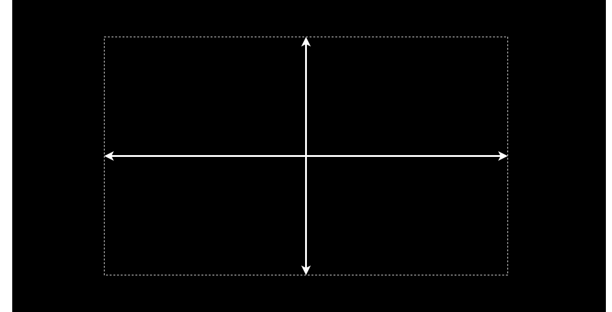

#
Das Portfolio Performance Handbuch besteht aus vier Kapiteln, die von einem bekannten [Rahmenwerk für die Erstellung von Dokumentationen](https://diataxis.fr/) abgeleitet wurden.
Die Dokumentation ist entlang zweier Achsen strukturiert: Theorie und Praxis sowie Lernen und Machen.

- [Erste Schritte](index.md)
Wenn du neu in Portfolio Performance bist, wird dir dieses Kapitel den Einstieg erleichtern.
Es behandelt alles von der Installation über die Erstellung eines neuen Portfolios, den Import von Wertpapieren und Transaktionsdaten bis hin zur Auswertung Ihres gesamten Portfolios.

- [Grundlagen](grundlagen/index.md)
Obwohl Portfolio Performance ein äußerst intuitives und benutzerfreundliches Programm ist, können die zugrunde liegenden Finanzkonzepte komplex sein. Dieses Kapitel vermittelt ein kurzes, aber klares Verständnis der wichtigsten Portfolio-Performance-Konzepte, wie Konten, Transaktionen, Berichtszeiträume, interner Zinsfuß und mehr.

- [How-to](how-to/index.md)
In diesem Kapitel findest du Schritt-für-Schritt-Beschreibungen gängiger Verfahren, einschließlich Datenimport, Dividendenbuchung, Suche nach historischen Kursen und mehr. Es werden auch einige Tipps & Tricks sowie Sonderfälle beschrieben.

- [Referenzhandbuch](referenzhandbuch/index.md)
ist eine detaillierte und technische Beschreibung aller Funktionen und Elemente der Benutzeroberfläche des Programms.
