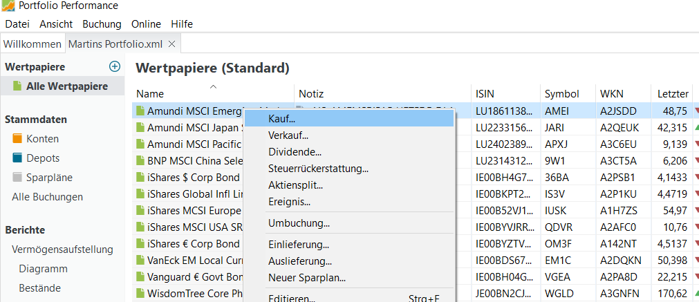
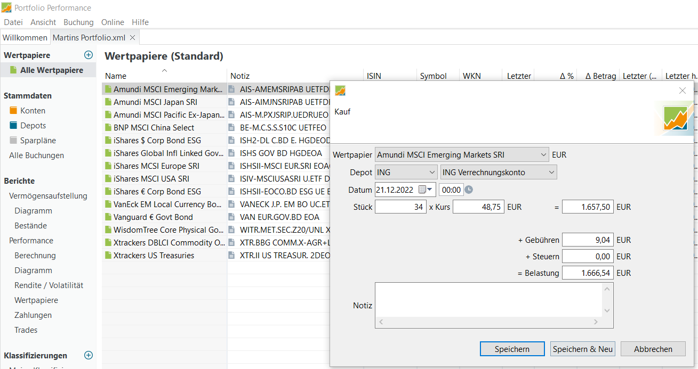
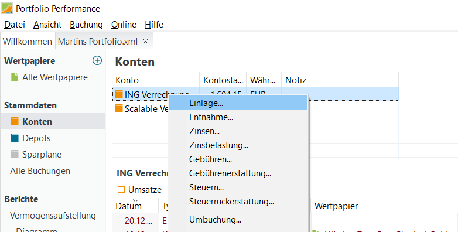

# Bestände erstmalig aufbauen

In diesem Schritt vollziehst du alle Transaktionen in deinem Depot nach, die zum heutigen Stand geführt haben. Das ist notwendig, um die Wertentwicklung unter Berücksichtigung deiner Anlageentscheidungen der Vergangenheit berechnen zu können. Alternativ kannst du auch einfach mit den aktuellen Beständen starten, oder zu einem ausgewählten Aufsetzpunkt in der Vergangenheit.

## Kauf oder Einlieferung?

Portfolio Performance bietet *Kauf, Verkauf, Einlieferung* und *Auslieferung* für die Buchung von Transaktionen an. Wo ist der Unterschied? 

Abbildung: Kauf - Zugang im Depot, belastet 
Verrechnungskonto.{class=pp-figure style="width:80%"}

Abbildung: Einlieferung - nur Zugang im Depot.{class=pp-figure style="width:80%"}

Bei einem *Kauf* bucht *Portfolio Performance* den Kauf als Zugang im Depot, und belastet dazu das zugehörige Verrechnungskonto. 

Bei einer *Einlieferung* bucht *Portfolio Performance* nur den Zugang im Depot.

## Aufsetzpunkt festlegen

Es kommt auf deine Zielsetzung an, wie weit du die zurückliegenden Transaktionen in *Portfolio Performance* erfassen möchtest. 

Um die Performance des Portfolios von der ersten Einlage bis heute zu bestimmen, musst du alle Bewegungen auf dem Depot und Verrechnungskonto seit der Einrichtung nachvollziehen. Das ist einmalig ein bisschen Arbeit, schafft aber die volle Transparenz (Variante A). Alternativ kannst du mit den Beständen aus einem Depot-Auszug (Quartals- oder Jahresauszug) beginnen, dann kannst du aber nur bis zu diesem Stichtag zurückschauen (Variante B).

### Variante A: Lückenlose Buchung aller zurückliegenden Transaktionen für Depot und Verrechnungskonto

Möchtest du die Performance der Bestände und Einlagen auf Depot und Verrechnungskonto rückwirkend nachvollziehen, musst du bei null starten. Du buchst rückwirkend,

- alle *Käufe* und *Verkäufe* für das Depot inkl. Gebühren und Steuern 
- alle *Einlagen, Entnahmen, Zinsen* und *Steuern* für das Verrechnungskonto 

Das kann je nach Alter des Portfolios und Menge der Transaktionen etwas Mühe machen. 

Auf den ersten Blick kann es dir überflüssig erscheinen, die Buchungen auf dem Verrechnungskonto auch noch zu erfassen, und nicht nur die Bewegungen im Depot. Das ist aber grundsätzlich sinnvoll:

- Dividenden werden auf das Verrechnungskonto ausgezahlt
- laufende Depotgebühren werden vom Verrechnungskonto abgebucht
- eine möglicherweise anfallende Vorabpauschale als jährlicher Steuerabschlag wird vom Verrechnungskonto abgebucht
- zuletzt ist auch das Guthaben auf dem Verrechnungskonto relevant für die gesamte Wertentwicklung deines Vermögens

### Variante B: Anlage der Bestände zu einem Stichtag, danach lückenlose Buchung  

Basis sind die Kontoauszüge von Depot und Verrechnungskonto zu einem Stichtag. Du betrachtest die Bestände der Wertpapiere im Depot und das Guthaben auf dem Verrechnungskonto zum gewählten Stichtag als "vom Himmel gefallen". Dazu buchst du 

- die Bestände zum Stichtag als *Einlieferung* in das Depot 
- den Stand des Verrechnungskontos zum Stichtag als *Einlage*.

Damit hast du einen sauberen Aufsetzpunkt für die Buchung der Transaktionen nach dem Stichtag. Du buchst du jetzt noch vom Stichtag bis heute

- alle *Käufe* und *Verkäufe* für das Depot inkl. Gebühren und Steuern 
- alle *Einlagen, Entnahmen, Zinsen* und *Steuern* für das Verrechnungskonto 

## Depot: Transaktionen buchen

Abbildung: Wertpapier für Kauf, Verkauf, Einlieferung usw. auswählen.{class=pp-figure style="width:100"}

In der linken Navigationsleiste wählst du `Alle Wertpapiere`. Jetzt kannst du das Wertpapier in der Wertpapier-Übersicht auswählen und mit der rechten Maustaste `Kauf ...`, `Einlieferung ...` usw. das entsprechende Eingabefenster öffnen. 

Abbildung: Kauf von Wertpapieren im Depot buchen.{class=pp-figure style="width:100"}

Gib Datum, Stück, Kurs, Gebühren und ggf. Steuern ein und klicke `Speichern`. 

Für viele Online-Banken und -Broker kannst du PDF-Wertpapierabrechnungen schnell und bequem importieren, sogar mehrere auf einmal. Siehe Forum/FAQ [Buchungen aus PDF-Dateien importieren](https://forum.portfolio-performance.info/t/buchungen-aus-pdf-dateien-importieren/38) .

## Verrechnungskonto: Transaktionen buchen

Abbildung: Einlagen, Entnahmen usw. für das Verrechnungskonto buchen.{class=pp-figure style="width:100"}

In der linken Navigationsleiste wählst du `Konten`. Jetzt kannst du das Konto in der Konten-Übersicht auswählen und mit der rechten Maustaste `Einlage ...`, `Zinsen ...` usw. das entsprechende Eingabefenster öffnen. 

## Buchungen überprüfen und editieren

Abbildung: Alle Buchungen für das Musterportfolio anzeigen.{class=pp-figure style="width:100"}

Du kannst deine Buchungen über die Navigationsleiste `Alle Buchungen` anzeigen, hier ist sind alle gebuchten Käufe, Verkäufe, Einlagen usw. in einer Liste aufgeführt. Bei einem Eingabefehler kannst du die Buchung hier auch editieren und korrigieren (rechte Maustaste `Buchung editieren`) oder eine fehlerhafte Buchung löschen (rechte Maustaste `Löschen`). 
