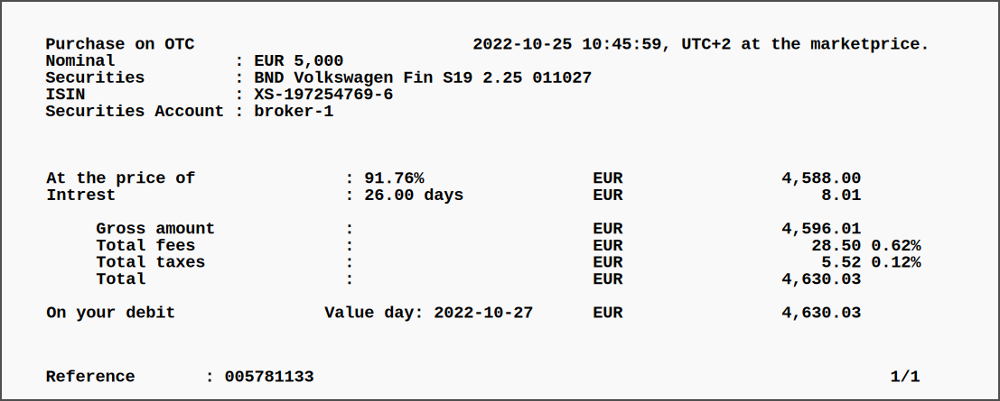
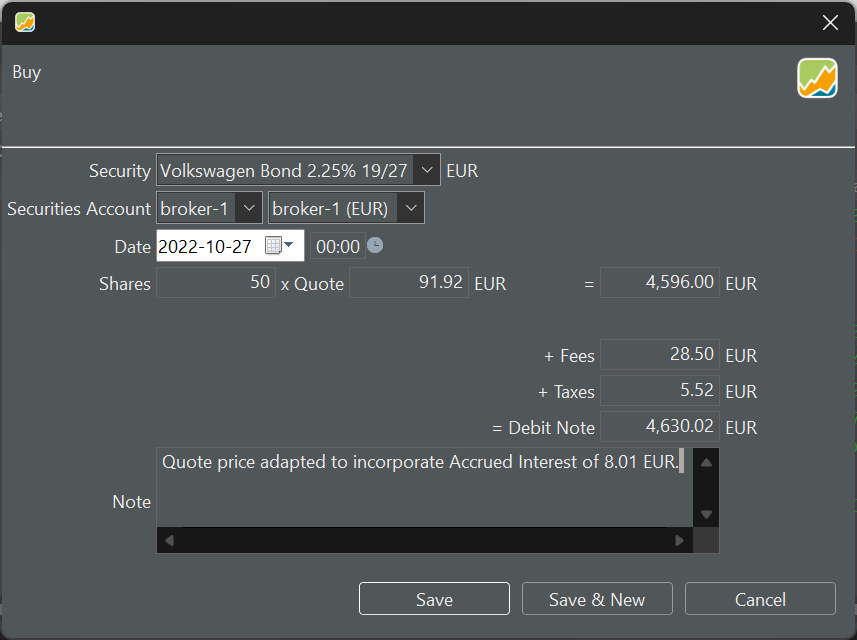
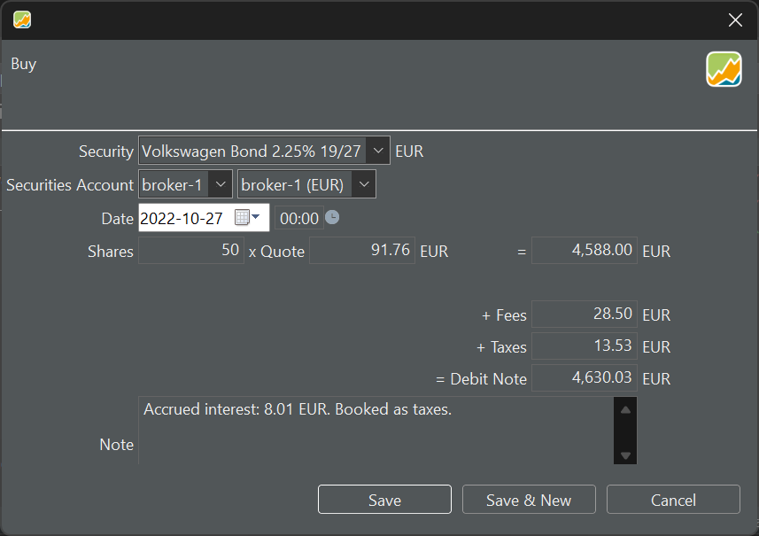
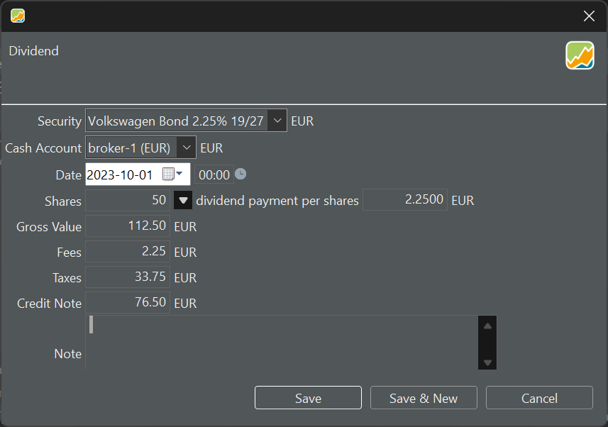

Eine Anleihe ist ein Finanzinstrument, das eine Schuldverschreibung darstellt. Wenn eine Einrichtung, z. B. ein Staat, ein Land oder ein Unternehmen, eine Anleihe ausgibt, leiht sie sich Geld von Investoren. Im Gegenzug verpflichten sie sich, den Kapitalbetrag zusammen mit regelmäßigen Zinszahlungen über einen bestimmten Zeitraum zurückzuzahlen. Anleihen werden in Portfolio Performance nicht direkt unterstützt, aber mit ein paar einfachen Tricks, die im [ Forum](https://forum.portfolio-performance.info/t/verbuchung-von-anleihen/1537/43) nachzulesen sind, kannst Du sie effektiv verwalten. 

## Hinzufügen einer Anleihe als Wertpapier

Nehmen wir einmal an, Du hast eine Anleihe von Volkswagen gekauft und erhältst eine Abrechnung ähnlicher der in Abbildung 1.

Abbildung: Abrechnung über einen Anleihenkauf{pp-figure}

Bevor Du den Kauf buchen kannst, musst Du zuerst ein [Wertpapier anlegen](../intro-wertpapiere-anlegen.md). Das Suchen nach der ISIN wird in den wenigsten Fällen erfolgreich sein. Daher musst Du ein leeres Wertpapier anlegen und ISIN sowie Symbol und WKN ausfüllen.
Historische Anleihenkurse sind nicht besonders wichtig, da die Anleihe bei Fälligkeit schließlich zu 100 % zurückgezahlt wird.  Du kannst allerdings versuchen, über [Tabelle auf einer Webseite](../../how-to/historische-aktienkurse/table-website.md) z.B. von [ariva.de ](https://www.ariva.de/XS1972547696/kurse/historische-kurse?go=1&boerse_id=1&month=&clean_bezug=1) historische Kursdaten herunterzuladen.

!!! Wichtig 
    Historische Anleihenkurse werden in der Regel in Prozent geführt und nicht wie bei einer Aktie üblicherweise in einer Währung.

## Buchen des Kaufs einer Anleihe

Da historische Kurse als Zahlen von 0 bis 100 dargestellt werden, kannst Du dieses Format auch für den Kaufkurs verwenden. Am Fälligkeitstag wird die Anleihe bei einem Kurs von 100 % einen Wert von 5000 EUR haben. In „Aktien“ und „Kursen“ ausgedrückt bedeutet das, dass Du den Wert von 50 Aktien × 100 EUR erhalten wirst. Du kaufst das Wertpapier jedoch zu 91,76 % (siehe Abrechnung in Abbildung 1). Der Bruttowert beträgt also `50 × 91,76 EUR = 4588 EUR`. Gebühren und Steuern können wie gewohnt eingetragen werden.

Die in Abbildung 1 gezeigte Anleihe wird am 1. Oktober 2027 bei einem jährlichen Zinssatz von 2,25 % fällig, der jedes Jahr am 1. Oktober zu zahlen ist. Da Du die Anleihe am 27. Oktober (Valuta) erworben hast, hast Du bereits 26 Tage aufgelaufene Zinsen. Bei einem Zinssatz von 2,25 % entspricht das einem Betrag von `5000 EUR × 2,25 % × 26/365`, also 8,01 EUR. Diese aufgelaufenen Zinsen hast Du am Kauftag an den Verkäufer zu zahlen, erhältst sie aber bei der ersten Zinszahlung am 1. Oktober 2023 zurück. Solltest Du die Anleihe vor Fälligkeit verkaufen, erhältst Du natürlich auch Stückzinsen.

Um die aufgelaufenen Zinsen korrekt zu verbuchen, gibt es einige Möglichkeiten; (siehe [Diskussion](https://forum.portfolio-performance.info/t/verbuchung-von-anleihen/1537/43) im Forum für einige Varianten).

1. Anpassen des Kaufpreises. Im Fall des Beispiels in Abbildung 1 wird der Ankaufspreis zu 4596 EUR `(=4588 + 8,01)`. Der Kurs wird zu 91,92 EUR von 91,92 % `(=4596/50)`. Der Nachteil dieser Methode ist, dass die Preisentwicklung und die Performanceberechnung nicht korrekt sind.

Abbildung: Workaround durch Anpassung des Kurspreises zur Berücksichtigung der aufgelaufenen Zinsen.{pp-figure style= "width: 70%"}

2. Um eine genaue Erfassung des Kaufpreises zu erhalten, könntest Du die aufgelaufenen Zinsen als „Steuer“ verbuchen (siehe Abbildung 3). Der Kaufpreis ist korrekt und der richtige Betrag wird vom Depotkonto entnommen.  Die „falschen“ Steuern können bei der ersten Zinszahlung mit einer „Steuerrückerstattung“ korrigiert werden.

Abbildung: Workaround für eine Buchung von aufgelaufenen Zinsen über Steuer.{pp-figure style= "width: 70%"}

3. Der Kauf des Wertpapiers wird ohne die aufgelaufenen Zinsen verbucht. Um die Stückzinsen zu verbuchen, musst Du den korrekten Betrag (8,01 EUR) von dem mit dem Wertpapier verbundenen Depotkonto auf ein separates Depotkonto umbuchen. Bei der ersten Zinszahlung wird der aufgelaufene Zinsbetrag dann wieder auf das ursprüngliche Depotkonto des Wertpapiers überwiesen. 

## Verbuchen von Zinsen

Der Buchungstyp `Wertpapier --> Kontextmenü --> Zinsen` ist für die Erfassung von Zinszahlungen auf Einlagenkonten gedacht. Dieser könnte zwar für die Verbuchung von Zinszahlungen auf Anleihen verwendet werden, aber es fehlt die Möglichkeit, das Wertpapier anzugeben, aus dem die Zinsen stammen. Folglich würde das Einlagenkonto alle Zinszahlungen zusammenfassen, ohne die Möglichkeit, eine bestimmte Zinszahlung der Wertentwicklung eines bestimmten Wertpapiers zuzuordnen.

Ein besserer, wenn auch etwas unintuitiver Ansatz besteht darin, die Buchung als   `Wertpapier --> Kontextmenü --> Dividende` zu erfassen. Dividenden sind an ein bestimmtes Wertpapier, in diesem Fall eine Anleihe, gebunden, wodurch sichergestellt wird, dass die Berechnung der Wertentwicklung der Anleihe korrekt bleibt. Je nach gewählter Aufzeichnungsoption für den Kauf (wie bereits erwähnt) könnten die folgenden drei Transaktionen durchgeführt werden. 

1. Die aufgelaufenen Zinsen werden vollständig als Dividende verbucht (siehe Abbildung 4). Die Stückzinsen (für den Verkäufer) zum Kaufzeitpunkt (8,01 EUR) haben wir bereits in den verbuchten Kaufpreis einkalkuliert.

    Abbildung: Zinszahlung 2,25 % von 5000 EUR.{pp-figure style= "width: 70%"}

    

2. Die Zinszahlung (112,50 EUR) wird um den Betrag reduziert, der bereits am Kaufdatum als Steuer verbucht wurde (8,01 EUR). Über eine Rückerstattung `Konto --> Kontextmenü --> Steuerrückerstattung` wird dieser Betrag zurückerstattet.

3. Die Zinszahlung wird um den Betrag reduziert, der auf ein separates Konto überwiesen wurde. Der aufgelaufene Zinsbetrag wird dann auf das ursprüngliche Depotkonto des Wertpapiers zurücküberwiesen.

