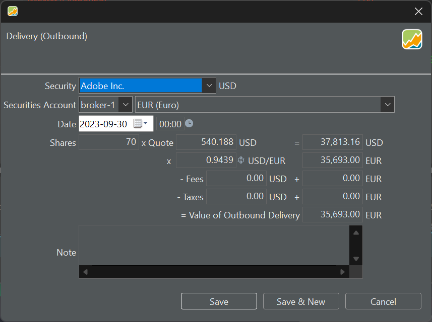

Eine Auslieferung ist die umgekehrte Buchung einer Einlieferung und ähnelt daher einer Verkaufstransaktion. Es gibt allerdings einen großen Unterschied zu einem Verkauf. Das Geld, das normalerweise aus einem Verkauf auf das Referenzkonto gebucht werden würde, gibt es nicht.
Somit wird deutlich, dass sowohl Einlieferungen als auch Auslieferungen ohne Gegenkonto auskommen.

Abbildung: 2 zeigt eine Auslieferung von Adobe-Aktien (USD), die jedoch in EUR verbucht wird.{pp-figure}

!!! Wichtig
     Obwohl der Wert einer Auslieferung, Gebühren und Steuern nicht in einem Portfolio Performance hinterlegtem Konto erfasst werden, können sie sich dennoch auf die Performance auswirken.