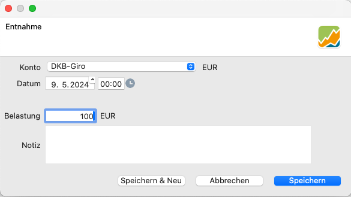

Um eine Entnahme in einer bestimmten Währung zu veranlassen, navigierst Du zum entsprechenden Konto. `Stammdaten --> Konto`. Vergewissere Dich, dass das gewählte Konto
der Währung entspricht, die Du auszahlen möchtest.

Bei einer Entnahme musst Du Dir vor Augen halten, dass Du Geld von Portfolio Performance abziehst bzw. entnimmst. 

## Entnahme buchen

Die Erfassung einer Entnahme ist ein einfacher Vorgang (siehe Abbildung 1). Gib das Entnahmekonto, das Transaktionsdatum, den Betrag und optional eine Notiz dazu ein.

Abbildung: Buchung einer Entnahme.{class=pp-figure style="width:100%"}

Bitte beachte, dass eine Entnahme Einfluss auf Deine Depotauswertung haben kann. Außerdem solltest Du schauen, dass Dein Konto nicht ins Negative läuft, denn das würde bedeuten, es handelt sich um einen Kredit. Zwar kann Portfolio Performance auch damit umgehen, wird aber in einem anderen Abschnitt behandelt.

