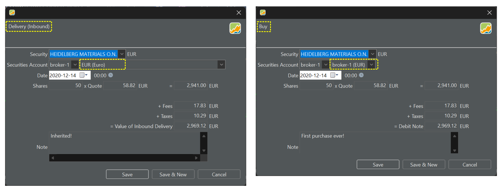

Eine Einlieferung ist mit einer Kauftransaktion vergleichbar, allerdings gibt es keine Buchung auf dem Referenzkonto. Das bedeutet, Du hältst Wertpapiere nur und hast diese eben aus Sicht von Portfolio Performance nicht gekauft. Das könnte z. B. der Fall sein, wenn man Wertpapiere erbt. Weiter kann es Sinn ergeben, eine Einlieferung in Betracht zu ziehen, wenn Du Dein Portfolio zu einem späteren Zeitpunkt als den ursprünglichen Käufen abbilden möchtest. Damit ersparst Du Dir das mühevolle Einpflegen mehrerer Kauftransaktionen (siehe dritte Option [Verwalten Deines Portfolios](index.md)). Abbildung 1 vergleicht eine Kauf- und eine Einlieferung für dasselbe Wertpapier.

Abbildung: Einlieferung vs. Kauftransaktion.{pp-figure}

Du kannst eine Transaktion in Fremdwährung erfassen, indem du die entsprechende Währung aus dem Dropdown-Menü auswählst. Außerdem ist es möglich, eine Transaktion in einer anderen Währung als der Standardwährung des Wertpapiers zu erfassen. Es wird dann ein Wechselkurs vorgeschlagen.