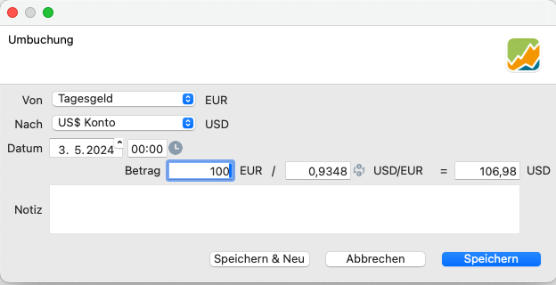

Um eine Einzahlung in einer bestimmten Währung zu veranlassen, navigierst du zum entsprechenden Konto. `Stammdaten > Konto`. Vergewissere dich, dass das gewählte Konto dieselbe Währung hat wie die Einzahlung. Um Geldbeträge zwischen Konten zu transferieren, sei es in der gleichen Währung oder in verschiedenen Währungen (unter Verwendung der von der [EZB](https://data.ecb.europa.eu/currency-converter) bereitgestellten Wechselkurse), benutzt du `Kontextmenü > Umbuchung`.

# Einzahlung buchen

Die Erfassung einer Einzahlung ist ein einfacher Vorgang (siehe Abbildung 1). Gib das Einzahlungskonto, das Transaktionsdatum, den Betrag und optional eine Notiz dazu ein.

Abbildung: Einzahlung für den Kauf von Apple Aktien.{class=pp-figure style="width:100%"}

Bitte beachten Sie, dass eine Einlage zu bestimmten Performance-Kennzahlen beiträgt. Außerdem ist zu beachten, dass jeder Wertpapierkauf zu einer Verringerung des Kontostandes führt. Wenn der Kontostand nicht ausreicht, kann dein Konto ins Minus rutschen.

# Umbuchung zwischen unterschiedlichen Währungen

Du kannst Geld zwischen zwei Konten überweisen, unabhängig davon, ob sie dieselbe Währung haben oder nicht. In Fällen, in denen die Konten unterschiedliche Währungen haben (siehe Abbildung 2), schlägt Portfolio Performance automatisch einen Wechselkurs vor, der auf der [EZB-Website](https://data.ecb.europa.eu/currency-converter) basiert.

Abbildung: Umbuchung mit vorgeschlagenem EZB Wechselkurs.{class=pp-figure style="width:100%"}

