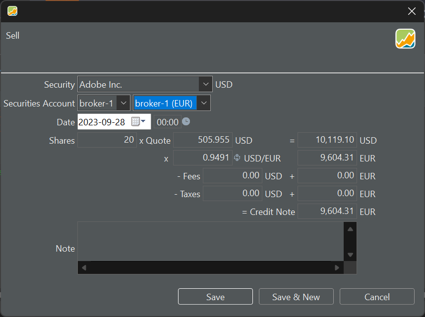

Die Verkaufstransaktion ist der Kauftransaktion sehr ähnlich. Auch hier kannst Du die Ergebnisse der Transaktion auf einem Konto mit der gleichen oder einer anderen Währung verbuchen. Im letzteren Fall (siehe Abbildung 1) werden bei der Auswahl des ausländischen Kontos (z.B. US-Dollar) drei neue Felder verfügbar: Wechselkurs, USD-Gebühren und USD-Steuern.

## Verkaufen eines einzelnen Wertpapiers

Im Demo-Portfolio haben wir die Adobe-Aktie nur einmal gekauft (10 Aktien). Alle diese Aktien haben natürlich den gleichen Preis, sodass es keine Rolle spielt, welche Aktien im Falle eines Teilverkaufs verkauft werden.

Abbildung: Verkauf eines Wertpapiers in US-Dollar über ein Depotkonto in EURO.{class=pp-figure}

In Abbildung 1 wird die Aktie in US-Dollar ausgewiesen, und folglich wird auch der Verkaufswert in US-Dollar berechnet. Da Du jedoch beabsichtigst, diese Transaktion auf einem in Euro geführten Konto zu verbuchen, muss dieser US-Dollar-Wert umgerechnet werden. Sobald Du ein Depot mit einer anderen Währung auswählst, wird das Feld für den Wechselkurs (z.B. 0,9491) automatisch mit dem korrekten Wechselkurs für dieses spezifische Datum und der entsprechenden Währung ausgefüllt. Diese Informationen werden von der Website der Europäischen Zentralbank (EZB) bereitgestellt. Du kannst sie auch über das Menü `Ansicht --> Währungen --> Währungsrechner` abrufen.

Wenn Du das Datum nachträglich änderst, wird der Wechselkurs entsprechend angepasst, auch wenn Du manuell einen Wechselkurs eingegeben hast. Daher empfiehlt es sich, zuerst das Transaktionsdatum festzulegen.

Du hast die Möglichkeit, Gebühren und Steuern in beiden Währungen einzugeben. Die ausländischen Gebühren und Steuern werden automatisch mit demselben Wechselkurs wie oben umgerechnet. Es gibt keine Zwischensumme in der Landeswährung, sodass der Gutschriftbetrag nicht einfach eine Summe der oben genannten Zahlen ist.

Der Berechnungsablauf entspricht dem in [Abbildung 3](kauf.md) auf der Kaufseite. So wird beispielsweise durch die Änderung der Gutschrift der Bruttowert in EURO angepasst, was sich wiederum auf den Bruttowert in US-Dollar (Wechselkurs bleibt unverändert) und schließlich auf den Kurspreis auswirkt.

## Verkauf eines mehrfach gehandelten Wertpapiers

In Deinem Portfolio können einige Wertpapiere mehrfach zu unterschiedlichen Preisen gekauft worden sein (siehe Abbildung 2 für ein Beispiel). Was passiert, wenn Du diese Aktie teilweise verkaufst?

Abbildung: Mehrfache Transaktion desselben Wertpapiers {class=pp-figure}

Stammen diese Anteile aus der ersten oder zweiten Tranche, die Du gekauft hast, oder aus einer Kombination von beiden? Für den eigentlichen Verkauf spielt das keine Rolle. In dem Beispiel aus Abbildung 2 wurden 40 Aktien zu einem Preis von 72,48 EUR verkauft. Aber wie werden die restlichen Anteile bewertet? Portfolio Performance folgt dem **FIFO-Prinzip** (First In, First Out). Die 40 Aktien, die verkauft werden, stammen also vollständig aus dem ersten Kauf. Was übrig bleibt, sind 10 Aktien aus der ersten Tranche und 30 Aktien aus der zweiten Tranche. Eine andere Möglichkeit wäre das LIFO-Prinzip (Last In, First Out). In diesem Fall würden 10 Aktien aus der ersten Tranche übrig bleiben und keine aus der zweiten Tranche. Macht dies einen Unterschied? In diesem speziellen Fall wird die Aktie beim FIFO-Verfahren niedrigeren durchschnittlichen Einstandspreis.

`FIFO`: Durchschnittlicher Einstandspreis der verbleibenden 40 Aktien = ((10 * 58,82) + (30 * 39,60)) / 40 = 44,05 EUR

`LIFO`: Durchschnittlicher Einstandspreis der verbleibenden 40 Aktien = ((40 * 58,82) + (00 * 39,60)) / 40 = 58,82 EUR