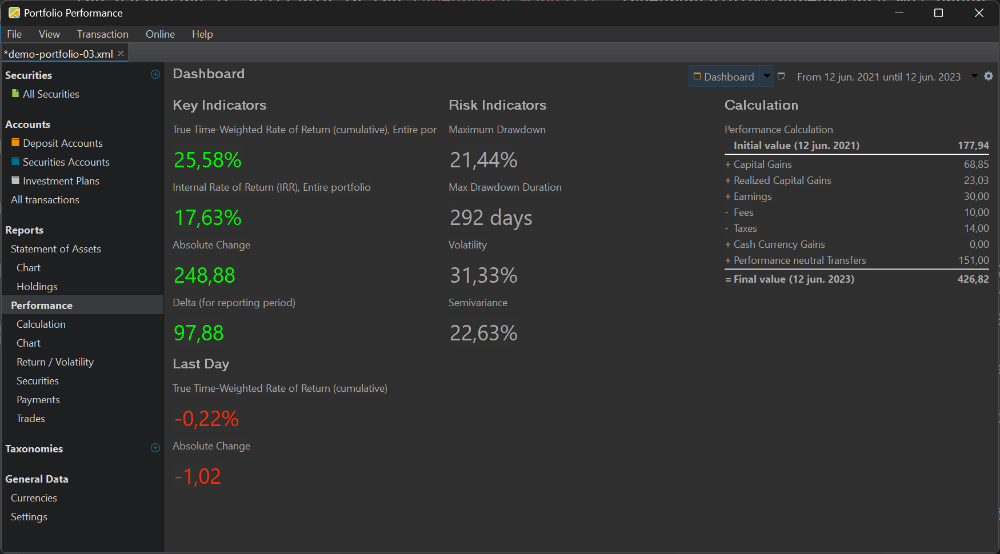

Um die Wertentwicklung Deines Portfolios zu beurteilen, solltest Du Dir zunächst das Dashboard samt den Dir zur Verfügung stehenden Dashboards ansehen. Die wichtigsten Wertentwicklungs- und Risikoindikatoren für das gesamte Portfolio werden in einem Dashboard zusammengefasst, das über das Menü `Ansicht --> Berichte --> Performance` oder über die Seitenleiste geöffnet werden kann. (siehe Abbildung 1). Eine umfassende Übersicht über das Dashboard findest Du im [Referenzhandbuch](../referenzhandbuch/ansichten/berichte/performance/index.md) unter `Ansicht --> Berichte --> Performance`. Wie immer zeigen grüne Werte einen Gewinn an, während rote Werte einen Verlust bedeuten.

Abbildung: Dashboard mit unterschiedlichen Kennzahlen für einen zweijährigen Berichtszeitraum.{class=pp-figure}

Um die hier erwähnten Erklärungen samt Bildern besser zu verstehen, lädst Du Dir am besten das [Demo-Portfolio-03](../../en/assets/demo-portfolio-03.xml) herunter. Starten wir mit dem Widget Performance-Berechnung (auf der rechten Seite) und schauen uns dies etwas genau an.

## Performance-Berechnung

- **Berichtszeitraum:** Wähle einen Zeitraum zwischen 12. Juni 2021 und 12. Juni 2023. Da wir wissen, dass wir in diesem Zeitraum Aktien erworben oder besessen haben.

!!! Wichtig
    Interessierst Du Dich für Kennzahlen ab dem initialen Kauf, so muss die Berichtszeit mindestens einen Tag vor dem ersten Kauf liegen! Dieses Verhalten gilt auch für die Auswertung auf Depotebene!

- **Anfangswert:**Hierbei handelt es sich um den Einstandspreis zu Beginn des Berichtszeitraums.
In unserem Beispiel halten wir also Wertpapiere oder Kryptowährungen im Wert von 177,94 EUR am 12. Juni 2021.
Der hier angezeigte Wert entspricht dem in Portfolio Performance gespeicherten Tagesschlusskurs und kann daher vom tatsächlichen Einstandskurs abweichen. Wann die Aktien tatsächlich gekauft wurden, spielt für diese Art der Auswertung keine Rolle, denn wir möchten einen Zeitraum innerhalb der Haltezeit auswerten und nicht die gesamte Haltezeit.

- **Endwert:**Beschreibt den aktuellen Buchwert aller in Portfolio Performance enthaltenen Anlageklassen. In unserem Beispielfall also 426,82 EUR. Um den Betrag nachvollziehen zu können, gehst Du links in die Navigation `Berichte --> Performance --> Berechnung` und öffnest den Tab `Vermögensaufstellung (Ende)`. Für das Referenzkonto siehst Du Eingänge im Wert von 125 EURO basierend auf Dividenden sowie  Verkäufen mit Gewinn.
`share-1` hat gerade einen Buchwert von 190,06 EUR, resultierend aus 10 verbliebenen Aktien mit einem aktuellen Kurs von 19,06 EUR.
`share-2 `steht gerade bei einem Kurs von 111,76 EUR, resultierend aus 8 Aktien mit einem aktuellen Kurs von 13,97 EUR.
In Summe kommen wir somit auf einen Endwert von 426,82 EUR.    `(125 EUR + 190,06 EUR + 111,76 EUR)`

!!! Wichtig
    Der Endpreis beinhaltet den initialen Kaufpreis, also den Anschaffungswert bzw. die Belastung, die beim Kauf des Wertpapiers angefallen ist.

- **Performanceneutrale Bewegung:** Hierbei handelt es sich um Einlagen, die Du beispielsweise auf Deinem Referenzkonto getätigt hast, um Wertpapiere oder Kryptowährungen zu kaufen.
Wenn Du Dir in der Beispieldatei die Buchungen ansiehst, wirst Du feststellen, dass in dem oben gewählten Zeitraum zwei Einlagen gebucht wurden. Einmal 84 EUR für einen Nachkauf von `share-1`sowie 67 EUR für einen Nachkauf von `share-2`. Der initiale Kauf von `share-1` fällt nicht in den von uns gewählten Zeitraum und wird daher in der Bilanz auch nicht berücksichtigt.

- **Realisierte Kurserfolge:**Entspricht der Summe Deiner im Zeitraum verkauften Wertpapiere oder Kryptowährungen.
Am 12. April 2024 wurden 5 Stück `share-1` zum Preis von 22,40 EUR pro Stück verkauft. Da Portfolio Performance wie auch Dein Broker das FIFO-Prinzip anwendet, liegt der Einstandskurs von `Share-1` bei 17,794 EUR. Somit ergibt sich folgende Berechnung des realisierten Kursgewinns:    `5 x (22,40 EUR - 17,794 EUR) = 23,03 EUR`.

- **Erträge:**Ergeben sich aus den Dividendenzahlungen `15 x 2 EUR = 30 EUR`. Die angezeigten **Steuern** und **Gebühren** beinhalten sämtliche Belastung im gewählten Zeitraum. Die Erfassung derselben erfolgt in der Regel via PDF-Import oder manueller Buchung anhand der Abrechnung des Brokers oder der Bank. Daher findest Du hier nicht die Gebühr des initialen Kaufs von `share-1`, denn dieses Wertpapier wurde bereits vor der gewählten Periode gekauft.

## Vermögensaufstellung

- **Absolute Veränderung:** (Links im Abbildung 1) beschreibt die Differenz zwischen Anfangs- und Endwert. `426,82 EUR - 177,94 EUR = 248,88 EUR`   In diesem Beispiel ist das Portfolio heute mehr wert als damals. Allerdings gilt es auch hier wieder zu beachten, dass der Betrag die initialen Anschaffungskosten berücksichtigt. Man kann also sagen, dieser Betrag beinhaltet die Vermögensänderung plus den Wert, welcher Portfolio Performance in Form von Einlagen zugeflossen ist.

- **Delta im Berichtszeitraum:** Beschreibt den Wert aus folgender Berechnung. `Kurserfolge` plus `Realisierte Kurserfolge` plus `Erträge` minus `Gebühren`minus `Steuern`.   
Für Dich bedeutet das: `68,85 EUR + 23,03 EUR +30 EUR - 10 EUR -14 EUR = 97,88 EUR`
Also genauso, wie es die Indikatoren im Widget Performance-Berechnung zeigen.

## Performance

-**Interner Zinsfuß (IZF):**Hierbei handelt es sich um den annualisierten Zinssatz (17,63 %), der erforderlich ist, um aus dem Anfangswert von 177,94 EUR 426,82 EUR zu machen. Performanceneutrale Einlagen in Höhe von 151 EUR werden in der Berechnung berücksichtigt. Diese Kennzahl trifft maßgeblich eine Aussage darüber, wie erfolgreich Dein Portfolio ist. Noch mehr Informationen dazu findest Du hier: [Geldgewichtete Rendite](../grundlagen/performance/geld-gewichtet.md)

!!! Wichtig
    In die Berechnung fließen alle Zu- bzw. Abflüsse inklusive des jeweiligen Zeitpunkts, sowie Kurserfolge mit ein.

-**True Time-Weighted Rate of Return (kumulativ):** Beschreibt die Zeitgewichtete Rendite. In unserem Fall 25,58 % bzw. der Weg 177,94 EUR zu 426,82 EUR. Mit dieser Kennzahl bewertest Du das Wachstum Deines Portfolios, losgelöst von performanceneutralen Geldbewegungen. Für Zeitgewichtete Rendite spielt die Höhe sowie der Zeitpunkt einer Einzahlung keine Rolle. Noch mehr Informationen dazu findest Du hier: [Zeitgewichtete Rendite](../grundlagen/performance/zeit-gewichtet.md)