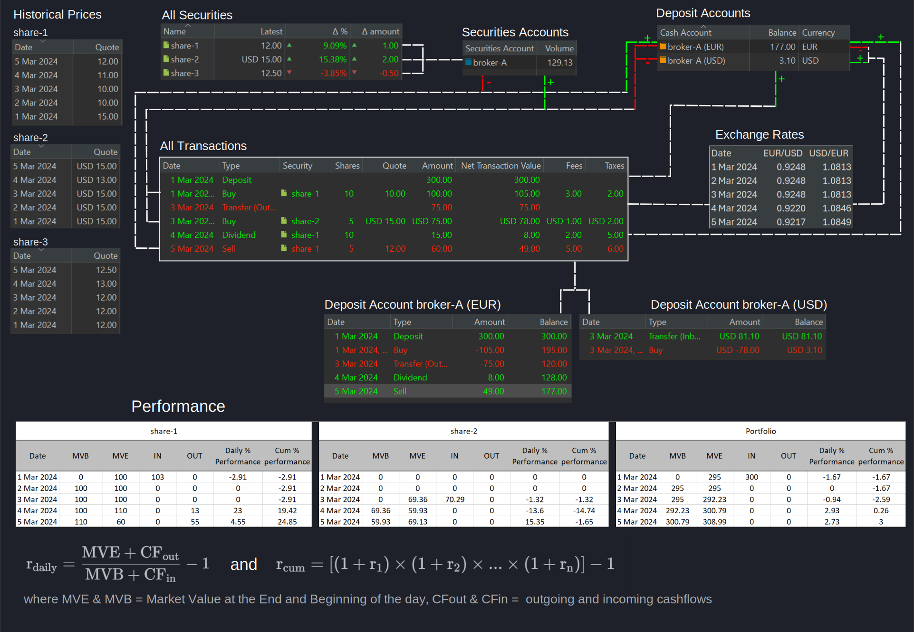

---
title: Systemübersicht Beispiel
lastUpdate: 2025-05-03
description: Übersicht über die Systemkomponenten von Portfolio Performance, detailliert wie Transaktionen, Performanceberechnungen und andere Faktoren die Gesamtperformance des Portfolios beeinflussen.
authors:
    - name: Portfolio Performance Team
    - name: Nirus2000
version: 1.0
slug: system-uebersicht
tags:
    - Portfolio Management
    - Investmentanalyse
    - Glossar
    - Portfolio Performance
changes:
    - date: 2025-05-03
      author: Nirus2000
      description:
        - YAML-Quelle hinzugefügt
todo: Alle links erstellen und referenzen bilden
----

Der Name PortfolioPerformance (PP) beschreibt seinen Zweck sehr gut: die Verwaltung eines Investmentportfolios aus einer Performance-Perspektive. Dieser Fokus unterscheidet sich von vielen proprietären Broker-Apps, die primär die technische Ausführung von Aufträgen erleichtern. Der folgende Text umreißt die wichtigsten Komponenten. Folgen Sie den Links, um weitere Informationen zu jeder Komponente zu erhalten.

Das Portfolio umfasst ein Wertpapierdepot (Broker-A) und zwei Verrechnungskonten (in EUR und USD). Der Saldo der Verrechnungskonten entspricht dem Endsaldo vom 5. März 2024. Drei Aktien mit ihren historischen Kursen wurden hinzugefügt (Alle Wertpapiere). Nur Aktie-1 und Aktie-2 haben zugehörige Transaktionen und sind somit an der Performanceberechnung beteiligt. Die [historischen Kurse](../how-to/historische-aktienkurse/index.md) sind Teil der Stammdaten der Wertpapiere. Die Wechselkurse werden unter [Ansicht > Allgemeine Daten > Währungen](../referenzhandbuch/ansichten/stammdaten/waehrungen.md) bereitgestellt.

Abbildung: Portfolio Performance Komponenten und ihre Beziehungen. {class=pp-figure}

Im Zentrum des Systems stehen die Transaktionen (Alle Transaktionen). In diesem Beispiel sind sechs Transaktionen enthalten.

1. Am 1. März 2024 wurde eine Einzahlung von 300 EUR auf das EUR-Verrechnungskonto von Broker-A getätigt, um Aktien zu kaufen.
2. Später am selben Tag wurden 10 Aktien der Aktie-1 zu 15 EUR pro Aktie gekauft. Nach Abzug von 5 EUR für Gebühren und Steuern wurden dem EUR-Verrechnungskonto von Broker-A 155 EUR belastet, sodass ein Saldo von 145 EUR verblieb.
3. Am 3. März wurden 75 EUR zu einem Wechselkurs von 0,9248 USD/EUR in USD umgetauscht, was 81,10 USD ergab. Der Saldo des EUR-Kontos von Broker-A sank auf 70 EUR, während Broker-A (USD) 81,10 USD hielt.
4. Über das USD-Verrechnungskonto wurden 5 Aktien der Aktie-2 zu 15 USD pro Aktie gekauft, was einem Netto-Transaktionswert von 78 USD entspricht. Der Saldo von Broker-A (USD) sank auf 3,10 USD.
5. Am 4. März wurde eine Dividende von 1,5 EUR pro Aktie gezahlt. Nach Abzug von 7 EUR für Gebühren und Steuern erhöhte sich der Saldo von Broker-A (EUR) um 15 EUR auf 78 EUR.
6. Am 5. März wurden 5 Aktien der Aktie-1 zu 12 EUR pro Aktie verkauft, was einem Netto-Transaktionswert von 60 EUR entspricht. Nach Abzug von 11 EUR für Gebühren und Steuern erhöhte sich der Saldo von Broker-A (EUR) auf 127 EUR.

Der Transaktionsfluss auf den Verrechnungskonten ist klar nachvollziehbar (wie oben beschrieben). Bezüglich des Endsaldos des Wertpapierdepots von Broker-A (129,13 EUR) am 5. März enthält das Depot 5 Aktien der Aktie-1 im Wert von 60 EUR und 5 Aktien der Aktie-2 im Wert von 75 USD. Da die Basiswährung des Wertpapierdepots EUR ist, wird der USD-Wert mit einem Wechselkurs von 0,9217 USD/EUR in 69,13 EUR umgerechnet. Dies ergibt eine Summe von 129,13 EUR, was den Endsaldo des Wertpapierdepots darstellt.

Die Performance wird täglich berechnet. Zur Berechnung benötigt man den Marktwert des Vermögenswerts am Anfang (MVB) und am Ende (MVE) des Tages sowie den gesamten Netto-Betrag der eingehenden und ausgehenden Cashflows. Mit diesen Werten kann die tägliche Performance anhand der in Abbildung 1 dargestellten Gleichung berechnet werden (siehe auch). Diese täglichen Performances können dann zur Bestimmung der kumulativen Performance verwendet werden. Analysieren und vergleichen wir die Performance von Aktie-1, Aktie-2 und des Gesamtportfolios über verschiedene Tage hinweg.

- **1. März**
    * Aktie-1: Da die Aktien während des Tages gekauft werden, ist der Marktwert zu Beginn des Tages (MVB) null EUR. Der MVE beträgt 100 EUR; 10 Aktien zum Schlusskurs von 10 EUR pro Aktie. Für den Kauf der Aktie ist ein Netto-Cashflow von 103 EUR erforderlich (zur Zahlung des Kapitals und der Gebühren). Steuern werden NICHT berücksichtigt. Es gibt keine Cashflows. Die tägliche Performance = [100/(0 + 103)] - 1 = -0,0291 oder -2,91 %.
    * Aktie-2: Alle Werte sind null; die Performance ist ebenfalls null (technisch gesehen sollte sie undefiniert sein, da durch null dividiert wird).
    * Portfolio: Das Portfolio umfasst alle Wertpapiere und Verrechnungskonten. Der MVE des Portfolios ist der Marktwert von Aktie-1 (100 EUR) zuzüglich des Restbetrags auf dem Verrechnungskonto (195 EUR) oder insgesamt 295 EUR. Die tägliche Performance beträgt somit [295/(0+300)] - 1 = -0,0167 oder -1,67 %.
- **2. März**: Es gibt keine Transaktionen, und die historischen Kurse sind stabil. Die tägliche Performance ist null, und die kumulative Performance bleibt für alle Vermögenswerte auf dem gleichen Niveau.
- **3. März**
    * Aktie-1: Für Aktie-1 ändert sich nichts.
    * Aktie-2: Der MVE von Aktie-2 beträgt 76 USD (5 x 15 USD/Aktie) oder 75 x 0,9248 = 69,36 EUR. Der gesamte Cashflow entspricht dem MVE + Gebühren = 76 USD. Die tägliche Performance beträgt somit [75/(0 + 76)] - 1 = -0,0132 oder -1,32 %. Die kumulative Performance = [(1+0) x (1+0) x (1 -0,0132)] -1 = -1,32 %.
    * Portfolio: Der MVE des Portfolios ist die Summe der MVEs der beiden Aktien zuzüglich des Restbetrags auf den Verrechnungskonten: 100 + 69,36 + 120 + 2,87 (3,10 USD x 0,9248) = 292,23 EUR. Die tägliche Performance beträgt [292,23/(295+0)] - 1 = -0,0094 oder -0,094 %. Die kumulative Performance = [(1 - 0,0167) x (1 + 0) x (1 -0,0094)] -1 = -2,59 %.
- **