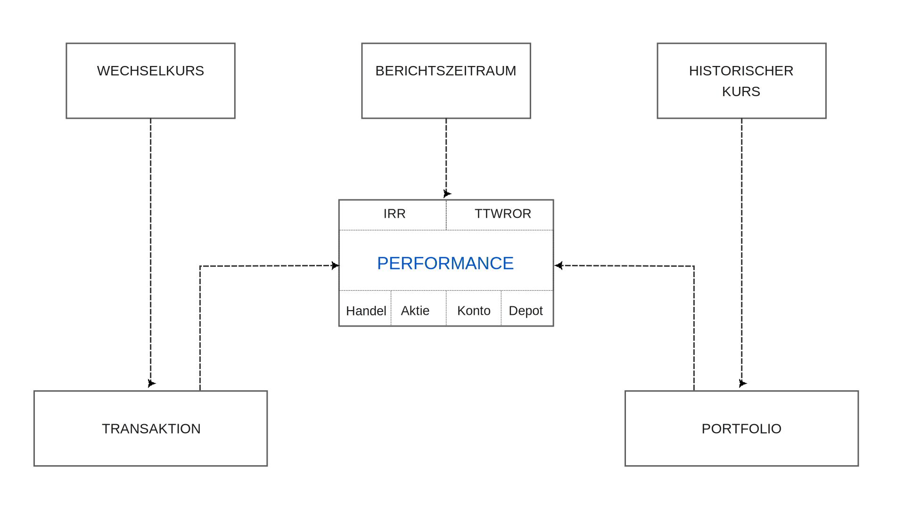
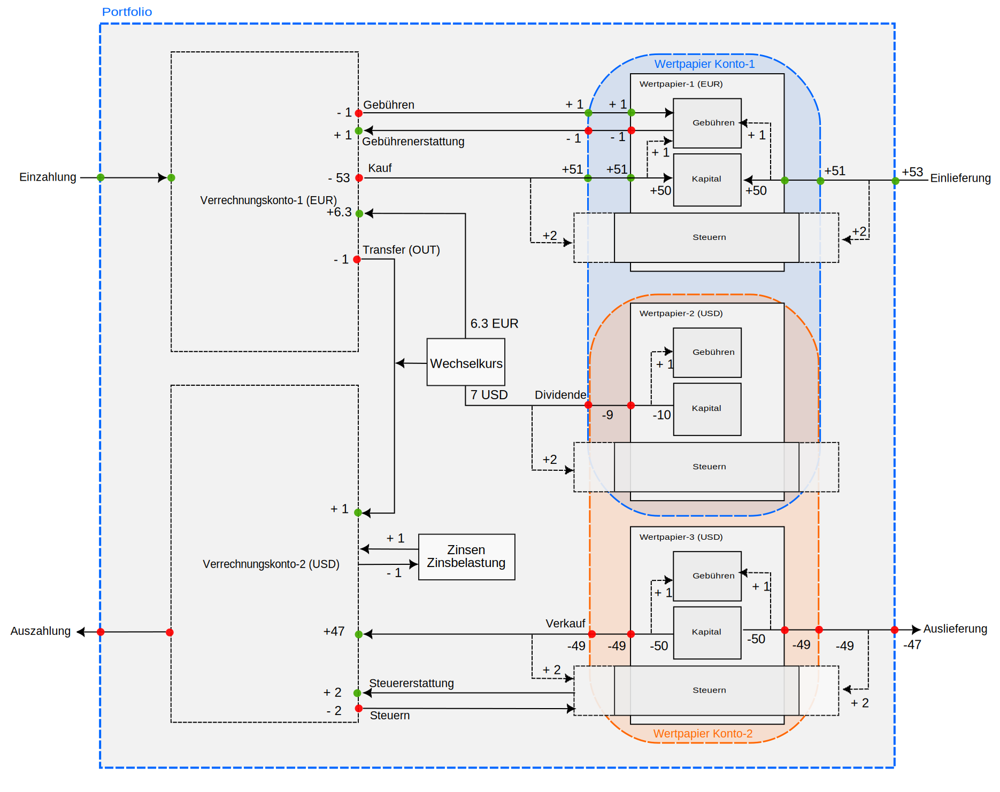

Der Name PortfolioPerformance (PP) erfasst seinen Zweck sehr gut: die Verwaltung eines Anlageportfolios aus Performance-Sicht. Dieser Fokus steht im Gegensatz zu vielen proprietären Broker-Apps, die primär die technische Ausführung von Aufträgen erleichtern. Der folgende Text umreißt die Hauptkomponenten (siehe Abbildung 1). Folgen Sie den Links, um weitere Informationen zu jeder Komponente zu erhalten. Ein [Beispiel](https://www.google.com/search?q=system-overview-example.md) mit einem einfachen Portfolio finden Sie in einem separaten Text.

## Komponenten

Abbildung: Systemübersicht mit Komponenten und Beziehungen.{class=pp-figure}

Performance ist ein vielschichtiges Konzept. Es gibt nicht nur verschiedene Methoden zur Berechnung, wie z. B. den [geldgewichteten (IRR)](https://www.google.com/search?q=./performance/money-weighted.md) und den [zeitgewichteten (TTWROR)](https://www.google.com/search?q=./performance/time-weighted.md) Renditesatz, sondern Sie können die Performance auch auf verschiedenen Ebenen berechnen: das [Portfolio als Ganzes](https://www.google.com/search?q=../reference/view/reports/performance/index.md), ein Wertpapier- oder Verrechnungskonto, ein [einzelnes Wertpapier](https://www.google.com/search?q=../reference/view/reports/performance/securities.md) oder ein einzelner [Trade](https://www.google.com/search?q=../reference/view/reports/performance/trades.md). In seiner einfachsten Form, ohne Transaktionen, kann die Performance eines Portfolios durch die folgende Gleichung dargestellt werden (detailliertere Informationen finden Sie in den oben genannten Links):

$$\mathrm{r = \frac{(MVE - MVB)}{MVB} \quad (Gl.  1)}$$

wobei MVE = der Marktwert des Portfolios am Ende des Berichtszeitraums und MVB = der Marktwert des Portfolios am Beginn des Zeitraums ist.

Die Performance wird direkt vom [Berichtszeitraum](https://www.google.com/search?q=./reporting-period.md) beeinflusst, der standardmäßig auf ein Jahr ab heute eingestellt ist. Der Berichtszeitraum bestimmt den Wert des Portfolios, des Kontos oder des Wertpapiers am Anfang und am Ende des Zeitraums (z. B. MVB und MVE in den Performancegleichungen). Im Falle des geldgewichteten Renditesatzes (IRR) bestimmt er auch die Restlaufzeit, die ein Cashflow hat, um am Ende des Berichtszeitraums einen Gewinn oder Verlust zu generieren.

[Wechselkurse](https://www.google.com/search?q=../reference/view/general-data/currencies.md) haben einen indirekteren Einfluss und kommen immer dann ins Spiel, wenn eine Transaktion eine Währungsumrechnung beinhaltet. Dazu gehören Überweisungen zwischen verschiedenen Währungskonten und Transaktionen wie Käufe, Verkäufe und Dividenden in verschiedenen Währungen. Beim Kauf von Wertpapieren, die in USD notieren, müssen Sie beispielsweise möglicherweise Euro zu einem bestimmten Wechselkurs in USD umtauschen. Beim Verkauf dieser Wertpapiere müssen Sie möglicherweise den USD wieder in Euro umtauschen. Schwankungen des Wechselkurses zwischen dem Zeitpunkt des Kaufs und dem Zeitpunkt des Verkaufs können zu einem Gewinn oder Verlust führen, da sich der Wert des USD in Euro möglicherweise geändert hat.

[Historische Kurse](https://www.google.com/search?q=../how-to/downloading-historical-prices/index.md) von Wertpapieren beeinflussen maßgeblich den Marktwert und somit die Performance des Portfolios, der Wertpapierkonten, der einzelnen Wertpapiere und der Trades. Es ist klar, dass ein profitabler Trade erzielt wurde, wenn der Kurs eines Wertpapiers am Ende eines Trades höher ist als zu Beginn. Dieser Kursanstieg führt zu einem Kapitalgewinn, der direkt zur Gesamtperformance und zum Wert des Portfolios beiträgt.

Nicht zuletzt hängt die Performance direkt vom Portfolio und den Transaktionen ab. *Ohne* Transaktionen innerhalb des Berichtszeitraums vereinfacht sich die grundlegende Performancegleichung zu IRR = TTWROR = (MVE/MVB) - 1. Wenn MVE größer als MVB ist, wurde ein Gewinn erzielt, was zu einer positiven Performance führt. Umgekehrt, wenn MVE kleiner als MVB ist, ist das Portfolio am Ende des Berichtszeitraums weniger wert als zu Beginn, was zu einer negativen Performance führt.

## Transaktionen

Die Dinge werden komplizierter, wenn [Transaktionen](https://www.google.com/search?q=../reference/transaction/index.md) während des Berichtszeitraums stattfinden. Es gibt 13 Arten von Transaktionen, die jeweils Cashflows in das und aus dem Portfolio, dem Konto oder dem Wertpapier generieren. Abbildung 2 veranschaulicht alle Transaktionstypen zwischen den vier Hauptkomponenten: dem Portfolio (dargestellt durch eine gestrichelte blaue Linie), Einlagenkonten (Cash) in EUR und USD, drei Wertpapieren (von denen zwei in USD notieren) und zusammengefasst in zwei Wertpapierkonten (orange und blau gestrichelte Linien). Wertpapier-2 (USD) ist in beiden Konten vorhanden.

Transaktionen werden durch Pfeile dargestellt. Sie generieren Cash-Outflows (roter Kreis) oder Cash-Inflows (grüner Kreis). Die Zahlen neben den Kreisen stellen die Höhe des Cashflows dar, basierend auf einem hypothetischen Beispiel eines Kaufs oder Verkaufs von 5 Aktien zu 10 EUR/USD pro Aktie, was zu einem Kapitalzufluss von 50 EUR/USD führt. Gebühren und Steuern sind immer auf 1 bzw. 2 EUR festgelegt. Eine Dividende von 2 USD pro Aktie wird gezahlt; ein Wechselkurs von 0,9 EUR/USD wird verwendet.

Abbildung: Übersicht aller Transaktionstypen mit zugehörigen Cashflows auf Portfolio-, Konto- und Wertpapierebene.{class=pp-figure}

Ein [*Einzahlung*](https://www.google.com/search?q=../reference/transaction/deposit-removal.md) generiert zwei Cash-Inflows: einen auf Portfolioebene und einen auf Ebene des Einlagenkontos. Diese Transaktion führt zu einem Inflow, da Geld auf das Einlagenkonto und somit auch in das Portfolio eingebracht wird. Andererseits erzeugt eine [*Abhebung*](https://www.google.com/search?q=../reference/transaction/deposit-removal.md) zwei Cash-Outflows und entzieht Geld von einem Cash-Konto und dem Portfolio.

Ein [*Zugang Lieferung*](https://www.google.com/search?q=../reference/transaction/delivery.md) fügt einem Wertpapier Anteile hinzu und erhöht somit das Kapital des Wertpapiers (Anteile x historischer Kurs) **und** des Wertpapierkontos. Umgekehrt verringert ein [*Abgang Lieferung*](https://www.google.com/search?q=../reference/transaction/delivery.md) das Kapital, indem Anteile vom Wertpapier entfernt werden, was zu einem Cash-Outflow führt.

Besondere Aufmerksamkeit sollte den [*Gebühren* und *Steuern*](https://www.google.com/search?q=../reference/transaction/fees-taxes.md) gewidmet werden. Der Zugang von 5 Aktien zu 10 EUR pro Aktie erhöht das Kapital um 50 EUR, erfordert aber einen Zufluss von 53 EUR in das Portfolio. Der Cash-Inflow in das Wertpapier beträgt jedoch 51 EUR, da die 1 EUR Gebühr erst nach dem Cashflow an der Wertpapiergrenze abgespalten wird. Um den Cash-Inflow oder -Outflow eines Wertpapiers zu bestimmen, sollten immer die Gebühren berücksichtigt werden. Gebühren werden als intrinsisch für die Transaktion betrachtet, während Steuern nicht als intrinsisch für ein Wertpapier betrachtet werden. Die Erhebung von Steuern variiert stark von Land zu Land, und die Performance eines Wertpapiers sollte nicht davon abhängen. Steuern sind standardmäßig von der Performanceberechnung auf Wertpapierebene ausgeschlossen. Bezüglich der Wertpapierkontoebene bietet Portfolio Performance zwei Möglichkeiten: Kontoperformance **vor** oder **nach** Steuern (Standardberechnung); siehe Menü Ansicht > Berichte > Diagramm > Diagramm konfigurieren > Datenreihe hinzufügen ... Die Standardberechnung **Nach Steuern** ist in Abbildung 2 dargestellt. Beim Überschreiten der Wertpapierkontogrenze (zweiter grüner Kreis) sind die Steuern bereits in der Steuerkomponente des Wertpapiers berücksichtigt. Der Cash-Inflow des Wertpapierkontos beträgt somit 51 EUR. Bei der Berechnung **Vor Steuern** beträgt der Cash-Inflow des Wertpapierkontos 53 EUR, da 2 EUR Steuern erst nach Überschreiten der Wertpapierkontogrenze in die Steuerentität eingezahlt werden.

Alle anderen Transaktionen sind intern für das Portfolio; sie beeinflussen die Performance des Portfolios nicht. Beispielsweise ist die *Übertrag-ab-Transaktion* ein Fluss zwischen zwei Einlagenkonten und hat als solche keinen Einfluss auf die Performance des Portfolios, außer wenn es zu einer Währungsumrechnung kommt, wie im Beispiel von Abbildung 2.

Angenommen, Sie überweisen 100 EUR ganz am Anfang des Berichtszeitraums zu einem Umrechnungskurs von 1,1 EUR/USD und erhalten eine Einzahlung von 90,91 USD. Der Wechselkurs änderte sich am Ende des Berichtszeitraums auf 0,9 EUR/USD. Da die Performanceberechnung in der Währung des Portfolios erfolgt, z. B. EUR, werden diese 90,91 USD am Periodenende mit 81,82 EUR bewertet, was zu einem Verlust von etwa 18 EUR aufgrund von Währungsverlusten führt.

Ein [*Kauf*](https://www.google.com/search?q=../reference/transaction/buy-sell.md) ähnelt stark einem Zugang Lieferung, mit dem Unterschied, dass der Cashflow aus dem Inneren des Portfolios und nicht von außen kommt. Aus Sicht des Cash-Kontos ähnelt dies einem Cash-Outflow. Das Wertpapier und das Wertpapierkonto erhalten einen Cash-Inflow. Eine Erörterung von Gebühren und Steuern finden Sie im vorherigen Text.

Ein [*Verkauf*](https://www.google.com/search?q=../reference/transaction/buy-sell.md) führt zu einem Cash-Inflow auf ein Einlagenkonto (47 USD), da der Kapitalverkauf von 50 USD um Steuern und Gebühren reduziert wird.

!!! Note
    In Bezug auf die Performance können eine Kauf-/Verkauf-Transaktion und eine Zugang/Abgang Lieferung zu deutlich unterschiedlichen Ergebnissen führen. Nur wenn eine Kauftransaktion am selben Tag und zum gleichen Betrag von einer Einzahlungstransaktion begleitet wird, gibt es keinen Performanceunterschied zwischen Kauf und Lieferung. Wenn jedoch eine Kauftransaktion nicht von einer entsprechenden Einzahlungstransaktion begleitet wird, wird der Kassenbestand auf dem betreffenden Konto reduziert (und kann potenziell negativ werden), was sich negativ auf den Marktwert am Ende (MVE) des Kontos auswirken kann.

Eine [*Dividende*](https://www.google.com/search?q=../reference/transaction/dividend.md) kann als eine Art Verkaufstransaktion betrachtet werden. In Abbildung 2 erhalten Sie für das Kapital (5 Aktien) von Wertpapier-2 (USD) eine Dividende (Bruttobetrag) von 10 USD (5 Aktien x 2 USD/Aktie). Die Gebühren werden abgezogen, was zu einem Outflow von 9 USD für das Wertpapier und das Wertpapierkonto führt. Nach Abzug der Steuern und Umrechnung der verbleibenden 7 USD in EUR wird ein Cash-Inflow von +6,3 EUR auf dem Einlagenkonto-1 (EUR) verbucht.

Die separaten Transaktionen *Gebühren*, *Gebührenrückerstattung*, *Steuern* und *Steuerrückerstattung* folgen den gleichen Regeln wie oben beschrieben. Daher macht es keinen Unterschied, ob Sie Steuern und Gebühren als Teil einer Kauf-, Verkaufs- oder Lieferungstransaktion erfassen oder ob Sie sie in separate Transaktionen aufteilen.

Eine Sonderstellung nehmen die Transaktionen *Zinsen* und *Sollzinsen* ein. Obwohl sie den Kassenbestand des Einlagenkontos erhöhen oder verringern, generieren sie **keinen** Cash-Inflow oder -Outflow. So wie das Kapital eines Wertpapiers aufgrund von Kursschwankungen steigen oder fallen kann (Kapitalgewinn oder -verlust), kann sich der Saldo eines Einlagenkontos aufgrund von Zinsen ändern.