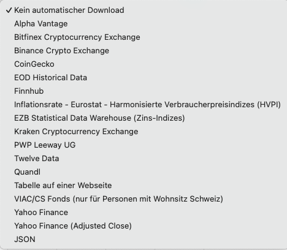

Abbildung: Historische Kursquellen Quotes.{class=align-right style="width:40%"}

Die Suche nach guten und aktuellen, aber kostenlosen Kursquellen für historische Kurse kann eine echte Herausforderung sein. Die Liste der Kursquellen in Portfolio Performance umfasst die folgenden Optionen (siehe Abbildung 1): Alpha Vantage, EOD Historical Data, Finnhub, Leeway, Twelve Data, Portfolio Report, Quandl, und Yahoo Finance. Die übrigen Alternativen sind auf Bitcoins und andere statistische Daten zugeschnitten.

Leider sind die Nutzungsbedingungen für viele dieser Quellen im Laufe der Zeit immer restriktiver geworden. Sie sind hier hauptsächlich aus Kompatibilitätsgründen aufgeführt. In der Praxis können nur Portfolio Report und Yahoo Finance oder JSON für ein typisches Portfolio empfohlen werden.

Einige spezifische Anwendungsfälle werden im Folgenden erörtert. Viele weitere sind im Forum beschrieben.

