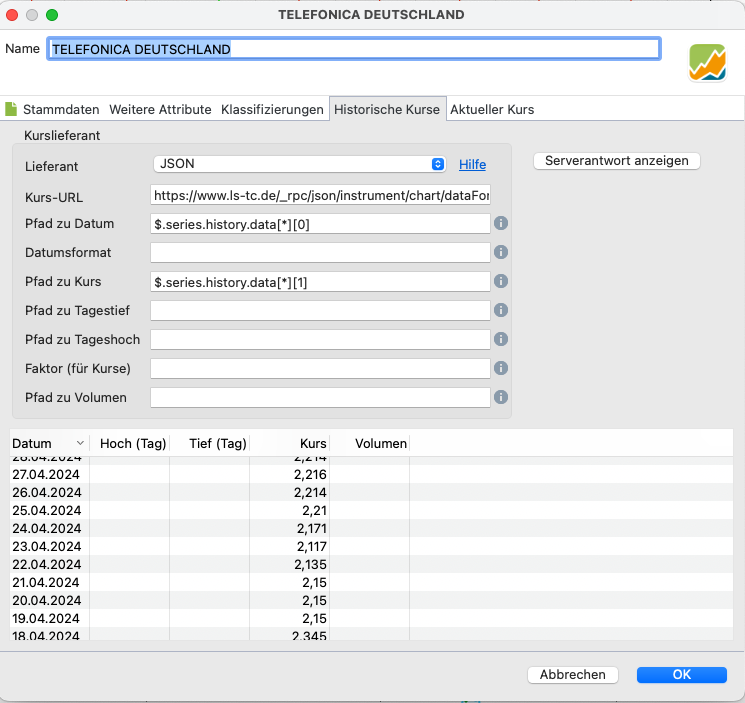
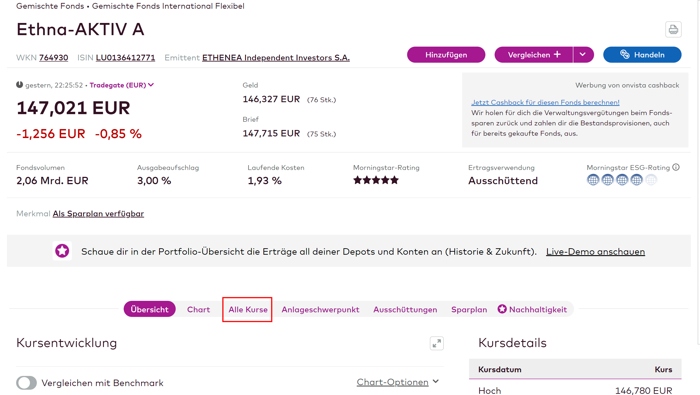
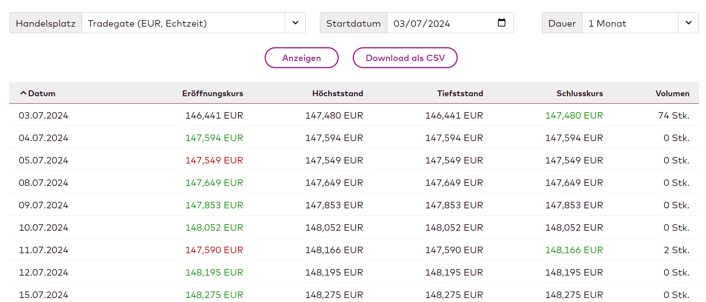
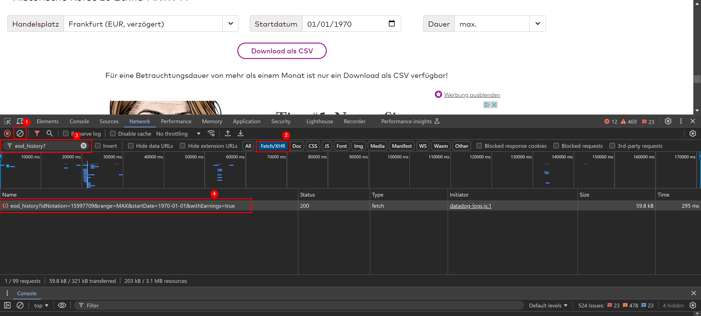
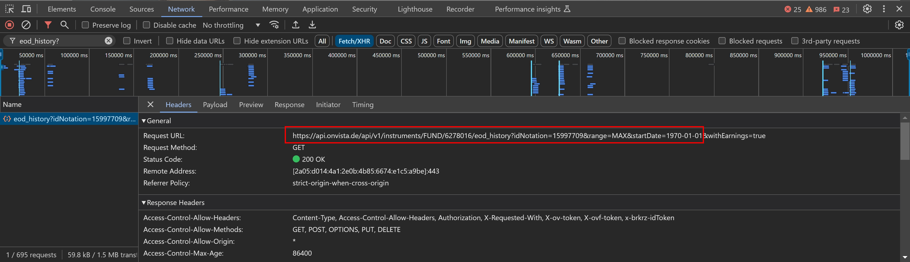
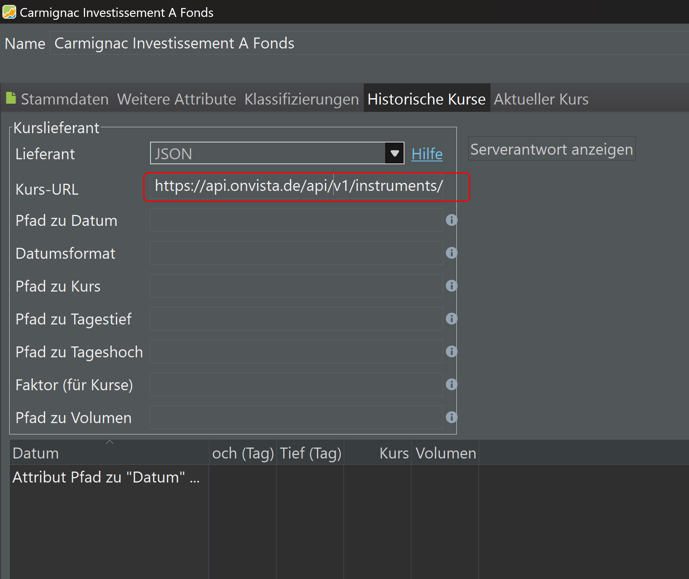
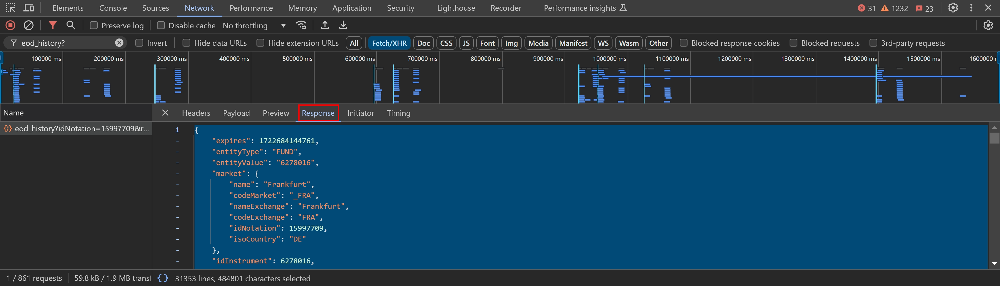
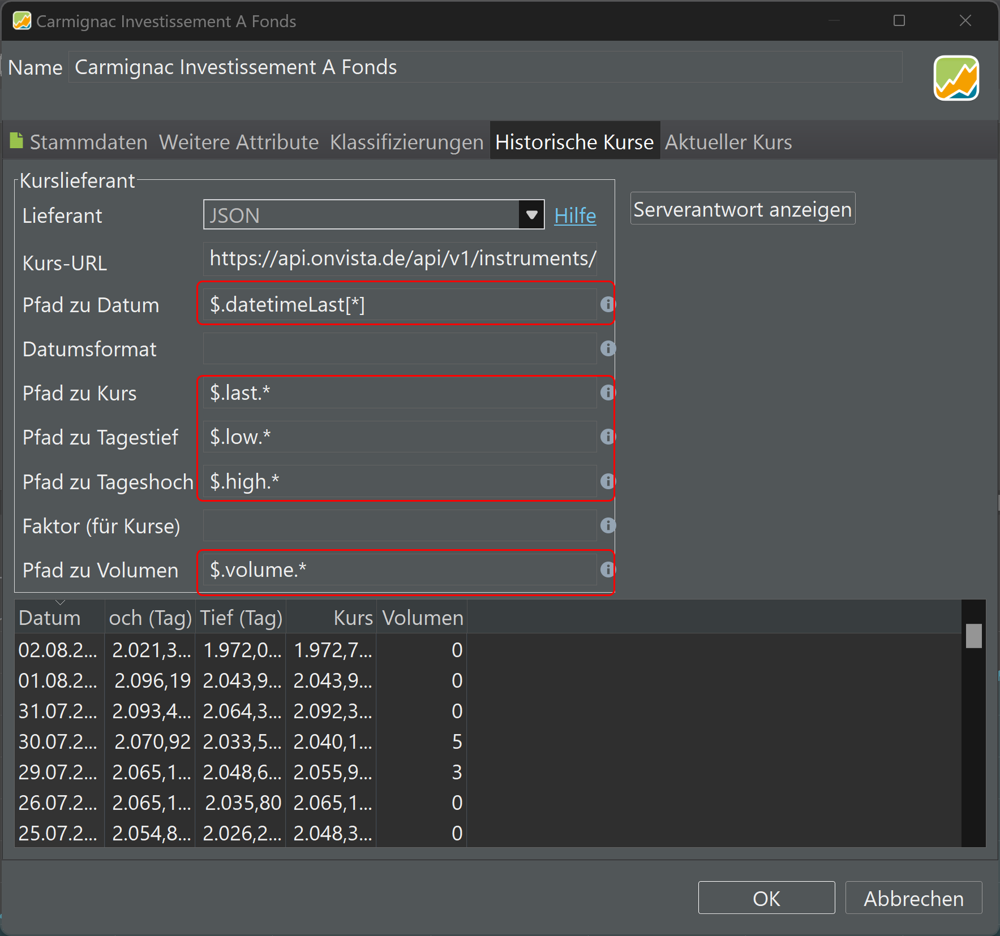

## Datenimport via API

Finanzwebseiten stellen ihre Daten, z. B. historische Kurse, in der Regel über eine Schnittstelle (API) zur Verfügung. Um auf diese historischen Kurse über die API zuzugreifen, können Benutzer HTTP-Anfragen an bestimmte API-Endpunkte senden und dabei Parameter wie Datumsbereiche, Aktiensymbole und andere relevante Filter angeben. Der API-Endpunkt (=Server) verarbeitet diese Anfragen, ruft die angeforderten historischen Kursdaten aus seiner Datenbank ab und gibt die Informationen in einem strukturierten Format, häufig JSON oder XML, zurück.

Als Beispiel dient die folgende [URL](https://eodhd.com/api/eod/AAPL?from=2024-01-15&to=2024-01-17&period=d&api_token=demo&fmt=json), um die historischen Kurse von Apple zwischen 2024-01-15 und 2024-01-17 von der Website `eod historical data` abzufragen.

`https://eodhd.com/api/eod/AAPL?from=2024-01-15&to=2024-01-17&period=d&api_token=demo&fmt=json`

Mit Stand vom Januar 2024 ist der bereitgestellte Demo-API-Token noch gültig. Sollte er in Zukunft nicht mehr funktionieren, brauchst Du einen [kostenlosen API-Schlüssel](eodhd.md).

``` JSON
[
    {
        "date": "2024-01-16",
        "open": 182.16,
        "high": 184.26,
        "low": 180.93,
        "close": 183.63,
        "adjusted_close": 183.63,
        "volume": 65603000
    },
    {
        "date": "2024-01-17",
        "open": 181.27,
        "high": 182.93,
        "low": 180.3,
        "close": 182.68,
        "adjusted_close": 182.68,
        "volume": 47317400
    }
]

```

Eine JSON-Antwort kann zwei Arten von Elementen enthalten: Listen und Objekte. Eine Liste ist eine geordnete Sammlung von Elementen zwischen [ ]. Auf diese kann über ihre Position zugegriffen werden. Ein Objekt ist eine ungeordnete Sammlung von Schlüssel-Werte-Paaren zwischen { }. Ein Schlüssel ist ein eindeutiger Identifikator für einen Wert, und ein Wert kann eine beliebige Art von Daten sein, z. B. eine Zahl, eine Zeichenkette, ein Boolescher Wert, eine Liste oder ein Objekt. Eine JSON-Antwort ist eine hierarchische Struktur, d. h. eine Liste kann andere Listen oder Objekte enthalten, und ein Objekt kann andere Listen oder Objekte enthalten.

Um auf einen bestimmten Wert innerhalb dieser hierarchischen Struktur zuzugreifen, musst Du den Pfad von der Wurzel zum Element angeben. Um auf ein Element in einer Liste zuzugreifen, musst Du seinen Index verwenden, der eine Zahl ist, die seine Position in der Liste angibt. Der Index beginnt bei 0 für das erste Element. Um auf ein Element von einem Objekt aus zuzugreifen, musst Du seinen Schlüssel verwenden, der eine Zeichenkette ist, die seinen Namen im Objekt angibt. Der Schlüssel wird in doppelte Anführungszeichen "" eingeschlossen.

Eine Abfragesprache wie *JSONPath* (von Portfolio Performance verwendet) stellt die Wurzel der JSON-Antwort mit einem $-Symbol dar. Um die Elemente im Pfad zu trennen, musst Du einen Punkt verwenden. Um zum Beispiel auf den Schlusskurs des zweiten Tages zuzugreifen, musst Du den Pfad ``$[1].close`` verwenden. Das bedeutet, dass Du mit der Wurzel $ beginnst, dann zum zweiten Element in der Liste ``$[1]`` gehst, das ein Objekt ist, und dann zum Wert mit dem Schlüssel "close" im Objekt ``$[1].close`` gehst, das eine Zahl ist.

Du brauchst diesen JSON-Pfad, um den JSON Quote Feed Provider von Portfolio Performance zu vervollständigen. Verwende  die folgenden Parameter, um die historischen Kurse abzurufen (siehe auch Abbildung 1). Eine Erklärung der Bedeutung der verschiedenen Kursnotierungen findest Du unter Grundlagen > [Historische Kurse](../../grundlagen/historische-kurse.md).

Abbildung: Server Antwort mit Kursdaten im JSON-Format (=2D.DE).{class=pp-figure}



- Kurs-URL: `https://www.ls-tc.de/_rpc/json/instrument/chart/dataForInstrument?container=chart1&instrumentId=41717&marketId=1&quotetype=mid&series=intraday%2Chistory%2Cflags&type=&localeId=2`
- Pfad zu Datum: `$.series.history.data[*][0]`
- Pfad zu Kurs: `$.series.history.data[*][1]`


Versuchen wir es mit einem etwas komplizierteren Beispiel. 
Die folgende URL ermöglicht den Abruf der beiden jüngsten Tageskurse von NVIDIA aus Yahoo Finance (klicken Sie auf den folgenden Link, um das Ergebnis zu sehen).

[https://query1.finance.yahoo.com/v8/finance/chart/NVDA?interval=1d&range=5d](https://query1.finance.yahoo.com/v8/finance/chart/NVDA?interval=1d&range=2d)

Die Antwort von Yahoo-Server ist ein langes JSON-Dokument mit allen historischen Kursen der letzten 2 Tage. 
Die Ausgabe wurde aus Gründen der Übersichtlichkeit umstrukturiert und gekürzt (scrollen Sie nach unten, um die Kurse zu sehen).

``` JSON
{
  "chart": {
    "result": [
      {
        "meta": {
          "currency": "USD", 
          "symbol": "NVDA"
        },
        "timestamp": [1705415400, 1705501800],
        "indicators": {
          "quote": [
            {
              "close": [563.82, 560.53],
              "open": [550.17, 563.46],
              "high": [568.34, 564.71],
              "low": [549, 547.40],
              "volume": [44958000, 47439400]
            }
          ],
          "adjclose": [
            {
              "adjclose": [563.82, 560.53]
            }
          ]
        }
      }
    ],
    "error": null
  }
}

```

Die JSON-Antwort von oben ist ein Objekt, das von { } umgeben ist. 
Es enthält Metadaten des Wertpapiers, Unix-Zeitstempel der beiden abgerufenen Daten und die verschiedenen Kurswerte. Du brauchst einen JSON-Pfad, um die verschiedenen Werte abzurufen:

- Fehler Code: `$.chart.error`
- Metainformation der Aktie: `$.chart.result[0].meta`.  Das Ergebnis kommt in einem Array, selbst wenn es sich nur um eine Aktie handelt, denn man hätte auch 2 und mehr Aktien abfragen können.
- Symbol (): `$.chart.result[0].meta.symbol`
- Abgefragtes Datum: `$.chart.result[0].timestamp[*]`. Das * dient als Platzhalter, um alle Variablen lesen zu können
- Zweites Datum: `$.chart.result[0].timestamp[1]`
- Alle verfügbaren Kurse (inkl. bereinigter Kurse): `$.chart.result[0].indicators`
- Alle nicht bereinigten Kurses: `$.chart.result[0].indicators.quote[0]`
- Schlusskurse: `$.chart.result[0].indicators.quote[0].close`
- Schlusskurs vom ersten Tag: `$.chart.result[0].indicators.quote[0].close[0]`

Wenn Du das üben möchtest, nutzt Du am besten [JSONPath Online Evaluator](https://jsonpath.com/). Kopiere die JSON-Antwort in die Eingabemaske. Ein weiteres praktisches Tool [JSONPath Finder](https://jsonpathfinder.com/).

Mit den oben genannten Informationen sollte es ein Leichtes sein, Kurse mit JSON abzurufen.

Abbildung: JSON Kursdaten Parameter.{class=pp-figure}


Bei den meisten Diensten muss man sich registrieren, um einen API-Schlüssel zu erhalten, eine eindeutige Kennung, die den Nutzer authentifiziert und den Zugang zum Dienst ermöglicht. Zwar bieten zahlreiche Finanzdienste scheinbar kostenlose API-Schlüssel an, doch erweisen sich ihre Nutzungsbedingungen und langfristigen Verpflichtungen oft als unzureichend. Portfolio Performance hat aus Kompatibilitätsgründen mehrere dieser Dienste in seiner Liste der Kursquellen-Anbieter behalten; z.B. Alpha Vantage, eodhd, .... In der Regel empfiehlt es sich, Portfolio Report und Yahoo Finance für ein typisches Portfolio zu nutzen.


## Beispiel Onvista API (Stand: 03.08.2024)
Onvista (https://www.onvista.de/) hat ein breites Spektrum an Assets und dazu auch sehr lang vorgehaltene historische Daten. 
Wer historische Daten von vor 10 Jahren und mehr benötigt (bspw. für das Tracken von Rentenversicherunge etc.),
hat hier große Chancen fündig zu werden.

Auf der Seite eines Assets kann man aktuell unter `Alle Kurse` ganz unten unter `Historische Kurse zu XYZ` 
historische Daten von einem Monat direkt einsehen. Längere Zeiträume müssen als CSV Datei runter geladen werden.

Abbildung: Alle Kurse anzeigen Onvista {class="pp-figure"}



Abbildung: Historische Kursdaten Onvista {class="pp-figure"}



In der Filterauswahl über der Tabelle ist es möglich den jeweiligen Handelsplatz auszuwählen, 
das Startdatum festzulegen und den Zeitraum, der betrachtet werden soll. Sobald mehr als ein Monat ausgewählt wird,
erscheint statt der Kursliste ein Download Button und man muss eine CSV runter laden. 
Ein automatisierter CSV Import von einer URL ist über Portfolio Performance aktuell nicht möglich. 
Da aber im Hintergrund des Download-Mechanismuses ein Call gegen die Onvista API (HTTP) stattfindet, 
welcher ein JSON object zurückliefert, kann die Call-URL und das zurückgegebene JSON für einen automatisierten Import 
genutzt werden.

Beispiel-Url:
[https://api.onvista.de/api/v1/instruments/FUND/6278016/eod_history?idNotation=35420185&range=M1&startDate=2024-07-03&withEarnings=true](https://api.onvista.de/api/v1/instruments/FUND/6278016/eod_history?idNotation=35420185&range=M1&startDate=2024-07-03&withEarnings=true)).

### URL Aufbau
Die URL unterscheidet sich, je nachdem was man in der Filterauswahl über der Tabelle ausgewählt hat.

Die wichtigen Parts sind:

- Der Wert hinter `/FUND/` (hier: `6278016`) in der URI, stellt das zu exportierende Asset dar. 
- Der Parameter `idNotation` (hier: `35420185`) bestimmt den Handelsplatz. 
- Der Parameter `range` (hier: `M1`) gibt den Betrachtungszeitraum an (Dauer).
- Der Parameter `startDate` (hier: `2024-07-03`) gibt das Startdatum der Kurse an. 

Die weiteren Parameter sind für den Import unerheblich. 

### URL ermitteln 
Um den größtmöglichen historischen Zeitraum zu beziehen, stellt man bei `Dauer` den Wert `max.` ein. 
Das Startdatum springt dann automatisch auf den Anfang der Unix Epoche `01.01.1970`. 
Anschließend wählt man den gewünschten Handelsplatz oder probiert einige Handelsplätze durch und wählt den mit der 
längsten Historie oder der besten Datenqualität. Dazu lädt man sich die Dateien zunächst exemplarisch runter und öffnet 
sie in Excel oder ähnlichem.

Um nun an die URL des Calls zu kommen, kann man die Developer Tools der jeweiligen Browser nutzen. Im Chrome kann die 
Developer Toolbar über die Taste `F12` oder die Tastenkombination `Strg+Shift+I` geöffnet werden (alternativ über das 
Browsermenü unter `Weitere Tool -> Developer Tools`).

In den Developer Tools wählt man nun den `Netzwerk` Tab und stellt den Filter `Fetch/XHR` ein. Außerdem stellt man beim 
Textfilter `eod_history?` ein. Zudem löscht man zuvor am besten einmal alle bestehenden Calls mittels des
`Clear Nework Logs`-Button. 
So bekommt man beim Ausführen des Downloads nur die Calls angezeigt, die zum Download der
CSV gehören. Nach dem erneuten Ausführen des Downloads, kann man den Download Call dann in Log-Liste sehen. 

Abbildung: Onvista API Call Developer Tools  {class="pp-figure"}



Durch Anklicken des Calls, kann man den Call genauer betrachten und sich die URL aus den Call-Details
kopieren. Den Teil `&withEarnings=true` kann man dabei auslassen. 

Abbildung: Onvista JSON URL mittels Developer Tools beziehen {class="pp-figure"}



Diese Url kann nun in Portfolio Performance als Kurs-Url eingetragen werden.

Abbildung: Onvista JSON in Call Details {class="pp-figure"}



### JSON Antwort einsehen
Um die oben erläuterten JSON Pfade zu ermitteln, kann man die URL auch einfach in der Browser Adressbar eingeben und 
man bekommt das JSON direkt im Browser angezeigt. Alternativ ist es auch im Tab `Response` in den Call-Details zu finden.

Abbildung: Onvista JSON in Call Details {class="pp-figure"}



### Beispiel JSON
Hier ein gekürztes Beispiel des gelieferten Onvista API JSONs:

```json
{
  "expires": 1722542222119,
  "entityType": "FUND",
  "entityValue": "11680838",
  "market": {
	"name": "Frankfurt",
	"codeMarket": "_FRA",
	"nameExchange": "Frankfurt",
	"codeExchange": "FRA",
	"idNotation": 15911132,
	"isoCountry": "DE"
  },
  "idInstrument": 11680838,
  "idNotation": 15911132,
  "isoCurrency": "EUR",
  "unitType": "STK",
  "datetimeStartAvailableHistory": "2006-10-20T00:00:00.000+00:00",
  "datetimeEndAvailableHistory": "2024-07-31T23:59:59.000+00:00",
  "idTradingSchedule": 66,
  "datetimeLast": [
	1719835200,
	1719921600,
	1720008000,
	1720094400,
	1720180800,
	1720440000,
	1720526400,
	1720612800,
	1720699200
  ],
  "first": [
	2107.229,
	2106.275,
	2119.345,
	2126.186,
	2114.754,
	2116.483,
	2125.949,
	2133.487,
	2152.971
  ],
  "last": [
	2109.383,
	2114.109,
	2123.822,
	2115.041,
	2119.793,
	2131.636,
	2133.645,
	2143.027,
	2132.029
  ],
  "high": [
	2109.777,
	2114.109,
	2123.822,
	2126.186,
	2119.793,
	2134.405,
	2138.599,
	2143.078,
	2154.079
  ],
  "low": [
	2102.052,
	2098.794,
	2110.312,
	2114.702,
	2112.632,
	2116.483,
	2125.949,
	2133.487,
	2132.029
  ],
  "volume": [
	0.0,
	0.0,
	0.0,
	0.0,
	0.0,
	0.0,
	0.0,
	0.0,
	40.0
  ],
  "numberPrices": [
	23,
	27,
	23,
	18,
	22,
	23,
	20,
	28,
	1
  ],
  "displayUnit": "EUR"
}
```
Aus der Struktur ergeben sich folgenden Eingaben in Portfolio Performance:

| Feld Portfolio Performance | JSON Pfad           |
|----------------------------|---------------------|
| Pfad zum Datum             | `$.datetimeLast[*]` |
| Pfad zum Kurs              | `$.last.*`          |
| Pfad zum Tagestief         | `$.low.*`           |
| Pfad zum Tageshoch         | `$.high.*`          |
| Pfad zum Volumen           | `$.volume.*`        |


#### Eingabe in Portfolio Performance
Wenn man die URL, den Datums- und den Kurs-Pfad angegeben hat, sollte Portfolio Performance bereits Kursdaten laden und 
im Dialogfenster unten anzeigen. Die anderen Felder sind nicht zwingend notwendig. 

Abbildung: Finale Settings Portfolio Performance Onvista JSON {class="pp-figure"}




