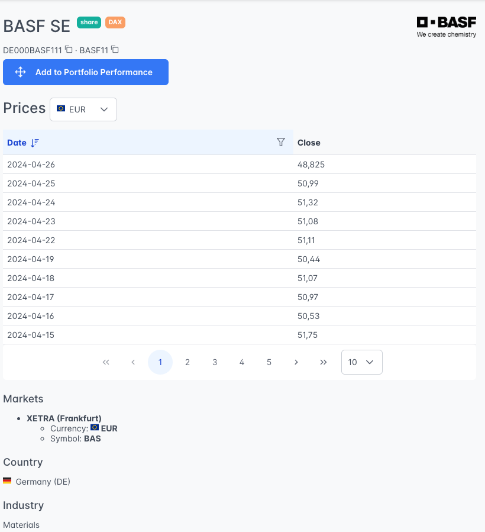
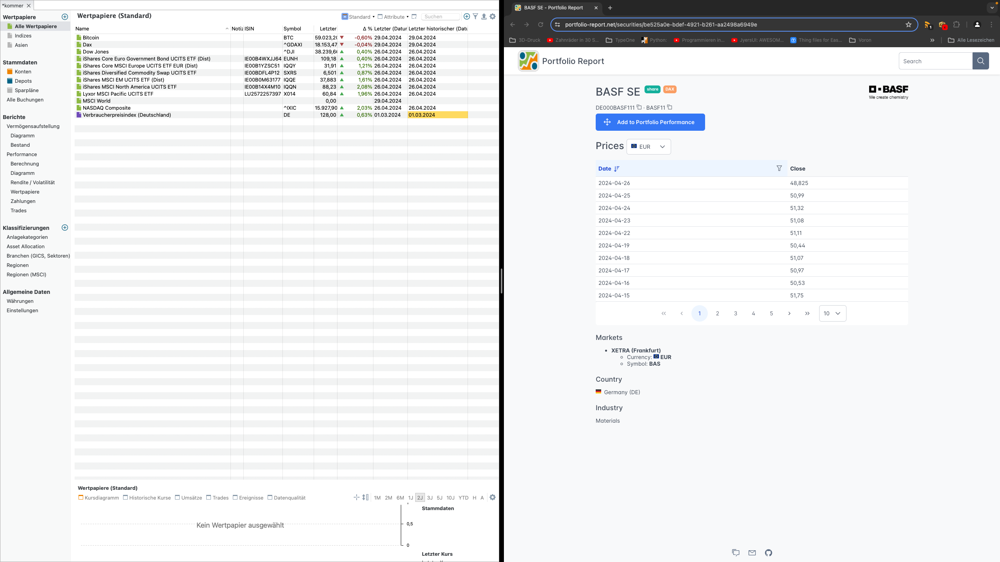
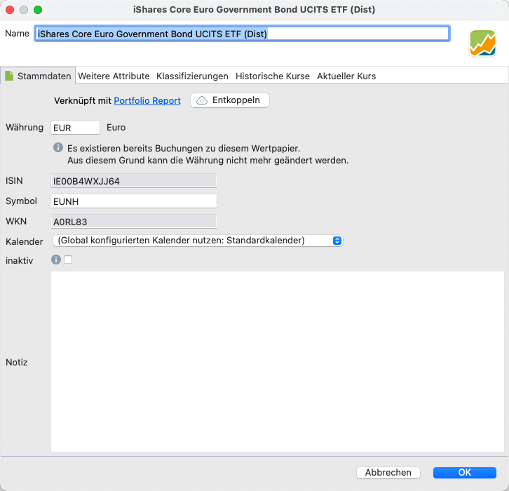
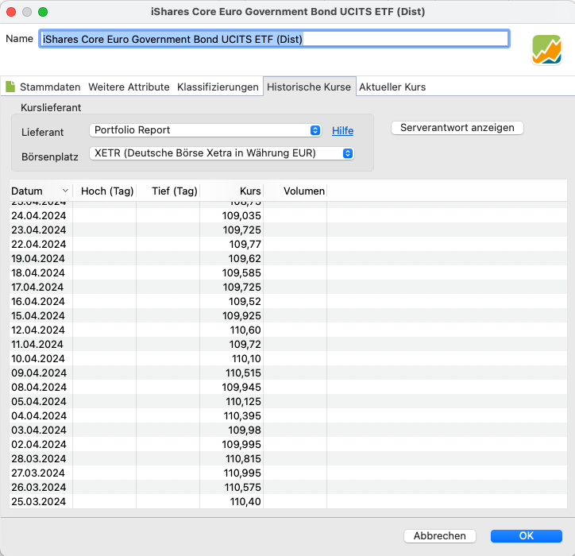

Portfolio Report (PR) ist ein Open-Source-Projekt, das eng mit der Portfolio Performance-App zusammenarbeitet. Das Hauptziel besteht darin, Portfolio Performance durch die Bereitstellung von Stammdaten, einschließlich Name, ISIN, WKN und Tickersymbol, sowie von historischen Kursen für ausgewählte Wertpapiere zu verbessern.

Du kannst Portfolio Report verwenden, um Wertpapiere anzulegen oder um historische Kurse für bereits vorhandene Wertpapiere zu erhalten.

## Neues Weretpapier mit Portfolio Report anlegen

- Navigiere zur Website von Portfolio Report [https://www.portfolio-report.net/](https://www.portfolio-report.net/)
- Öffnen Portfolio Performance und positioniere, wenn möglich, beide Fenster nebeneinander, wie in Abbildung 2 dargestellt.
- Nutze die Suche oben rechts (siehe Abbildung 1), um nach dem gewünschten Wertpapier zu suchen (Name, ISIN oder WKN).

Abbildung: Suchergebnis in Portfolio Report.{class=align-center style="width:70%"}

Wenn das Wertpapier in der PR-Datenbank enthalten ist, werden der Name (z.B. *BASF S NA O.N. *), ISIN (*DE000BASF111*) und WKN (*BASF11*) angezeigt, zusammen mit einem Logo des Wertpapiers (*Wir schaffen Chemie*) und einigen zusätzlichen Informationen wie dem Handelsmarkt (*XETRA*), der Währung (*EUR*), dem Tickersymbol auf dem angegebenen Handelsmarkt (*BAS*), der Verfügbarkeit von Preisen (*2000-01-03 - 2024-01-12*), dem Land (*Deutschland*) und dem Industriesektor (*Materials*) des Unternehmens. Auf einer zweiten Registerkarte `Preise` finden Sie die historischen Kurse des Wertpapiers.

Zur Zeit sind nur Wertpapiere, die auf XETRA (Deutsche Börse) gehandelt werden, in Portfolio Report verfügbar. Außerdem werden nur historische Kurse (d.h. Schlusskurse nach Handelsende) bereitgestellt, keine aktuellen Kurse (d.h. während des Handels auf einem Marktplatz).

- Ziehen Sie die große blaue Schaltfläche `Add to Portfolio Performance` auf das Fenster von PP (= klicken, halten und fallen lassen). Das funktiert am besten, wenn die beiden Anwendungen nebeneinander auf dem Bildschirm platziert sind (siehe Abbildung 2). Ansonsten musst du die Schaltfläche auf das PP-Symbol in der Taskleiste ziehen.

Abbildung: Mit Portfolio Report ein Wertpapier anlegen.{class=align-center style="width:90%"}

- Du kannst das erfolgreiche Hinzufügen des neu erstellten Wertpapiers überprüfen, indem du die Registerkarte Stammdaten kontrollierst. Es sollte die Meldung `Linked to Portfolio Report` angezeigt werden (siehe Abbildung 3). Außerdem sollte auf der Registerkarte "Historische Kurse" der Kurs-Feed mit den richtigen Informationen gefüllt sein. (siehe Abbildung 4.)

    Es ist wichtig zu beachten, dass durch die Verknüpfung mit Portfolio Report die Felder `ISIN` und `WKN` nicht mehr geändert werden können. Wenn du diese Felder aktualisieren möchtest, musst du die "Entkoppeln"-Schaltfläche verwenden, um die Verbindung zu Portfolio Report wieder auf zu heben. Leider wird dadurch auch die Kursquelle der historischen Kurse entfernt.

Abbildung: Neues Wertpapier mit Portfolio Report angelegt.{class=align-center style="width:50%"}

Abbildung: Historische Kurse von Portfolio Report.{class=align-center style="width:50%"}

## Ein bestehendes Wertpapier mit Portfolio Report verknüpfen

Weiterhin besteht de Möglichkeit ein bestehends Wertpapier mit PR zu verknüpfen, insbesondere um Zugang zu seiner Kurs-Quelle mit historischen Preisen zu erhalten.

- Navigiere  zur [Portfolio Report Website] (https://www.portfolio-report.net/) und suche nach dem gewünschten Wertpapier.
- Kopiere die URL der Webseite. Sie sollte mit "https://www.portfolio-report.net/securities/" beginnen, gefolgt von einer Kennung wie "be525a0ebdef4921b261aa2498a6949e". Dies ist der interne Code, den Portfolio Report diesem Wertpapier zuweist. Diu findest diese URL in der Adressleiste oder am unteren Rand des Bildschirms, wie in Abbildung 2 dargestellt.
- In Portfolio Performance wählst du das gewünschte Wertpapier in der Liste "Alle Wertpapiere" aus, klickst mit der rechten Maustaste und wählst "Mit Portfolio Report Verknüpfen". Zusätzlich musst du die Kursquelle manuell hinzufügen, indem du Portfolio Report als Kursquelle auswählst und den entsprechenden Marktplatz konfigurierst (z.B. XETRA). 

## Abrufen historischer Kurse von PR

Immer wenn Portfolio Performance Kurse aktualisiert, z.B. über das Menü `Online > Kurse aktualisieren`, wird eine Anfrage an die Portfolio Report-Website gesendet. Portfolio Report erhält nur Informationen, die technisch notwendig sind, darunter:

- Angaben zur Identifikation des Wertpapiers, des Handelsplatzes und ggf. des Zeitraums.
- Die Versionsnummer der anfragenden Portfolio Performance App.
- Die IP-Adresse des anfragenden Geräts.

Diese Informationen werden vorübergehend in Protokolldateien auf dem Server gespeichert. Die IP-Adresse wird anonymisiert gespeichert. Darüber hinaus findet keine Speicherung oder Auswertung der Daten statt.

Die obigen Informationen basieren auf einem deutschen [Artikel von Entwickler Thomas](https://forum.portfolio-performance.info/t/historische-kurse-von-portfolio-report/8600). Der [Quellcode](https://github.com/portfolio-report/pr-www) kann bei Github abgerufen werden.