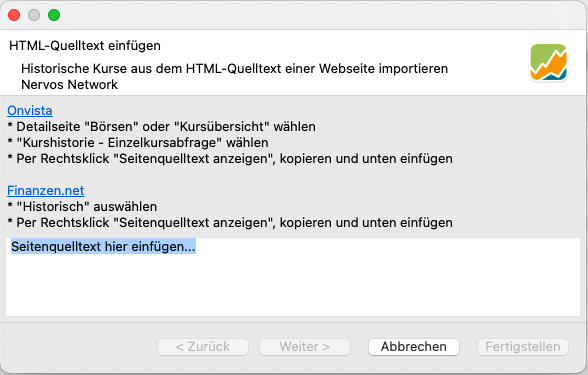

Börsen wie die NASDAQ veröffentlichen historische Kurse und Echtzeitkurse für die auf ihren Plattformen gehandelten Aktien.  Finanzwebseiten wie ariva.de bieten ein breiteres Spektrum. Diese historischen Kurse sind in der Regel in einer Tabelle mit Überschriften wie Datum, Eröffnung, Schlusskurs, ... enthalten.

Es sollte möglich sein, diese Informationen von der Website abzurufen. Portfolio Performance bietet zwei Methoden an: automatischer und manueller Abruf.

## Automatischer Abruf

ARIVA.DE ist eine deutsche Website, die Finanzinformationen und Nachrichten sowie Aktienkurse, Marktindizes, Rohstoffe, Währungen, Fonds, Zertifikate, Anleihen und mehr bietet.

Abbildung: Historische Kurse auf ARIVA.DE.{class=pp-figure style="width:80%"}

Die Webadresse lautet:
`https://www.ariva.de/aktien/nvidia-aktie/kurse/historische-kurse`.

Wenn Du diese URL in das Feld Kurs-URL in Abbildung 2 eingibst, werden die Kurse des aktuellen Monats heruntergeladen. 
Die Verwendung dieser Methode zum Anhängen der historischen Kurse ist nur wirksam, wenn Sie die Kurse regelmäßig aktualisieren, indem Sie das Portfolio öffnen.
Bitte beachte, dass Du andere Monate auswählen kannst, das bietet sich unter anderem an, wenn man Kurslücken stopfen möchte.

Abbildung: Historische Kurse von Ariva.de.{class=pp-figure style="width:80%"}

Aus unerklärlichen Gründen werden weder die Volumenangaben noch die Höchst- und Tiefstkurse von der Bourserama URL abgerufen: `https://www.boursorama.com/cours/historique/NVDA`.
Bitte beachten Sie, dass dieser Link monatliche Kurse liefert, auch wenn tägliche Kurse auf dem Bildschirm angezeigt werden.

## Manueller Abruf

Die oben beschriebene Methode funktioniert nicht immer. Einige Websites verwenden JavaScript oder andere Technologien, um die Tabellen zu erstellen.
Auf der Website Finanzen.net beispielsweise wird unter der Standard-URL `https://www.finanzen.net/historische-kurse/nvidia` nur der Kurs des aktuellen Tages angezeigt, sodass für die Anzeige anderer Zeiträume die Eingabe des Anfangs- und Enddatums erforderlich ist. In solchen Fällen könnte ein manueller Abruf benutzt werden, um diese Daten zu erfassen.

Abbildung: Manueller Abruf.{class=pp-figure style="width:80%"}

- Stelle sicher, dass die Webseite die Daten anzeigt, die Du herunterladen möchtest.
- Klicke mit der rechten Maustaste auf die Tabelle und wähle "Seitenquelltext" aus dem Kontextmenü.
- Markiere den gesamten Text mit der Tastenkombination Strg + A.
- Kopiere den Text mit dem Tastaturkürzel Strg + C.
- Navigiere zum Dialogfeld Historische Kurse; siehe [Alle Wertpapiere](../../referenzhandbuch/ansichten/wertpapiere/alle-wertpapiere.md) Abbildung 7.
- Füge den Text (Strg + V) in den markierten Bereich ein.
- Klicke auf `Weiter` und dann auf `Fertigstellen`.