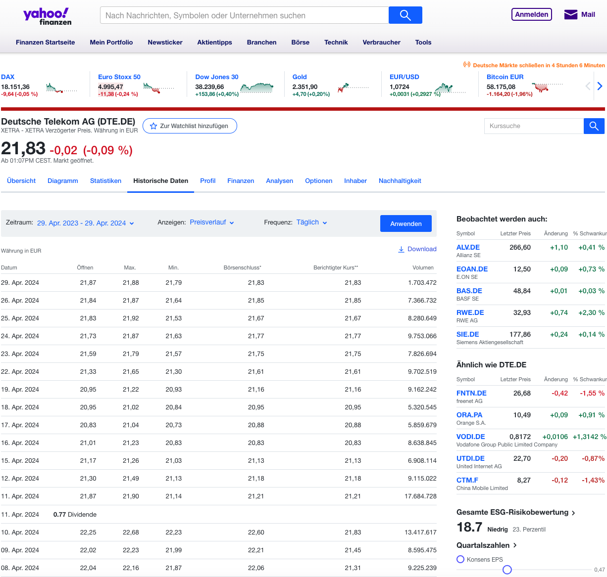

[Yahoo Finance](https://finance.yahoo.com/) bietet eine breite Palette von Tools und Finanzdaten, einschließlich historischer und Echtzeit-Aktienkurse, interaktiver Diagramme und aktueller Nachrichten, die ein breites Spektrum von Finanzmärkten abdecken.

Abbildung: Website von Yahoo Finance mit historischen Kursen der Deutschen Telekom.{class=pp-figure}

Klicke oben auf das Suchfeld und gib einen (Teil-)Namen ein, zum Beispiel "Deu". Wähle das richtige Wertpapier aus, in diesem Fall die Deutsche Telekom (DTE.DE). Navigiere zum zweiten Menü und klicke auf Historische Kurse (siehe Abbildung 1). Anschließend kannst du den Zeitraum und die Häufigkeit nach Bedarf anpassen.

!!! Hinweis
    Das Yahoo-Symbol (Ticker) ist in Klammern hinter dem Namen des Wertpapiers zu sehen, wie in Abbildung 1 dargestellt. Das Tickersymbol ist eine Reihe von Buchstaben, die ein börsennotiertes Unternehmen oder Finanzinstrument kennzeichnen. Das Tickersymbol für Apple Inc. lautet zum Beispiel "AAPL". Wenn es zu Verwechslungen kommen könnte, wie bei "DTE" (es gibt zwei Unternehmen DTE), wird der Handelsplatz hinzugefügt: "DTE.DE", um auf die Deutsche Telekom zu verweisen; ein an der Deutschen Börse gehandeltes Wertpapier oder "DTE (Standard)": DTE Energy Company, dass  an der NASDAQ gehandelt wird.