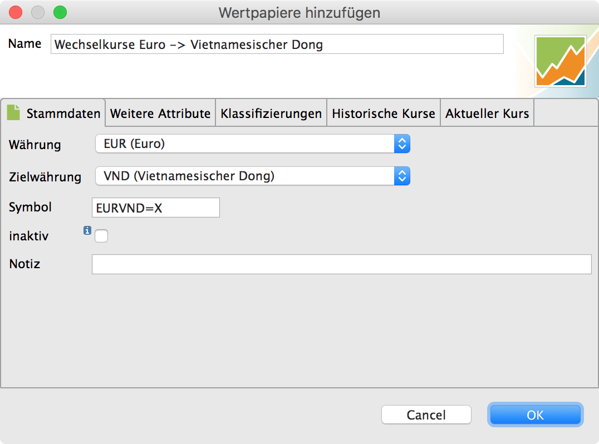
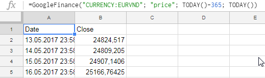

# Währungen

*Portfolio Performance* unterstützt Konten und Wertpapiere in Fremdwährungen.

* Die **Berichtswährung** stellt man unter *Berichte → Vermögensaufstellung* oben rechts in der Werkzeugleiste ein.
* Beträge in der Berichtswährung werden üblicherweise ohne Währungskürzel dargestellt (damit die Ansichten nicht unnötig viele Informationen darstellen).
* Konten und Wertpapiere können in einer Fremdwährung geführt werden. In einem Portfolio können Wertpapiere unterschiedlichster Währung existieren. Ein Wertpapier ohne Währung wird als *Aktienindex* interpretiert und kann entsprechend nicht gekauft werden.
* Neben den Wechselkursen der [Europäischen Zentralbank](#referenzwechselkurse-der-europaischen-zentralbank) kann man auch [benutzerdefinierte Wechselkurse](#benutzerdefinierte-wechselkurse) anlegen und - anlog zu Wertpapieren - aus den üblichen Quellen mit Kursen versorgen.
* Standardmäßig rechnet *Portfolio Performance* bei monetären Beträgen mit 2 Nachkommastellen und bei Wechselkursen mit 4 Nachkommastellen. Wenn der Wechselkurse invertiert wird, rechnet *Portfolio Performance* mit 10 Nachkommastellen.
* Wechselkurse können in [Mengennotierung oder Preisnotierung](#notierung) dargestellt werden.
* Beträge in einer Buchung werden - wenn möglich - mit dem Wechselkurs aus der Buchung selbst umgerechnet.

Die verfügbaren Wechselkurse finden sich unter *Allgemeine Daten --> Währungen --> Wechselkurse*.

Abbildung: Allgemeine Daten - Währungen - Wechselkurse.{class=pp-figure style="width:70%"}


## Notierung

In den Einstellungen kann man zwischen **Mengennotierung** und **Preisnotierung** umstellen.

> Die Mengennotierung gibt den Preis einer Einheit der inländischen
Währung in Einheiten der ausländischen Währung an (am Beispiel von
Europa und den USA aus europäischer Sicht: Dollar je Euro). Dagegen
gibt die Preisnotierung den Preis einer Einheit der ausländischen
Währung in Einheiten der inländischen Währung an (Euro je Dollar
aus europäischer Sicht).

> In der Eurozone, Großbritannien, Australien und Neuseeland wird heute
Mehrheitlich die Mengennotierung verwendet, während ansonsten die
Preisnotierung üblich ist, insbesondere auch in der Schweiz. [Quelle](https://de.wikipedia.org/wiki/Wechselkurs)


!!! example "Beispiele"
    Mengennotierung: EUR/USD 1,1232
    "Für einen Euro bekommt man 1,1232 US-Dollar."

    Preisnotierung: USD/EUR 0,89
    "Für einen US-Dollar muss man 0,89 Euro bezahlen."

## Währungsrechner

Mit dem Währungsrechner unter *Allgemeine Daten --> Währungen --> Währungsrechner* kann man nachvollziehen, welche Wechselkurse *Portfolio Performance* für eine Umrechnung verwendet.

In diesem Beispiel wird der *Dirham* aus den Vereinige Arabische Emiraten zunächst in *US-Dollar* und anschließend in *Euro* umgerechnet.


Abbildung: Währungsrechner.{class=pp-figure style="width:70%"}


*Portfolio Performance* gewichtet Wechselkurse und nutzt zur Umrechnung den Wechselkurs mit dem niedrigsten Gewicht:

* Benutzerdefinierte Wechselkurse haben ein Gewicht von 1
* Wechselkurse der EZB haben ein Gewicht von 2
* Invertierte Wechselkurse (Umkehrkurs) zählen zu dem Gewicht +2 hinzu
* Eine Kette von Wechselkursen (z.B. USD -> EUR -> CHD) zählt ein Gewicht von +1 hinzu

Mit diesen Gewichten wird sichergestellt, dass benutzerdefinierte Wechselkurse von denen der Europäischen Zentralbank genutzt werden. Andrerseits wird ein Wechselkurs der Europäischen Zentralbank dem Umkehrkurs eines benutzerdefinierten Wechselkurses vorgezogen. Ein direkter Wechselkurs wird einer Kette von Wechselkursen vorgezogen, die zu der gleichen Umrechnung führen würden.

## Referenzwechselkurse der Europäischen Zentralbank

*Portfolio Performance* lädt automatisch beim Start die [Referenzwechselkurse der Europäischen Zentralbank (EZB)](https://www.ecb.europa.eu/stats/exchange/eurofxref/html/index.en.html). Damit kennt *Portfolio Performance* die Wechselkurse aller wichtigen Währungen vom US-Dollar über den japanischen Yen, das britischen Pfund bis zum Schweizer Franken.

Laut Webseite werden die Wechselkurse der EZB gegen 16 Uhr aktualisiert:

> The reference rates are usually updated around 16:00 CET on every working day, except on TARGET closing days. They are based on a regular daily concertation procedure between central banks across Europe, which normally takes place at 14:15 CET. [Quelle](https://www.ecb.europa.eu/stats/policy_and_exchange_rates/euro_reference_exchange_rates/html/index.en.html)

## Benutzerdefinierte Wechselkurse

Benutzerdefinierte Wechselkurse sind in *Portfolio Performance* nichts anderes als Wertpapiere, die neben der eigenen Währung auch noch eine Zielwährung haben. Die Kurse werden zur Umrechnung der Beträge verwendet. Wechselkurse können über die gleichen Mechanismen wie [Kurse geladen](kursdaten_laden.md) werden, z.B. von Yahoo Finance oder per CSV Import.

Benutzerdefinierte Wechselkurse erstellt man mit dem Dialog *Wertpapiere -> Neuen Wechselkurs anlegen...*.

Abbildung: Wechselkurs anlegen.{class=pp-figure style="width:70%"}


Neben der Währung ("Basiswährung") gibt man die Zielwährung des Wechselkurses ein.


Abbildung: Wechselkurs editieren.{class=pp-figure style="width:70%"}




Um Kurse von **Yahoo Finance** zu laden, verwendet man ein Symbol aus der Basiswährung und Zielwährung mit dem Suffix **=X**. Für die Umrechnung von EUR (Euro) in den Vietnamesischen Dong (VND) heißt das Symbol entsprechend ```EURVND=X```.


Abbildung: Wechselkurse laden.{class=pp-figure style="width:70%"}


Alternativ kann man die Wechselkurse auch per CSV importieren: *Datei --> Importieren... --> CSV-Dateien*. Die CSV-Datei für den Kurs Euro nach Vietnamesischer Dong kann man z.B. per Google Sheets erstellen. Dazu nutzt man einfach die Funktion ```GoogleFinance``` für Euro und Dong ```CURRENCY:EURVND``` in etwa so für das letzte Jahr:


Abbildung: Wechselkurs in Google Sheet laden.{class=pp-figure style="width:70%"}



Die Google Sheets-Datei lädt man dann als CSV herunter und importiert sie danach ganz normal mit dem CSV-Import in *Portfolio Performance*.

Abbildung: Speichern aus Googe Sheet.{class=pp-figure style="width:70%"}


