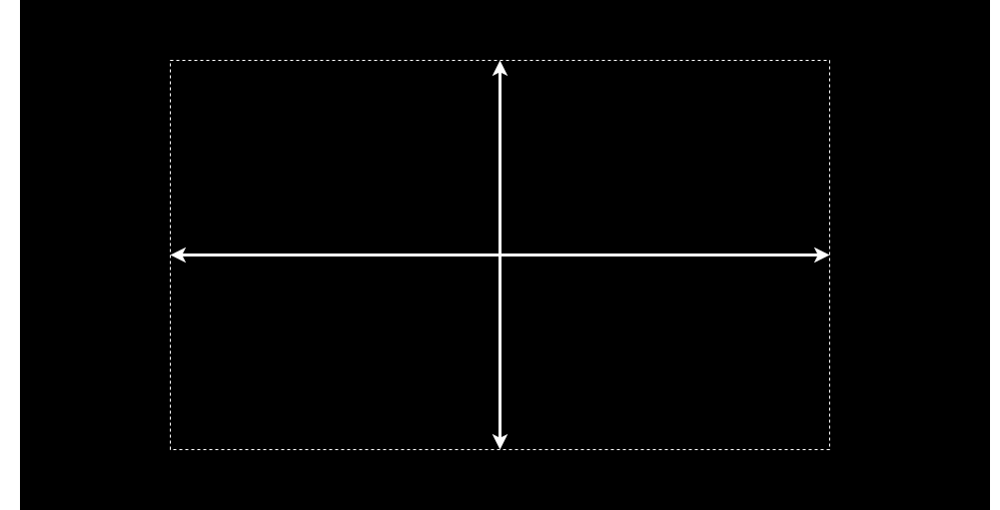

# Was ist Portfolio Performance?

Seit Anfang 2012 gibt es [Portfolio Performance](https://portfolio-performance.info), um die Performance eines Gesamtportfolios zu berechnen - über verschiedene Depots und Konten hinweg - anhand von True-Time Weighted Rate of Return und internem Zinsfuß.

*Portfolio Performance* ist ein einfaches und leistungsfähiges Tool für die Pflege Deines Wertpapier-Portfolios. Mit *Portfolio Performance* kannst Du:

- die Zusammensetzung und Entwicklung Deines Wertpapier-Portfolios mit aussagekräftigen Übersichten, Kennzahlen und Diagrammen verfolgen.
- historische Kursverläufe der Wertpapiere und Deine Käufe und Verkäufe nachverfolgen.
- die Wertpapiere im Portfolio nach Deinem Bedarf klassifizieren und die Zusammensetzung visualisieren, z. B. nach Anlageklassen und Regionen.
- die Portfoliostrategie mit Deiner geplanten Asset Allocation definieren, verfolgen und im Rebalancing sicherstellen.
- eine übergreifende Sicht über mehrere Depots und Verrechnungskonten herstellen.
- die Abrechnungen von Online-Banken und -Brokern schnell und bequem zu importieren.

*Portfolio Performance* (PP) selber versucht so einfach und intuitiv zu bleiben wie es nur geht. Aber ohne Erklärungen geht es nicht immer - viele ähnliche Fragen im [Forum](https://forum.portfolio-performance.info) zeigen das. Dieses "Handbuch" soll Euch bei den ersten Schritten mit *Portfolio Performance* begleiten, grundlegende Konzepte erklären und die erklärungsbedürftigen Features dokumentieren.

Die **Portfolio Performance** (PP) Anleitung besteht aus vier Kapiteln, die von einem bekannten [Framework zur Erstellung von Dokumentationen](https://fachglossar.platinus.at/docs/Glossar/D-Glossar/Diataxis-Framework/) abgeleitet sind. Die Dokumentation ist entlang zweier Achsen strukturiert: praktisches versus theoretisches Wissen und Lernen versus Anwenden.

- [Erste Schritte](index.md)
Wenn du neu in Portfolio Performance bist, wird dir dieses Kapitel den Einstieg erleichtern.
Es behandelt alles von der Installation über die Erstellung eines neuen Portfolios, den Import von Wertpapieren und Transaktionsdaten bis hin zur Auswertung Ihres gesamten Portfolios.

- [Grundlagen](grundlagen/index.md)
Obwohl Portfolio Performance ein äußerst intuitives und benutzerfreundliches Programm ist, können die zugrunde liegenden Finanzkonzepte komplex sein. Dieses Kapitel vermittelt ein kurzes, aber klares Verständnis der wichtigsten Portfolio-Performance-Konzepte, wie Konten, Transaktionen, Berichtszeiträume, interner Zinsfuß und mehr.

- [Referenzhandbuch](referenzhandbuch/index.md)
ist eine detaillierte und technische Beschreibung aller Funktionen und Elemente der Benutzeroberfläche des Programms.

- [How-to](how-to/index.md)
In diesem Kapitel findest du Schritt-für-Schritt-Beschreibungen gängiger Verfahren, einschließlich Datenimport, Dividendenbuchung, Suche nach historischen Kursen und mehr. Es werden auch einige Tipps & Tricks sowie Sonderfälle beschrieben.

# Mithelfen...

Wie Ihr leicht sehen könnt, gibt es noch viele weiße Seiten in diesem Handbuch. 
Meldet euch bei Interesse auch im Forum! [Vielen Dank an alle, die bisher schon mitgeholfen haben.](https://github.com/portfolio-performance/portfolio-help/graphs/contributors)
