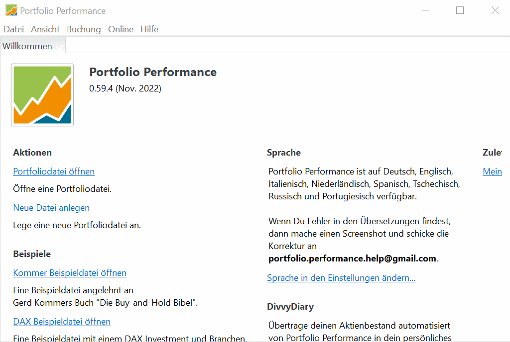

# Neue Portfoliodatei anlegen

Im ersten Schritt erstellst du in *Portfolio Performance* deine neue Portfoliodatei. Zunächst erfasst du dazu nur ein paar grundlegende Daten. Später wird die Portfoliodatei alle deine Wertpapiere, Konten, Depots, Buchungen usw. enthalten.

## Hauptwährung, Depot und Verrechnungskonto anlegen

<figcaption>Bild: Grundlegende Portfoliodaten eingeben</figcaption>

Über `Datei > Neu > Datei` richtest du das Portfolio erstmalig ein. Als Erstes wählst du _Euro_ als die Hauptwährung, die als Standard für neue Konten, Depots und Wertpapiere verwendet wird. Klicke `Weiter`. 

Dann fügst du das erste Paar aus Depot und Referenzkonto mit `Hinzufügen` hinzu. Füge ggf. weitere Depots mit ihren Referenzkonten hinzu. Klicke `Fertigstellen`. 

Im Arbeitsbereich zeigt *Portfolio Performance* jetzt die (noch leere) Vermögensaufstellung an.

## Portfoliodatei speichern

Das gerade angelegte Portfolio speicherst du über `Datei > Speichern unter ...` als Portfoliodatei im XML-Format im Dateisystem deines Computers ab. Klicke `Speichern`. 

Die Portfoliodatei wird dich lange begleiten, also passe gut darauf auf und wähle einen Ort, den du regelmäßig sicherst. Die Portfoliodatei wird am Anfang der Arbeit mit *Portfolio Performance* geöffnet und beim Abschluss gespeichert.

Du solltest dir darüber klar sein, dass die Daten mit der Standard-Option *XML* im Klartext auf die Festplatte geschrieben werden, und prinzipiell für jeden zugänglich sind, der Zugriff auf das Dateisystem hat.  
