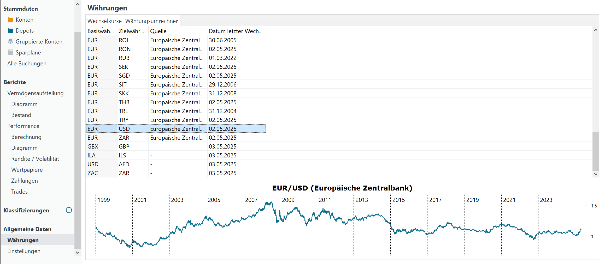
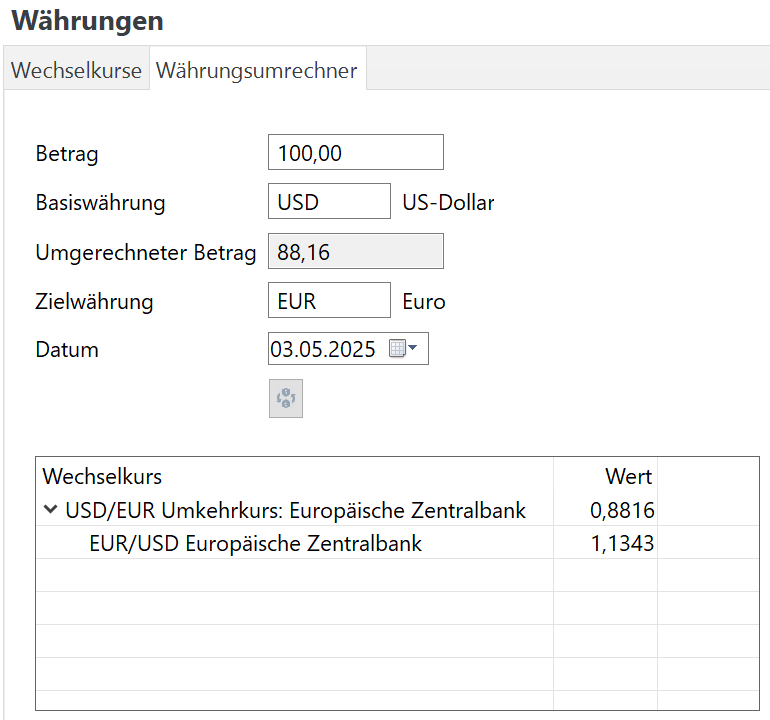

---
title: Währungen
lastUpdate: 2025-05-03
description: Anzeigen historischer Wechselkurse und Nutzung des Währungsrechners in Portfolio Performance.
authors:
    - name: Portfolio Performance Team
    - name: Nirus2000
version: 1.0
slug: waehrungen
tags:
    - Portfolio Management
    - Investmentanalyse
    - Glossar
    - Portfolio Performance
changes:
    - date: 2025-05-03
      author: Nirus2000
      description:
        - YAML-Quelle hinzugefügt
todo: Alle links erstellen und referenzen bilden
----

Historische Wechselkurse und ein Währungsrechner finden Sie im Menü `Ansicht > Allgemeine Daten > Währungen`. Es werden mehr als 50 Währungskombinationen wie EUR/USD (siehe Abbildung 1) bereitgestellt. Diese Wechselkurse werden von der [Europäischen Zentralbank](https://www.ecb.europa.eu/stats/policy_and_exchange_rates/euro_reference_exchange_rates/html/index.de.html) (EZB) abgerufen und reichen bis ins Jahr 1999 zurück, als der EUR auf den Finanzmärkten eingeführt wurde. Es handelt sich dabei um Referenzkurse, die wahrscheinlich leicht von den tatsächlichen Transaktionskursen abweichen, die Ihr Broker oder Ihre Bank verwenden wird. Es kann nur ein Diagramm angezeigt werden; keine numerischen Daten. Das Kontextmenü des Diagramms wird anderswo beschrieben.

Abbildung: Wechselkurse und Währungsrechner. {class=pp-figure}

!!! Hinweis

    Sie können eine CSV-Datei mit allen Wechselkursen seit 1999 auf der Webseite [Euro foreign exchange reference rates](https://www.ecb.europa.eu/stats/policy_and_exchange_rates/euro_reference_exchange_rates/html/index.de.html) herunterladen; scrollen Sie dazu zu den Zeitreihen.

Abbildung: Währungsrechner. {class=align-right style="width:50%"}

Die zweite Registerkarte in Abbildung 1 zeigt den Währungsrechner (siehe Abbildung 2). Mit diesem Tool können Sie jeden Betrag von der Basiswährung in eine Gegenwährung für ein bestimmtes Datum umrechnen. Auf dem Devisenmarkt (Forex) werden Währungspaare üblicherweise als XXX/YYY dargestellt, wobei XXX die Basiswährung ist. Eine Einheit der Basiswährung XXX ist YYY Einheiten der Gegenwährung wert. Zum Beispiel bedeutet am 13. Februar 2025 der Wechselkurs EUR/USD = 1,0370, dass 1 EUR 1,0370 USD wert ist.

Da EUR/USD = 1,0370 ist, folgt daraus, dass USD/EUR = 0,9643 ist. Welche Notierung bevorzugen Sie? Das hängt ein wenig von Ihrer Inlandswährung (der Währung, die Sie täglich verwenden) und Ihrer Präferenz für Multiplikation oder Division ab.

Daraus ergeben sich zwei Arten der Notierung: die direkte (oder Preis-) Notierung versus die indirekte (oder Mengen-) Notierung. Standardmäßig geht Portfolio Performance von letzterer aus, aber Sie können die Notierungsart im Menü `Hilfe > Einstellungen > Darstellung` ändern.

- Eine indirekte Notierung drückt den Betrag der Fremdwährung aus, der benötigt wird, um eine Einheit der Inlandswährung zu kaufen oder zu verkaufen. Der Preis der Inlandswährung wird in Einheiten einer Fremdwährung ausgedrückt. Für einen Bürger der Europäischen Gemeinschaft ist die Notierung EUR/USD = 1,0370 eine indirekte Notierung.
- Bei einer direkten Notierung ist die Fremdwährung die Basiswährung, während die Inlandswährung die Gegenwährung ist. Für einen Bürger der Europäischen Gemeinschaft ist die Notierung USD/EUR = 0,9643 eine direkte Notierung.

Sie können beide Arten anzeigen, indem Sie auf die Schaltfläche `Währungen tauschen` unterhalb des Datumsfelds in Abbildung 2 klicken.