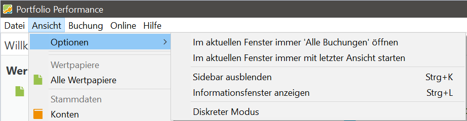

# Optionen

Das **Optionen**-Untermenü enthält verschiedene Einstellungen, um das Startverhalten des Programms und die Sichtbarkeit von Elementen auf dem Bildschirm anzupassen.

- **Immer mit „xxx“ in diesem Bereich starten**  
  Der Teil `xxx` ist variabel und hängt von der aktuell angezeigten Ansicht ab. Zum Beispiel, wenn die aktuelle Ansicht *Alle Buchungen* ist, lautet die Meldung `Immer mit 'Alle Buchungen' in diesem Bereich starten`. Wenn diese Option ausgewählt wird, wird diese Ansicht beim Starten immer im oberen Bereich angezeigt.

- **Immer mit letzter Ansicht starten**  
  Diese Option sorgt dafür, dass sich das Programm die zuletzt verwendete Ansicht (nur der obere Bereich) merkt und diese beim nächsten Öffnen wieder anzeigt.

- **Seitenleiste ausblenden … Strg+K**  
  Diese Option blendet die Seitenleiste auf der linken Seite des Bildschirms ein oder aus. Mit der Tastenkombination `Strg+K` lässt sich diese Einstellung ebenfalls umschalten.

- **Informationsbereich ausblenden … Strg+L**  
  Diese Option blendet den unteren Bereich des Bildschirms ein oder aus, der Details und Diagramme zum oberen Bereich anzeigt. Die Tastenkombination `Strg+L` schaltet diese Option um.

- **Diskreter Modus**  
  Diese Option blendet sensible monetäre Werte in deinem Portfolio aus und sorgt so für eine diskretere Anzeige. Beispielsweise werden die Anzahl der Anteile, der Marktwert, Steuern, Gebühren und andere Details durch `***` ersetzt. Der Kaufpreis, Kurswerte und Performance-Kennzahlen wie die interne Verzinsung (IRR) bleiben jedoch sichtbar.
