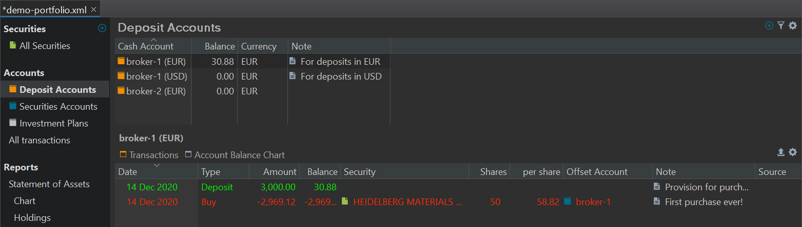
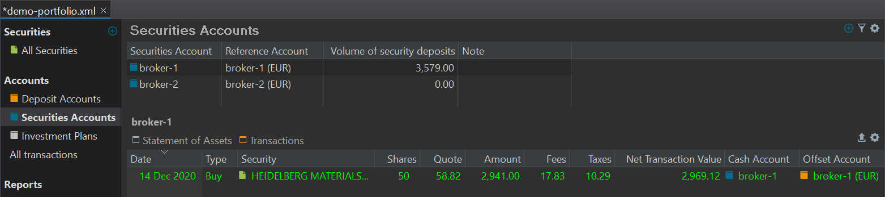

An account is a collection of [transactions](transaction.md). These transactions could include buy and sell transactions of securities (shares, etc.) for a Securities account or withdrawals and deposits of money for a Deposit account. Each account has a default currency attached. As part of the installation process, you have already created at least one Securities account and one Deposit account.

Portfolio Performance (PP) has two main types of accounts: Deposit and Securities accounts. They are described quite well in the [Guide on Getting Started](https://forum.portfolio-performance.info/t/guide-on-getting-started/5390) by Thomas (Contributor); you will need to scroll quite far down.

Other related terms are Reference account, Offset account, and Cash account.

## Deposit Account
Figure: Example of Deposit Accounts. {class="pp-figure"}

In Figure 1 (top panel), there are three deposit accounts named `Broker-1 (EUR)`, `Broker-1 (USD)`, and `broker-2 (EUR)`. Notice the column heading "Cash Account". The bottom panel shows the transactions of the selected Deposit Account `Broker-1 (EUR)`.

Deposit Accounts are used for deposits and withdrawals in EUR and USD in the two broker accounts. It's somewhat redundant to add "EUR" and "USD" in the name because you also need to specify the currency for each deposit account (see the third column in Figure 1). On the other hand, in many dialogs (for example when buying a security) you need to specify the deposit account. The added currency in the name of the deposit account will help you then choosing the correct one.

Of course, you can use other names depending on your needs. For example, if you want to keep all your dividends and taxes in a separate account, you could name it `Dividends` and `Taxes`. If you receive dividends in both EUR and USD, then you need also two deposit accounts with the name `Dividends` but with different currencies.

A deposit account is used to transfer or receive money as the result of a transaction. In Figure 1, the balance of `Broker-1 (EUR)` reflects the deposit of 3000 EUR and the purchase of each 2969.12 EUR. A deposit account can be negative. However, good practice requires that you first add a deposit of a large enough sum to cover the subsequent buy transactions, just as you would do with a real broker.

## Securities Account

A securities account will hold your securities and will be used for buying or selling securities. A securities account is most often named after the broker or bank that you use for buying or selling.

Figure: Example of Securities Accounts. {class = "pp-figure"}

Note that although `broker-1` has two deposit accounts (see figure 1), only one of them `broker-1 (EUR)` is set as the reference account. The bottom panel shows the purchase transaction with the `Broker-1`account.

## Related Terms

### Cash Account

The term Cash Account is somewhat inconsistently used. In Figure 1 (top panel; first column) it refers to a Deposit Account; which is in line with the name `Cash` Account. In Figure 2 (bottom panel)the `Cash Account`column refers to a Security Account (broker-1). 

### Reference Account

A securities account is always associated with a deposit account. This is the deposit account that will be used (if no other is explicitly assigned) for any buy or sell transaction on that securities account. This deposit account is called the Reference Account. In Figure 2, the `Broker-1` security account has a reference (deposit)account named `Broker-1 (EUR)`.

The Reference account of a Securities account must be set when creating this account (see Figure 2 of [Creating a Portfolio](../getting-started/create-portfolio.md)). You can always change the Reference account by selecting `Accounts > Securities Accounts` from the left sidebar. Double-click on the relevant Reference account currency and choose a new one from the drop-down menu (see Figure 2; second column).

### Offset Account

The offset or counter account, also known as a "Gegenkonto" in German, is an essential component when dealing with securities transactions. It acts as the counterpart to the securities account. In other words, for every transaction that occurs in the securities account, an equal and opposite entry is recorded in the offset account.

When you perform actions like buying or selling securities within your securities account, these transactions are balanced by corresponding entries in the offset account. For example, when you buy securities, the purchased securities are added to the securities account, and an equivalent amount of cash is withdrawn from the offset account. This ensures that the overall balance of your accounts remains zero or balanced.

However, also the term "Offset account" is a relative concept. Compare the bottom panels of Figure 1 and 2. For a `Deposit Account`(Figure 1), it refers to a `Security Account` and vice versa.