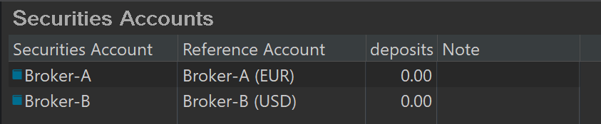

An account is a collection of [transactions](transaction.md). These could be buy and sell transactions of securities (shares, …) in case of a Securities account or the withdrawal and deposit of money for a Deposit account. Each account has a default currency attached. As part of the installation process, you should have already created at least one Securities account and one Deposit account.

PP has two main types of accounts: Securities and Deposit accounts. They are described quite well in the [Guide on getting started](https://forum.portfolio-performance.info/t/guide-on-getting-started/5390) of Thomas (Contributor); you will have to scroll quite far down.

Other related terms are “Investment Plans”, “All Transactions”, “Reference account” and “Offset account”. Sometimes a Deposit Account is called a Cash Account.

# Deposit account

{ pp-figure } 

In Figure 1, there are two deposit accounts; named EUR and USD (in column Cash Account). They are used for deposits and withdrawals in EUR and USD respectively. It's a bit redundant to call them “EUR” and “USD” because you also need to specify the currency that the account will use (see third column in figure). For example, if you want to book a dividend in EUR, you will see the following dialog box (see fig 2). The cash account can be selected from a drop-down list and the correct currency will be automatically.

You can use other names depending on your needs. For example, if you want to keep all your dividends or taxes in a separate account, you could name it “Dividends” and “Taxes” in stead of EUR and USD. Of course, you will also need to decide which currency that will be used for them. And, if you receive dividends in both EUR and USD then you need two deposit accounts with the name “Dividends” but with different currencies.

Another possibility is to name the deposit accounts with the name of the bank or broker they belong to; e.g. BNPPF, Deutsche Bank, …

A deposit account is used to transfer or receive money as the result of a transaction. In figure 1 (bottom part), 4 buy/sell transactions result in a negative balance (-2210 EUR). Good practice however requires that you first add a deposit of a large enough sum to cover the subsequent buy transactions; just as you should do with a real broker.

# Securities account

A security account will hold your securities and will be used for buying or selling securities. A security account is most of the time named after the broker or bank that you use to buy or sell.

# Related terms

## Reference account

A security account is always associated with a deposit account. This is the deposit account that will used (if no other is explicitly assigned) for any buy or sell transaction on that securities account. This deposit account is called Reference Account. In figure 3, the Broker-A security has a reference account Broker-A (EUR) while the Broker-B security account has a USD-deposit account (Broker-B (USD). Probably, you use Broker A mostly for your EUR transactions and Broker B for the USD transactions.

## Offset account
Offset account is translated from the German "Gegenkonto. It is the account used as the twin-account for a transaction. If you buy a share, then the Securities account is debeted and the "Gegenkonto" deposit account is credited.

