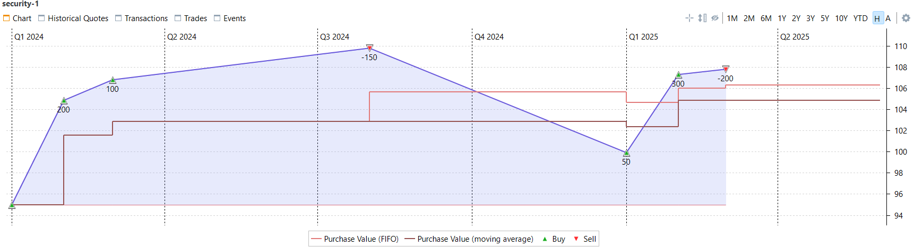
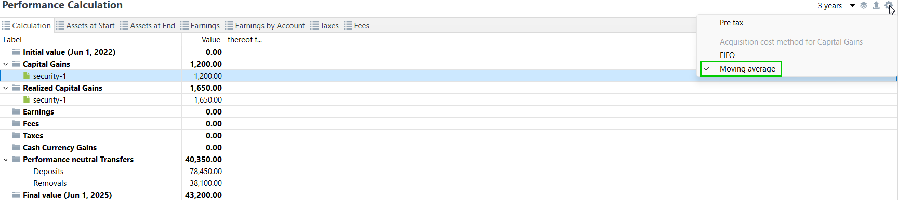
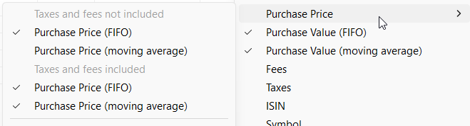

# Gains and Acquisiton Cost principle : FIFO vs Moving Average

To accurately assess realized and unrealized gains after the sale of a security, the sold amount and the remaining market value must be compared against the acquisition cost of the security. While this is straightforward in the case of a single purchase followed by a sale, various definitions and methodologies apply when multiple purchases and sales occur at different prices. Portfolio Performance calculates gains using two methodologies:

- The **FIFO** (First-In, First-Out) principle
- The **moving average** principle, also known as the **Adjusted Cost Base (ACB)** 

In the FIFO method, each share retains its original purchase price. When a sale occurs, the oldest shares are sold first, and the resulting gain or loss is determined based on their acquisition cost.
In the moving average method, all shares are assigned the same average purchase price.

!!! info "Typical use cases"
	**FIFO** is typically used in Germany 🇩🇪.  
	**Moving average** is typically used in Austria 🇦🇹 ([*GLD-Preis : gleitender Durchschnittspreis*](https://de.wikipedia.org/wiki/Gleitender_Durchschnittspreis)) , Canada 🇨🇦 ([*ACB : Adjusted Cost Base*](https://www.adjustedcostbase.ca/blog/how-to-calculate-adjusted-cost-base-acb-and-capital-gains/)), France 🇫🇷 ([*CUMP : Coût Unitaire Moyen Pondéré*](https://bofip.impots.gouv.fr/bofip/3619-PGP.html/identifiant%3DBOI-RPPM-PVBMI-20-10-20-40-20191220)).

### Example 1:

Let's consider the following transactions for a given security :

Buy : 100 shares at a share price of 95 €  
Buy : 200 shares at a share price of 105 €  
Buy : 100 shares at a share price of 107 €  
Sell : 150 shares at a share price of 110 €.  

**Moving Average method :**

The moving average Purchase Price of the 400 shares is : $\frac{(100 * 95 €)+(200 * 105 €)+(100 * 107 €)}{400} = 103 €$  
This is the Purchase Price of the 150 sold shares, and also of the remaining 250 shares.  
The **Realized Gain**  of this sell is therefore : $150 * 110 € - 150 * 103 € = 1050 €$  
The **Unrealized Gains** of the remaining shares is $250 * 110 € - 250 * 103 € = 1750 €$  
Note : the remaining shares are still at the same acquisition price than before the sale.  

**FIFO method :**

The 150 sold shares are the oldest shares : 100 from the first purchase and 50 of the second purchase.  
The **Realized Gain**  of this sell is therefore $100 * (110 € - 95 €) + 50 * (110 € - 105 €) = 1750 €$  
It is equivalent to having an average FIFO purchase price for the sold shares of $\frac{(100 * 95 €) + (50 * 105 €)}{150} = 98.33 €$  

The **Unrealized Gains** of the remaining shares is : $150 * (110 € - 105 €) + 100 * (110 € - 107 €) = 1050 €$  
It is equivalent to having an average FIFO purchase price for the remaining shares of $\frac{(150 * 105 €) + (100 * 107 €)}{250} = 105.8 €$  

Note : the remaining shares do not have the same average purchase price than before the sale, it went from 103 € to 105.8 €.  

### Example 2:
Let's add new transactions to the example above where we now own the remaining 250 shares.  
Buy : 50 shares at a share price of 100 €   
Buy : 300 shares at a share price of 107.5 €   
Sale : 200 shares at a share price of 108 €  

**Moving Average method :**

The moving average Purchase Price of the 600 shares is : $\frac{(250 * 103 €)+(50 * 100 €)+(300 * 107.5 €)}{250+50+300} = 105 €$  
This is the Purchase Price of the 200 sold shares, and also of the remaining 400 shares.  
The **Realized Gain**  of this sell is therefore : $200 * 108 € - 200 * 105 € = 600 €$  
The total Realized Gains from both sells is $1050 € + 600 € = 1650 €$  
The **Unrealized Gains** of the remaining shares is $400 * 108 € - 400 * 105 € = 1200 €$  

**FIFO method :**

The 200 sold shares are the oldest shares : the 150 from the second purchase and 50 from the third purchase.  
The **Realized Gain** of this sell is therefore $150 * (108 € - 105 €) + 50 * (108 € - 107 €) = 500 €$  
It is equivalent to having an average FIFO purchase price for the sold shares of $\frac{(150 * 105 €) + (50 * 107 €)}{200} = 105.5 €$ 
 
The total Realized Gains from both sells is $1750 € + 500 € = 2250 €$  
The **Unrealized Gains** of the remaining shares is : $50 * (108 € - 107 €) + 50 * (108 € - 100 €) + 300 * (108 € - 107.5 €) = 600 €$  
It is equivalent to having an average FIFO purchase price for the remaining shares of $\frac{(50 * 107 €) + (50 * 100 €) + (300 * 107.5 €)}{400} = 106.5 €$

Figure: Purchase Price on the Security Chart. {class= pp-figure}

Note that the moving average purchase price remains unchanged when a sale occurs, whereas the FIFO average purchase price does change.  

In summary : 

| Gains            | Moving Average | FIFO   | 
| :--------------: | :------------: | :------| 
| Unrealized Gains | 1200 €         | 600 €  | 
| Realized Gains   | 1650 €         | 2250 € | 
| Total            | 2850 €         | 2850 € | 

The total gain remains the same, but it is allocated differently between realized and unrealized gains depending on the cost methodology used. This is indeed what is presented by Portofolio Performance in [Reports > Performance > Calculation](../reference/view/reports/performance/calculation.md) :
Figure: Performance Calculation with the Moving Average method. {class= pp-figure}

Figure: Performance Calculation with the FIFO method. {class= pp-figure}

In Portfolio Performance, you can get :  

- The **Purchase Price** (average purchase cost per share) of your shares in the [Security Chart](../reference/view/securities/all-securities.md)
 and in the columns of [Reports > Statement of Assets](../reference/view/reports/statement/index.md)
 and [Reports > Performance > Securities](../reference/view/reports/performance/securities.md)
- The **Purchase Value** (Purchase Price x nb of shares) in the columns of [Reports > Statement of Assets](../reference/view/reports/statement/index.md) and [Reports > Performance > Securities](../reference/view/reports/performance/securities.md)
Figure: Purchase Price and Value columns. {class= pp-figure}

- The **Unrealized** and **Realized Capital Gains** in the [Reports > Performance > Calculation](../reference/view/reports/performance/calculation.md)
 and its associated widget and in the columns of [Reports > Statement of Assets](../reference/view/reports/statement/index.md) and [Reports > Performance > Securities](../reference/view/reports/performance/securities.md).

Figure: Performance Calculation Widget. {class= pp-figure}

