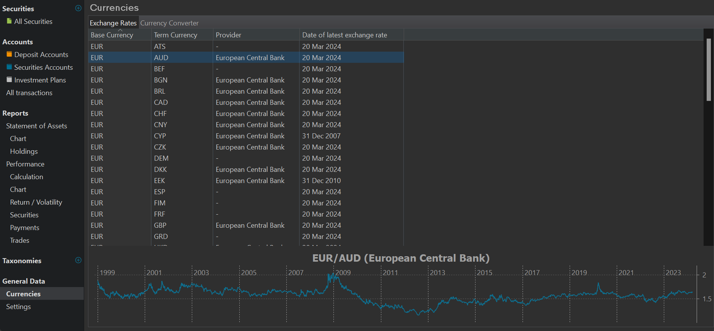
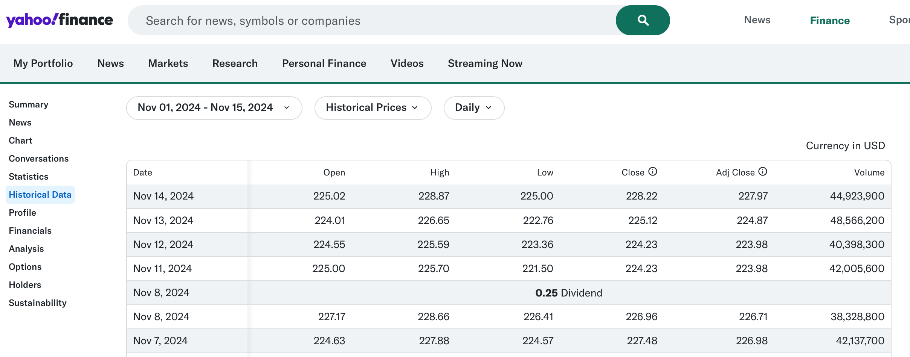

To calculate performance, PP may need two types of historical prices: historical security quotes and, in the case of foreign investments, historical exchange rates.

You can find the historical exchange rates under the menu `View > General Data > Currencies` (see Figure 1). These exchange rates are retrieved from [The European Central Bank](https://www.ecb.europa.eu/stats/policy_and_exchange_rates/euro_reference_exchange_rates/html/index.en.html) (ECB) and go back until the year 1999 when the EUR was introduced on the financial markets. They are in fact reference rates and will probably differ slightly from the real transaction rates that your broker or bank will use.

Figure: Exchange Rates. {class=pp-figure}

Securities are traded on exchange markets such as NASDAQ or XETRA, where buyers and sellers agree on a price. Historical quotes are the prices of securities at different points in time. The `Close` price is the last price of the security at the end of the trading day. Other types are the `Open` quote, the first price of the security at the start of the trading day, the `Low` and `High`quotes, which are the lowest and highest price of the security during the trading day. The `Latest` quote is the most recent price of the security available from the exchange market. The latest quote may not be the same as the close price.

Figure: Historical prices on Yahoo Finance. {class=pp-figure}

!!! Note
    PP uses the `Close` quote in its performance calculations. If there is a Latest quote available, it will be integrated in the Close price. For Bitcoins, the situation is more complex because they are traded 7/24. PP uses midnight (on the users system) to set the Close Quote. So, the historical quotes of a bitcoin could vary between users.

Sometimes, the historical quotes are adjusted to reflect certain events that affect the value of the security, such as stock splits, dividends, or mergers. These are called the `Adjusted close` quotes. They are useful for comparing the long-term performance of the security, as they account for the changes in the number of shares or the amount of cash paid to the shareholders.

There isn't a shortage of financial services that publish historical prices. However, most of them are rather expensive. Many also offer a so-called free account, but as the saying goes, *if it is free, you are the customer*." Finding *good* (precise, up-to-date) but *free* data sources for all your historical prices can be challenging. PP suggests, among others, *Alpha Vantage*, *Finnhub*, *Quandl*, which were once excellent solutions but have since changed their offerings and are not as useful anymore as free services. Their terms of use and, most importantly, their commitment in the long run often fall short. In practice, only Portfolio Report and Yahoo Finance can currently be recommended (Yahoo Finance has also placed the CSV download behind a paywall since late 2024). But see the [how-to section](../how-to/downloading-historical-prices/index.md) for some tips & tricks.

Exchange markets (must) publish the historical quotes of the securities they trade. Several financial services such as Yahoo Finance, Alpha Vantage, and others provide historical quotes for different securities and exchange markets through their websites.

There are two primary methods for obtaining financial data from the web: downloading a csv file, or using an API (Application Programming Interface) to get the data.

Both methods start with a request to the financial service or website. A request is a message that contains the information and parameters needed to access the historical quote feed. A request is sent from the client, which is the user's device or application, to the server, which is the financial service or website. The server processes the request and sends back a response. The response could be a csv file, or a structured text (JSON or XML).

In both cases, PP needs to map its internal fields, such as date and value of the quote, with the data in the response. If successfully, PP can use these fields then in its performance calculation.

!!! note
    In theory, one could scrape webpages that contain tables with historical prices (see for example, Figure 2). PP supports this method; see [Import HTML table](../reference/view/securities/all-securities.md#import-html-table). However, in practice, nowadays most service providers utilize JavaScript or another technology that hinders this scraping process.

