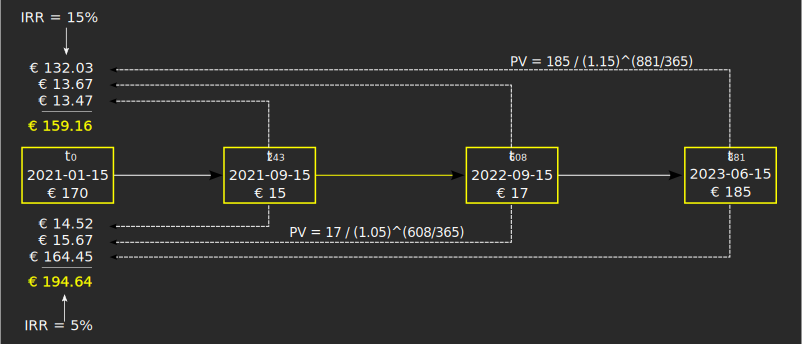

The Internal Rate of Return (IRR) measures the performance of an investment between two dates. It is expressed as an annual interest rate that is necessary to bring the initial value of the investment at time $t_{0}$ to the final value at time $t_{n}$. In PP, the reporting period is measured in days. The IRR can apply for a specific security or trade or the whole portfolio. The classic equation to explain the meaning of IRR is:

**Eq (1)**    $CF_{t0} = \frac{CF_{t1}}{(1 + IRR)^\frac{t_1}{365}}+\frac{CF_{t2}}{(1 + IRR)^\frac{t_2}{365}}+...+ \frac{CF_{tn}}{(1 + IRR)^\frac{t_n}{365}}$

$CF_{t0}$ is the initial cashflow at time $t_0$. It is the sum of all in- and outflows at that moment in time and represents your initial investment. $CF_{t1}$, $CF_{tn}$ are the -hopefully positive- net cashflows that your initial investment will yield. PP works with periods of 1 day instead of the classical periods of 1 year. Therefore $t_1$, $t_2$, $t_n$ should be converted to the number of days between $t_0$ and $t_n$. Of course, if the period between $t_0$ and $t_n$ is  for example 365 days, the exponent becomes 1. Eq (1) is a direct derivation from the classic formula of [present value](images/irr-future-present-value.svg).

A simple example. There is also a [IRR Practical example step-by-step](irr-example.md), solved in PP. On 2021-01-15 you have bought 10 shares at 17 EUR. Now (2023-06-15) the price has increased to 18.5 EUR. Meanwhile, you have received a dividend of 1.5 EUR/share on 2021-09-10 and a second dividend of 1.7 EUR/share on 2022-09-10. What is the performance or IRR of this security? Let's first have the timing and cashflows correct.

Table: Cash flows at different times of investment.

| Date       | $t_n$ | $CF_n$           |
|------------|-------|------------------|
| 2021-01-15 |       |  170€            |
| 2021-09-15 | 243d  | 15€              |
| 2022-09-15 | 608d  | 17€              |
| 2023-06-15 | 881d  | 185€             |

According to (1)

$$CF_{t0} = \frac{15}{(1 + IRR)^\frac{243}{365}}+\frac{17}{(1 + IRR)^\frac{608}{365}}+ \frac{185}{(1 + IRR)^\frac{881}{365}}$$

What's the value of $CF_{t0}$ if IRR is for example 5%? Or 15%?

{.pp-figure}

If IRR = 15% then the combined future cashflows are worth 159.16 EUR in 2021-01-15. So, you need less money (than 170 EUR) to get the same financial results.  So, the real IRR should be somewhat lower. With 5% however, you need in 2021 about 194.64 EUR to get the same total cashflows. After some guesswork and interpolation you get at the exact IRR = 11.61% that will bring all future cashflow to the precise initial investment of 170 EUR.

In the previous example, the dividends are immediately "consumed" (you got yourself a nice meal from it). In another scenario, you keep the dividends in your drawer until 2023-06-15 and cash them in at the same moment you sell the share. In that case, there are only two cashflows: $CF_{t0}$ = 170 EUR and $CF_{t881}$ = 15 + 17 +185 EUR.

Equation (1) has only two terms and could be solved for IRR rather easily.

**Eq (2)**    $CF_{t0} = \frac{CF_{t1}}{(1 + IRR)^\frac{t_1}{365}} \implies  IRR = \sqrt[\frac{t_1}{365}]{\frac{CF_{t1}}{CF_{t0}}}-1$

In this case, your initial investment of 170 EUR has an IRR = $\sqrt[\frac{881}{365}]{\frac{217}{170}}-1$ = 10.64%. Why is this IRR smaller than the previous one? Because you kept the dividend until a later date, the 15 EUR in 2021-09-15 is less worth in 2023-06-15.

PP calculates three variants of IRR.

  + Performance IRR: this is the IRR for the whole project and a specific reporting period; see side bar > Reports > Performance.

  + Security IRR: the IRR of a selected security for a specific reporting period; see sidebar > Reports > Performance > Securities.

  + Trade IRR: the IRR of a buy-sell cycle of a selected security. See sidebar > Reports > Performance > Trades

The Performance and Security IRR are calculated for a specific [[reporting period]]; e.g. 1 year, 2 years, 3 years, custom period. It is very important to distinguish the following cases:

  + $t_0$ occurs before the start of the reporting period $RP_{start}$.  PP can calculate the value of $CF_0$ (through historic quotes or transaction price) at $RP_{start}$. The holding period is calculated from $RP_{start}$ for each CF.

  + $t_0$ occurs after $RP_{start}$ but before $RP_{end}$. The value of  The value of $CF_0$ is known. The holding period is calculated from $RP_{start}$.

  + $t_n$ falls after $RP_{end}$. All transactions after $RP_{end}$ do not contribute to the calculation of IRR for that reporting period.
