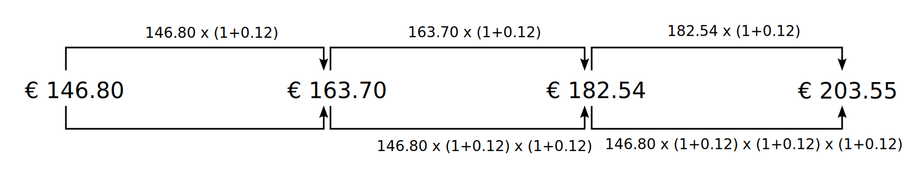

The measurement of your portfolio's performance seems rather straightforward. For example, on January 15, 2020, your demo-portfolio-01 contains 10 shares of `share-1` valuated at 14.68 EUR per share. Three years later (2023-01-15), the price of `share-1` has increased to 20.35 EUR per share, resulting in a market value of 203.55 EUR. The performance of your portfolio is 203.55 - 146.68 = 56.87 EUR. But, of course, this number alone doesn't convey much information.

In the following paragraphs, we initially outline a cashflow-free portfolio scenario. Similar to the previous example, you acquire a security, retain it for a certain duration, and hope it will increase in value. However, you may also opt for a more active portfolio management, involving the buying and selling of securities. Money will flow into and out of the portfolio, adding a layer of complexity to the investment scenario.

!!! note
    Return is the profit or loss generated by an investment over a period of time. It is usually expressed as a percentage of the initial investment. For example, if you invested $100 in a stock and sold it for $120 after a year, your return would be 20%.

    Rate of return is the annualized return on an investment. It is calculated by dividing the total return by the number of years the investment was held and then expressing the result as a percentage. For example, if you invested $100 in a stock and sold it for $120 after two years, your total return would be $20. Your rate of return would be 9.54% per year, assuming the return was compounded annually.

# Rate of Return without external cashflow

The measurement of the performance of a financial portfolio is based on the concept of return: the increase or decrease of value over a specific period. A *simple rate of return* can be calculated as:

$$\mathrm{r = \frac{(EMV - BMV)}{BMV} \qquad \Leftrightarrow \qquad 1 + r = \frac{EMV}{BMV}\qquad Eq  1}$$

where EMV = the End Market Value of the portfolio, and BMV = the Beginning Market Value of the portfolio. The return of the demo portfolio over a 3 year period is thus (203.55 - 146.80)/146.80 = 38.66%.

Rather than focusing solely on a single three-year holding period, it might be beneficial to know your annual performance and to consider multiple sub-periods. For this, you need the concept of *Future Value*. The calculation is given by Eq 2.

$$\mathrm{EMV = MMV \times (1 + r)^n \qquad \Leftrightarrow \qquad 1 + r = \left( \frac{EMV}{BMV}\right) ^ \frac{1}{n}\qquad Eq  2}$$

where r = the annual return rate, and n = the number of years. The exponential component $\mathrm{(1+r)^n}$ is clarified in Figure 1.

Figure: Calculation of an annual return rate of a three year period.{class=pp-figure}

Because 182.54 EUR = 163.70 EUR x (1 + 0.12) and 163.70 EUR = 146.80 x (1 + 0.12), this implicates that 182.54 EUR = 146.80 EUR x (1 + 0.12) x (1 + 0.12) or $\mathrm{(1 + 0.12)^2}$.

To calculate *r*, you need to take the n-root or 1/3 power of (EMV/BMV) minus 1. This results in: r = (203.55/146.80)^1/3 = 0.1151 or 11.51%. This approach assumes a stable *pushing* growing force on the investment of 11.51% each year.

The growth rate of `share-1` however isn't stable over time at all. You can easily read the valuation of your portfolio from the `Reports > Chart` menu in PP. As you can see, the demo portfolio has grown in the first year from 146.80 to 150.50 EUR (2.52%), in the second year from 150.50 to 159.62 EUR (6.06% or (159.62-150.50)/150.50), and, as you already know, in the third year to 203.55 EUR or 27.52%. None of these yearly *real* returns is the same as the annual calculated return of 11.51%. Also, it's easy to verify that the original calculated return of 38.77% for the entire period is not the simple addition of these yearly returns. The simple rate of return is a cumulative or compounded rate of return over multiple sub-periods. The end value of the previous period is the beginning value of the next.

The *compounded* return of an entire period should be calculated as follows, also called geometric or chain linking.

$$\mathrm{r = [(1 + r_1) \times (1 + r_2) \times (1 + r_3) ... (1 + r_{n-1}) \times (1 + r_n)] - 1}$$

This formula follows directly from Eq 1b. $MV_t$ is the value of the portfolio after the end of period *t*.

$$\mathrm{1 + r = \frac{EMV}{BMV}= \frac{MV_1}{BMV} \times \frac{MV_2}{MV_1} \times \frac{EMV}{MV_2}}$$

Each sub period value $MV_t$ can be cancelled out, except EMV and BMV. Plugging in the values from the example above gives: `r = [(1+0.026)*(1+0.061)*(1+0.275)] - 1 = 38.77%`

# Rate of Return with external cashflow

The approach from above assumes that no external money flows into or out of the portfolio. If, for example, additional shares are purchased after BMV then you cannot know how much of the EMV is caused by the capital growth of the original investment or by the additional purchase. Our calculations should take these external cash flows into account. 

An external cash flow refers to a transaction that either increases or decreases the value of a portfolio, mostly a monetary deposit or withdrawal. A positive cash flow signifies money flowing into the portfolio, while a negative cash flow indicates funds exiting the portfolio. In PP these transactions are called *Performance Neutral Transfers*, emphasizing that they shouldn't influence the portfolio performance calculation.

In our demo-portfolio-03.xml all transactions occur within a holding period of three years, starting at 2020-06-12. This timeframe implies that all transactions take place within this period and that the BMV of this period is thus 0 EUR.

 - First transaction is the purchase of 5 `share-1`. A deposit is made beforehand. This deposit is a positive cashflow. Money from outside enters the portfolio. The deposit is considered as a Performance Neutral Transfer; it should not change the portfolio performance. Utilizing this deposit at a later stage to purchase shares is an internal movement within the portfolio. Yet, it is precisely these shares that propel the portfolio's returns.
 - Buying 5 additional `share-1` and 8 `share-2`. Same argument as above.
 - Selling 5 `share-1`. The value is deposited into a cash account (which is part of the portfolio). This is considered as a "Performance Neutral Transfer". A security account of Broker-A will decrease but a deposit account will increase with the same amount. Whether this was a good or bad decision will be evident in performance calculation at the end of the period. The EMV of the portfolio will be decreased by 5 shares at some historical price which is hopefully less than the amount in the deposit account.
 - Cashing in a dividend. The value is deposited into a cash account (which is part of the portfolio). This is considered as "Performance Neutral Transfer". a cashflow; there is no money 
) are two positive cashflows. You need to make a deposit into a cash account in order to be able to purchase the securities. However, selling shares is not always considered as a cash outflow. .

The formula (sometimes called Return on Investment (ROI) is

$$\mathrm{ROI\,in\,percent\, = \frac{(EMV + NOF) - (BMV + NIF)}{BMV + NIF} \times 100 \qquad(Eq  3)}$$

where NOF is the Net Outflows and NIF is the Net Inflows

In case of external cashflows we are not sure that the EMV of our portfolio is caused by the existing 
For example, we buy 5 shares of share-1 and 8 shares of share-2 (refer to demo-portfolio-03.xml).

Investors also make occasional or periodic contributions to and withdrawals from investment accounts. These net contributions are not included as components of investment return; they represent an increase of capital at risk but not a capital gain on our investment. For this reason, when a fund receives new money it is not possible to measure performance by simply observing the change in market value

Moreover, your approach to calculating returns should also accommodate scenarios involving multiple securities with cash inflows and outflows. To handle such situations effectively, you can choose between a *money-weighted* or *time-weighted* approach.

# Money-weighted Rate of Return

The money-weighted rate of return is essentially the Internal Rate of Return (IRR) of the cash flows associated with the portfolio. This calculation considers both the timing (when) and the amount (how much) of the cash moves into and out of the portfolio. The money-weighted rate of return or IRR is the annual interest rate that is necessary to bring the start value of the investment to the end value. To generate the specified cash flows within the given time period, your portfolio must grow each year by a percentage equal to the IRR.

The base formula to calculate the IRR (see also [IRR theory](../irr-theory.md)) looks like:
$$CF_{t0} = \frac{CF_{t1}}{(1 + IRR)^\frac{t_1}{365}}+\frac{CF_{t2}}{(1 + IRR)^\frac{t_2}{365}}+...+ \frac{CF_{tn}}{(1 + IRR)^\frac{t_n}{365}} \qquad\mathrm{(Eq 2)}$$

For each cash flow CF at time $t_1$, $t_2$, ..., $t_n$, you calculate its present value by dividing it by ${(1 + IRR)^\frac{t_1}{365}}$, where t is the number of days from the reference time t0. This part discounts the future cash flows to their present values, considering the time value of money. Choosing an appropriate IRR will ensure that the sum of all discounted cash flows equals the initial investment or $CF_{t0}$.

It's easy to see from Eq 2 that the value of IRR is influenced by the magnitude of the cash flow. If the cash flow CF increases, the IRR must also become larger to balance the equation. If the exponent $\frac{t_2}{365}$ increases, the value of IRR should decrease. Therefore, IRR is a money-weighted rate of return.

In [IRR - Practical example](../irr-example.md), you will find a detailed and comprehensive explanation of the IRR calculation for our demonstration portfolio.

# Time-weighted Rate of Return
The time-weighted rate of return is not influenced by the amount invested. Whether you invest 1 EUR or 100 EUR, you will achieve the same return. The reporting period is divided into several holding periods, and for each holding period, a return value is calculated and then compounded into an overall return. Each period carries equal weight. In the True time-weighted methodology (TTWROR), performance is calculated using simple returns without any consideration for the total amount invested.

PP computes the TTWOR as follows. For each day within the reporting period, it collects the total portfolio value, inbound transfers, and outbound transfers. The portfolio value encompasses all deposit and securities accounts. To determine the value of a security, it multiplies the quantity by the (historical) price. Transfers encompass external cash flows, which can either enter the portfolio from outside (inbound) or exit it (outbound); assuming that fresh money is added at the beginning of the day (and hence is available to generate return) and removed at the end of the day. A dividend or sale transaction is not considered as a transfer; they remain within the portfolio. They are recorded in the cash account, thereby contributing to the increased valuation of the portfolio. A modified version of the simple return formula (see eq 1), including the transfers, is used to calculate the daily return value (named delta).

