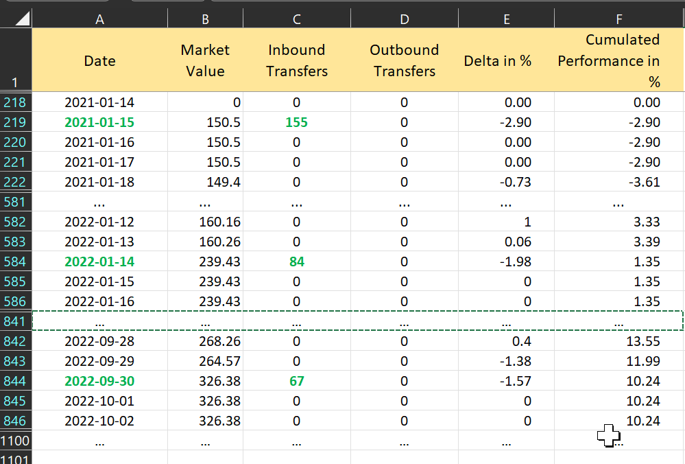

The measurement of the performance of a financial portfolio is based on the concept of return: the increase or decrease of value over a specific period. For example, your portfolio starts at 100 EUR and grows to 120 EUR by the end of the period, resulting in a performance of + 20%. Equation 1 offers two versions of the base formula; also named the Rate of Return.

$$\mathrm{r = \frac{(MVE - MVB)}{MVB} \qquad \Leftrightarrow \qquad 1 + r = \frac{MVE}{MVB}\qquad (Eq  1)}$$

where MVE = the market value of the portfolio at the end of the reporting period, and MVB = the market value of the portfolio at the beginning of the period. Please note that:

- The rate of return percentage applies to the entire period (3 years, 6 months, ...) and is not an annual rate.
- There have been no additional transactions within this specified period.

PP uses two different approaches to calculate the rate of return when additional transactions occur withing the reporting period: the money-weighted or time-weighted rate of return. It also distinguishes between the measuring the performance on portfolio, (individual) security, or trade level.

# The money-weighted rate of return
The money-weighted rate of return uses essentially the Internal Rate of Return (IRR) technique used in project management. This calculation considers both the timing (when) and the amount (how much) of the cash moves into and out of the portfolio within the reporting period.

The money-weighted rate of return or IRR is the annual interest rate that is necessary to bring the beginning value of the investment (MVB) and all subsequent cash flows to the end value (MVE). To generate the specified cash flows within the given time period, your portfolio must grow each year by a percentage equal to the IRR.

The base formula for the IRR calculation is:

$$\mathrm{MVE = MVB \times (1 + IRR) + \sum_{t=1} ^{n}CF_t \times (1+IRR)^{\frac{RD_t}{365}} \qquad (Eq  2)}$$

where *n* = the number of cash flows in the reporting period, $CF_t$ = cash flow at time *t* within the period, and $RD_t$ = the number of remaining days within the period of $CF_t$ for $CF_t$. Unfortunately, there is no easy way to derive the value of IRR from this equation. Software tools such as Excel employ the brute-force approach, iteratively solving the equation with various "guesses" of IRR until a suitable match is identified.

IRR is thus the interest rate that will make the future value on end date of the period of all $CF_t$ and MVB equal to the MVE. The formula is very similar to the calculation of [Future Value](images/info-irr-future-present-value.svg). With an interest rate of 5%, 100 EUR today will be worth 115.76 EUR or $\mathrm{100 \times (1 +0.05)^3}$. Since PP uses days as standard period, we need to divide the remaining number of days that the cash flow could influence the performance by 365 to obtain a decimal representation of the yearly period. $\mathrm{CF_t \times (1+IRR)^{\frac{RD_t}{365}}}$ is thus the expected future value at the end of the period of the CF at time *t* with an interest rate = IRR. Please note that without any cash flows, Equation (2) is identical to Equation (1). IRR is the rate of return of our portfolio.

In our demo-portfolio-03.xml all transactions take place within a holding period of three years, starting at 2020-06-12. Consequently, the MVB for this period is 0 EUR because the portfolio is empty at the beginning of the period. The following transactions occurred in the holding period (see Figure 1 below).

Figure: Overview of transactions - Deposit (3x), Buy (3x), Dividend, and partial Sell.{class=pp-figure}

 

Figure: Graph of historical quotes and transactions of share-1. {class=pp-figure}

Figure: Graph of historical quotes and transactions of share-2. {class=pp-figure}

By inserting the relevant information into Equation 2, we can calculate the IRR as outlined in Equation 3. With an IRR = 20.28%, MVE matches exactly the right side of the equation.

$$
\mathrm{MVE = MVB \times (1 + IRR)^{\frac{1095}{365}} + CF_{217} \times (1+IRR)^{\frac{878}{365}} + CF_{581} \times (1+IRR)^{\frac{514}{365}} +
CF_{255} \times (1+IRR)^{\frac{840}{365}} \qquad (Eq  3)}
$$

`MVE = 0 x 1.2^3 + 155 x 1.2^2.4 + 84 x 1.2^1.4 + 67 x 1.2^0.7`

or

`MVE = 0 + 241.68 + 108.95 + 76.23 = 426.82`

The initial cashflow of 155 EUR will contribute 241.68 EUR to MVE while the final cash flow of 67 EUR will only contribute 76.23 due the small remaining number of days until the end date.

However, out of the total of seven cash flows (3x buy, 1x dividend, 1x sale, 2x valuation remaining shares), only three seem to appear in the formula.  The other cash flows however are included in the valuation of the portfolio at the end date of the period (MVE). As you can see in Figure 4, MVE consists of the paid dividend and the result of the sale transaction (both parked on a deposit account), plus the valuation on the end date of the remaining shares from the portfolio.

Figure: Visualisation of the IRR equation. {class=pp-figure}

Since the dividend and sale result are placed in a cash account and as such remain stable until the end of period, all remaining cash flows could be written as:

`20 x 1.2^0 + 105 x 1.2^0 + 190.06 x 1.2^0 + 111.76 x 1.2^0 = MVE`

The exponent of each cash flow is zero, because there are no more remaining days to the end of the project. If the dividend or sales result are reinvested again, then an additional positive cash flow should be inserted.

In [IRR - Practical example](../irr-example.md), you will find a detailed and comprehensive explanation of the IRR calculation for our demonstration portfolio.

# Time-weighted Rate of Return
The time-weighted rate of return is not influenced by the amount invested. Whether you invest 1 EUR or 100 EUR, you will achieve the same return. The reporting period is divided into several holding periods, and for each holding period, a return value is calculated and then compounded into an overall return. Each period carries equal weight; hence the name time-weighted rate of return. In the True Time-Weighted Rate Of Return methodology (TTWROR), performance is calculated using simple returns without any consideration for the total amount invested.

To minimize the computational effort, older methods utilized larger holding periods. In our demo-portfolio-01, for instance, the initial periods would be formed by

`Period start --> CF1, CF1 --> CF2, ..., CFn-1 --> Period end`.

Because computer time is cheap nowadays, PP uses a single day as holding period. Let's take a look at our demo-portfolio-03. The portfolio took off on January 15, 2021, by purchasing five shares for a total amount of 155 EUR (taxes and fees 5 EUR inclusive). The closing price of `share-1` on that day was 15.05 EUR. The market value is thus 150.5 EUR; while still zero on the days before until the start of the reporting period (2020-06-15; see Figure 5).

Figure: Calculation of the TTWOR in PP. {class=pp-figure}

!!! Note
      You can easily generate the spreadsheet of Figure 1 with the menu `View > Reports > Performance > Chart` and selecting the icon (top right) `Export Data as CSV`. Choose `Export Entire Portfolio`.

The market value is the sum of the values of all deposit and securities accounts. To determine the value of a security, the (historical) closing price is taken. Transfers encompass external cash flows, which can either enter the portfolio from outside (inbound transfer) or exit it (outbound transfer); assuming that fresh money is added at the beginning of the day (and hence is available to generate return) and removed at the end of the day. Each deposit is made at the beginning of the day, allowing us to make purchases during that day without any concerns. The formula for Delta is:

$$\mathrm{Delta\  in \% = (MV_t - (MV_{t-1} + In_t - Out_t))/(MV_{t-1} + In_t - Out_t) \qquad (Eq  4)}$$

where $\mathrm{MV_{t-1}}$ = the market value of the previous day and In/Out stand for respectively Inbound and Outbound Transfer at the current day.

This formula calculates the performance of the current day MV_t against the previous day MV_{t-1}, corrected for cash flows.

Let's take a look at the purchase of 67 EUR of `share-1` on 2022-09-30. The market value of the portfolio on the previous day was 264.57 EUR. The current market value is 326.38 EUR. The simple rate of Return (Eq 1) should report that the performance r = (326.38 - 264.57)/264.57 = 23.36%. That's, of course, because of the cash inflow of 67 EUR. The intrinsic performance, independent of the magnitude of the cash flow is delta% = 326.38 - (264.57 + 67 - 0)/ (264.57 + 67 - 0) = -1.57%. This negative return is a result of the taxes and fees associated with the purchase of the share, causing the market value to temporarily dip slightly negative after the purchase;

In the time-weighted approach, the magnitude of the cash flows shouldn't have any impact; so the cash flows are added/subtracted both to the nominator and denominator of the equation.

With these returns, the *compounded* return or TTWOR or cumulative performance in % is calculated.

$$\mathrm{r = [(1 + r_1) \times (1 + r_2) \times (1 + r_3) ... (1 + r_{n-1}) \times (1 + r_n)] - 1 \qquad (Eq  5)}$$

where $r_t$ is the return rate or delta% from day *t*.