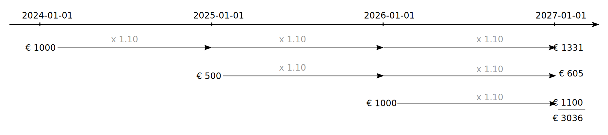
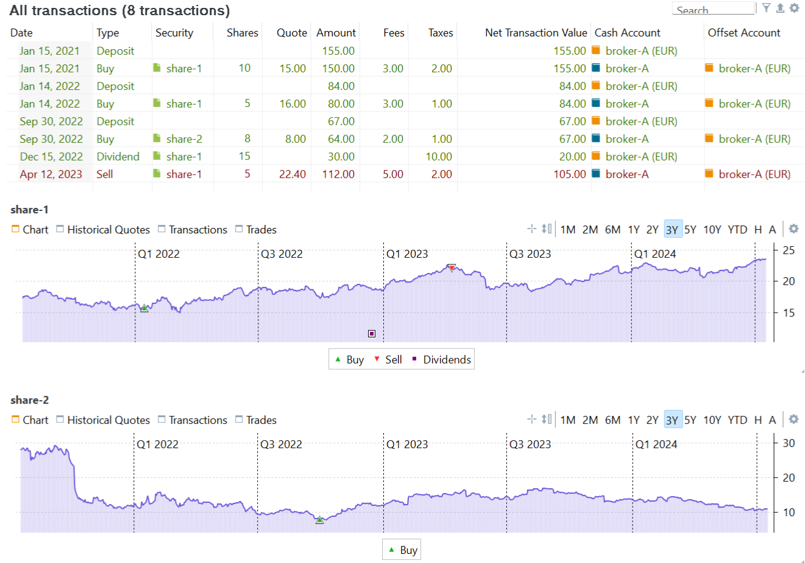
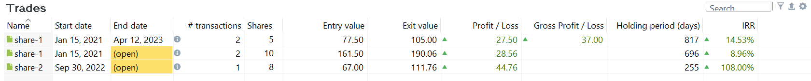

# The money-weighted rate of return
The money-weighted rate of return is identical to the Internal Rate of Return (IRR) technique used in project management. This calculation considers both the timing (when) and the size (how much) of the cash flows within the reporting period. A cash flow is any amount of money that is added to or withdrawn from a portfolio. The base formula for the IRR calculation is:

<a id="irr-equation"></a>

$$\mathrm{MVB \times (1 + IRR)^{\frac{RD}{365}} + \sum_{t=1} ^{n}CF_t \times (1+IRR)^{\frac{RD_t}{365}} = MVE \qquad \text{(Eq 1)}}$$

where *n* = the number of cash flows in the reporting period, CF<sub>t</sub> = the cash flow at time *t*, and RD<sub>t</sub> = the number of remaining days within the period after CF<sub>t</sub>. For MVB, RD equals the entire period, represented in days. To annualize the return rate, you need to divide the remaining days by 365. To calculate the periodic return rate for the entire period such as 2 years, divide by the number of days of the entire period; e.g. 730 days.

Equation 1 closely resembles the calculation of Future Value. In Figure 1, assuming a 10% interest on your investments, the initial 1000 EUR capital will grow to a future value of 1331 EUR in three years. Additional cashflows of 500 EUR and 1000 EUR in the following years will result in 605 EUR and 1100 EUR respectively. The total Future Value of the investment will then be 3036 EUR in three years.

Figure: Visualisation of Future Value calculation.{class=pp-figure}

 

Calculating IRR is in fact the inverse of calculating the future value (FV) of an investment. You don't know the interest rate or IRR, but you do know the MVB, the MVE, and the intermittent cashflows. According to Equation:

`1000 * (1 + IRR)^(3x365/365) + 500 * (1 + IRR)^(2x365/365) + 1000 * (1 + IRR)^(365/365) = 3036`

From this point forward, equations will be presented in a spreadsheet-like style, utilizing the asterisk (*) for multiplication and the caret (^) for power. This approach results in more concise equations that can be easily copied and pasted directly into a spreadsheet for verification.

`500 * (1 + IRR)^(2x365/365)` is thus the expected future value of a cash flow of 500 EUR at time 2025-01-01 by the end of the period (after 2*365 days) with an annual interest rate = IRR. Please note that in the absence of any cash flows, Equation 1 resembles the (annualized) simple return formula [MVE = MVB x (1 + r)](./index.md).

The IRR is the annual interest rate that must be applied to the beginning value of the investment (MVB) and all subsequent cash flows for their respective durations to equal the end value (MVE). In other words, the IRR of your portfolio is the annual interest rate that it must grow (or shrink) to get the end value.

Unfortunately, there is no easy way to derive the value of IRR from Equation 1. Software tools such as Excel have functions like IRR and XIRR, that employ a brute-force approach, iteratively solving the equation with various "guesses" of IRR until a suitable match is identified. In the examples below we will use the Goal Seek method of Excel to illustrate the solution.

## Defining the cashflows

The concept of cash flows appears to be straightforward: it refers to the cash that flows into or out of a system. However, let's consider the demo-portfolio-03 as an example (see Figure 2).

Figure: Overview of transactions - Deposit (3x), Buy (3x), Dividend, and partial Sell and charts of share-1 and share-2.{class=pp-figure}

 

This portfolio has one deposit account `broker-A (EUR)`, and one security account `broker-A`, containing two securities `share-1` and `share-2`. Only four [types of transactions](../../reference/transaction/index.md) are made: deposit, buy, dividend, and sell. The question is, what are the relevant cash flows in Equation 1 in this context? For instance, a deposit transaction will transfer money into the portfolio *and* the deposit account. A sell transaction will withdraw money from a security and security account *and* move it into a deposit account, *but* it does not affect the portfolio.

Before defining the relevant cash flows, it is essential to determine the level at which performance calculation is required. Do you need to calculate the performance of the entire portfolio (and for which period), of a specific account or security, or of a particular trade?

From the perspective of the portfolio, cash flows only occur when cash or securities are entering or leaving, the portfolio. Only four transaction types are relevant: `deposit`, `withdrawal`, `delivery in`, and `delivery out` (refer to Figure 3, on the left and right side).  Buy, sell, or dividend transactions do not create a portfolio cash flow. Money is not entering or leaving the portfolio; it is only moving between accounts *within* the portfolio.

From the perspective of the security or security account only five transactions are relevant: ´Buy´, `Sell`, `Dividend`, and also `Delivery In` and `Delivery Out`. These transactions will bring money into or out of the security (account). Some people may find it challenging to recognize that dividends are not portfolio cash flows. It may seem as though money is coming to the portfolio from an external source, similar to a deposit. However, the dividend is paid by a company to its shareholders as a distribution of profits. As a shareholder, you are essentially a partial owner, so the shares are paying the dividend themselves.

From Figure 3, you may notice that the cash flow into or out of a security is represented differently than one entering or leaving the security account or portfolio (square versus circle). Consider the first Buy transaction of `share-1`. It is clear that the outflow from the deposit account is 155 EUR. This amount is used for raw capital purchase (150 EUR), fees (3 EUR), and taxes (2 EUR). So, how much is the inflow into the security (account)? There are four possibilities
    
- **With fees and taxes (155 EUR)**: This amount is exactly what we actually pay for `share-1`. But, even if the share price *increases* slightly, the MVE will probably be less than the MVB with a *negative* performance as result  
- **With fees only (153 EUR)**: The fact that we paid 2 EUR taxes shouldn't be taken into account. Tax collection varies significantly from country to country and is also outside our control. Some countries will collect taxes at purchase time (as in this case), some do it partly at purchase and partly later, and some collect at the time of selling. A case could be made to exclude taxes from the performance calculation.
- **With taxes only (152 EUR)**: Fees are not taken into account; only taxes are. Although fees are also quite variable, they are more inherent to the purchase than taxes as they should reflect the real cost for the broker to carry out the transaction. Including taxes but disregarding fees is somewhat contradictory.
- **Without fees and taxes (150 EUR)**: This is the value that the 10 shares were worth at the time of purchase. If the security (account) is worth more or less in the future, this is the number to compare with. In this view, fees and taxes should not be taken into account in performance calculations.

It turns out that PP takes an in-between stance. For the calculation of the performance of the whole portfolio, fees and taxes are included (e.g., 155 EUR). For the performance at the security and security account level, only fees are included, and taxes are left out.


Figure: Defining all possible cash flows within a portfolio.{class=pp-figure}

 

## <span style="color:orange">IRR at portfolio level</span>

The following examples will calculate the IRR for an entire portfolio. You can find this performance indicator in the `View > Reports > Performance` dashboard. The resulting IRR can not be extrapolated to an individual account or security. It's the performance of the whole portfolio. Refer to the following sections to calculate the IRR of a [specific security](#irr-on-security-level) or [trade](#irr-on-trade-level). We use the [demo-portfolio-03](../../assets/demo-portfolio-03.xml) for all examples.

### **Example 1**: one deposit + buy transaction

Assume that in our demo-portfolio-03 *only* the first **deposit transaction** on Jan 15, 2021 has occurred. For a reporting period of three years (2020-06-12 :material-arrow-right: 2023-06-12), the MVB of the portfolio is zero. The portfolio is indeed empty on June 12, 2020. On Jan 15, 2021, the deposit account balance increases to 155 EUR and remains at that level until June 12, 2023. The MVE of the portfolio is therefore also 155 EUR. According to Equation 1, the IRR could be derived from:

```
MVB*(1+IRR)^(RD/365) + CF1*(1+IRR)^(RD1/365) = MVE
         ↓                        ↓            ↓
0*(1+0)^(1095/365)  +  155*(1+0)^(878/365) =  155
```

It's clear that `IRR=0` will satisfy the equation because one (1+0) to any power equals one. Therefore, the performance of the deposit account, and consequently the portfolio, remains zero, even after multiple deposits. This is because deposits increase both the deposit account and the MVE of the portfolio, ensuring that Equation 1 remains balanced with an IRR = 0.

PP has a specific term for these kinds of cash flows or transfers: `Performance Neutral Transfers`; see, for example, the [Performance Calculation Widget](../../reference/view/reports/performance/calculation.md). A deposit is 'Performance Neutral' because the transfer of money affects the MVE and the account by the same amount. A deposit account does not receive any interest or incur any costs. A deposited amount will stay unchanged in the account until the end of the period. The effect on performance (e.g. IRR) is zero.

What will happen if a **buy transaction** is added, similar to the second transaction in Figure 2? The result is twofold:

- The deposit account is reduced by 155 EUR, bringing it to zero and canceling the first transaction.
- The value of `share-1` is increased by 10 units, which were worth 150 EUR at the time of purchase. The remaining 5 EUR covered fees (3 EUR) and taxes (2 EUR).

Because, we are still focusing on calculating the *portfolio* performance, the equation from above still holds. Except, at the end of the period, `share-1` is quoted at 19.006 EUR/share, giving an MVE of the portfolio of 190.06 EUR.

```
           MVB           +               CF1         =   MVE
            ↓                             ↓               ↓
0*(1+IRR)^(1095/365)  +  155*(1+IRR)^(878/365) =  190.06
```

An `IRR = 8.85%` will solve this equation. In order to generate a MVE of 190.06 EUR, the initial cash flow CF1 of 155 EUR must grow at 8.85% per year for 2.41 years or 878 remaining days.

### **Example 2**: multiple buy transactions
When dealing with multiple cash flows, deriving the Internal Rate of Return (IRR) becomes much more complex. Take, for example, the three buying transactions from Figure 1. The same logic as mentioned earlier still applies.

- MVB is still zero at 2020-06-12. The period length is three years or 1095 days.
- There are six transactions: 3 deposit and 3 buy transactions (see Figure 2), resulting in multiple cashflows on multiple components.
- The cashflows on portfolio level are respectively: 155, 84, and 67 EUR (inclusive fees and taxes).
- The remaining days in the reporting period are respectively 878, 514, and 255 days for these three cashflows.
- MVE = 15 shares at a quoted price of 19.006 EUR, and 5 shares at 13.77 EUR, totaling 396.85 EUR. The deposit account is empty.

An `IRR = 15.60%` will solve the equation.
```
MVB           CF1                    CF2                    CF3             MVE
↓              ↓                      ↓                      ↓               ↓
0 + 155*(1+IRR)^(878/365) + 84*(1+IRR)^(514/365) + 67*(1+IRR)^(255/365) = 396.85`
```


Figure 5 illustrates the calculation in Excel ([download workbook](../../assets/demo-portfolio-03-calculation.xlsx)). The initial cash flow of 155 EUR will have grown to 219.68 EUR, if the holding period was 878 days and the yearly interest rate was 15.60%. The second buy will increase from 84 EUR to 103.03 EUR. The profit of `share-2` appears smaller due to the smaller amount of holding days. The calculation of IRR can be simulated in Excel using the `Data > Goal Seek method` (see Figure 4). The method tries to set the value of the calculated MVE (cell F11) to the observed MVE (manual input) by iteratively changing the value of IRR (cell F3), until a match (15.60%) is found.

Please note that the individual calculated end values of the shares do not necessarily correspond with the observed individual end values. Compare for example the expected and observed value of `share-2`. The observed value (cell J9) is much higher. Only the sum of the whole portfolio match and the same calculated IRR is applied to all shares. PP can - of course- also calculate the IRR for individual securities; see below to calculate the performance of [individual securities](#irr-on-security-level) and [trades](#irr-on-trade-level).

Figure: IRR-calculation for three buy-transactions. {class=pp-figure}


### **Example 3**: buy - dividend - sell transactions

In PP, the cash proceeds from a selling transaction are deposited into a cash account. A sell transaction is thus the opposite of a buy transaction. The security (account) will be reduced, while the referenced deposit account is increased by the same amount. Both cash flows will cancel each other out.

When a dividend payment is made, the associated deposit account is also increased by the dividend amount. However, it may seem unclear as to where this money originates. Although it appears to come from an external source, PP treats it as if it is generated by the security itself. Without the security, there would be no dividend. When a company pays a dividend to its shareholders, it essentially means that as a shareholder/owner, you are paying yourself a dividend from the company's earnings or profits. As a result, the value of the company, and your shares decrease accordingly.

However, from the perspective of calculating the portfolio performance, these details are not important. Since no money leaves or enters the portfolio, the performance equation is the same as in Example 2, except that the MVE = 426.82 EUR, including the result of the sell and dividend payment.

```
MVB              CF1                       CF2                       CF3             MVE
↓                 ↓                         ↓                         ↓               ↓
0 + 155*(1+0.2028)^(878/365) + 84*(1+0.2028)^(514/365) + 67*(1+0.2028)^(255/365) = 426.82`
```

Figure: IRR-calculation for buy-sell-dividend transactions. {class=pp-figure}


However, if the dividend payment or selling transaction is "consumed" (you bought yourself a coffee from it), resulting in an external cash flow (withdrawal), this transaction should be recorded in PP. Similarly, if you choose to reinvest the dividend or the proceeds from a sale, it necessitates recording a new transaction in PP.

### **Example 4**: MVB > 0
In the previous examples, all transactions took place within the reporting period. This isn't always the case. It is very important to distinguish the following cases:

  1. CF<sub>t</sub> occurs before the beginning of the reporting period (MVB date).  PP will calculate the value of CF<sub>t</sub> through historic quotes at time *t*. The market value of the investment at time *t* is used in the calculation, not the purchase value. The holding period is the entire reporting period.

  2. CF<sub>t</sub> occurs after the beginning but before the end of the reporting period. The value of CF<sub>t</sub> is known through the transaction data. The holding period is the number of remaining days from time *t* until the end of the reporting period.

  3. CF<sub>t</sub> falls after the end of the reporting period. CF<sub>t</sub> does not contribute to MVE and is omitted from the calculation of IRR for that reporting period.

 Consider a scenario where the holding period is only *two* years (from 2021-06-12 to 2023-06-12), or 730 days. Since the first buy of `share-1` occurs outside of this period (item 1 from above), the quoted price of `share-1` at the beginning of the period is used rather than the actual buying price.

- MVB = 177.94 EUR, representing 10 shares of `share-1` at the closing price of 17.794 EUR on June 11, 2021 (= the closing price from the day before the start of the period).
- Additional buys: two additional buys within the reporting period with respective remaining days of 514 and 255 days and known buying transaction prices.
-The dividend and sale will be valuated at the end date in the MVE and are not considered as a CF in this calculation.
- MVE = 426.82 EUR, including 125 EUR on the cash account from the dividend and sale.

The resulting formula with `IRR = 17.63%` is:

```
            MVB                       CF2                    CF3             MVE
             ↓                         ↓                      ↓               ↓
177.94 x (1+IRR)^(730/365) + 84*(1+IRR)^(514/365) + 67*(1+IRR)^(255/365) = 426.82`
```

Figure: IRR-calculation for a 2 year holding period (MVB > 0).{class=pp-figure}


## <span style="color:orange">IRR at security level</span>

The value of the IRR, calculated at portfolio level, doesn't say much about the performance of a specific security. For example, the IRR of `demo-portfolio-03` (3 years reporting period) is 20.28% (see Figure 5). The security IRR of `share-2` is 112.53% (see Figure 7 at the top). A quick look at Figure 7 (bottom) should clarify why: the security is acquired at the lowest price throughout the entire period. You can obtain the IRR for each security separately using the menu `View > Reports > Securities` (see Figure 7).

Figure: IRR-calculation for individual securities.{class=pp-figure}


 The relevant transactions to consider when calculating the performance of a single security are Buy, Sell, and Dividend (see Figure 3). In this instance, there were no deliveries of securities involved. Please note, that from the perspective of a single security:
 
- Buying: Generates a cash outflow from the deposit account and a cash inflow to the security.
- Selling: Generates a cash outflow from the security and a cash inflow to the deposit account.
- Dividend: Generates a cash outflow from the security and a cash inflow to the deposit account.

!!! Importyant
    - The cashflow to and from a security is always *inclusive* of fees. Fees are considered an inherent part of the security and the performance of the security is partly dependent on the the size of the fees.

    - Taxes are *excluded* from the calculation of security IRR. This exclusion is justified as taxes are not directly associated with a specific security, they are imposed by the government (sometimes collected at later dates), and are beyond the investor's control. Unlike fees, which can be influenced to some extent, taxes cannot. Therefore, the cash flow to consider for the security IRR calculation is the debit note of the transaction minus taxes.

    - In contrast to the portfolio IRR, dividend, buy, and sell transactions are treated as cashflows. The money from these transactions will 'enter' or 'leave' the security. This happens at the transaction date. Buying/selling the security (at a good or bad time) and paying dividends will impact the performance of the security. As a side effect, deposit accounts are *not* included in the Security IRR calculation.

    - With a multi-transaction security, the purchase price and value can be somewhat tricky to determine. For instance, the remaining 10 shares of `share-1` are the outcome of two purchase transactions and one sell transaction. Following the FIFO principle (First In, First Out), these 10 shares consist of the 5 remaining shares from the first buy and the 5 shares from the second buy. This results in an average price of 15.50 EUR (see example 6).


### **Example 5**: a security with one buy transaction

A straightforward example is illustrated by the IRR calculation of `share-2`. The single buy transaction falls within every holding period (1,2, or 3 years). The total cash flow of the transaction, including fees but not taxes, amounts to 66 EUR.

- MVB = 0 EUR.
- First and only cash flow: 8 shares at 8 EUR/share + 2 EUR fees. Remaining days = 255 for a 3 years period, ending at `2023-06-12`.
- MVE = 111.76 EUR or 8 shares at 13.97 EUR/share.

Inserting these values into Equation 1 will find a solution with `IRR = 112.53%`; see also Figure 8.

```
          MVB        +            CF1       =   MVE
           ↓                       ↓             ↓
0 x (1+IRR)^1095/365 + 66 x (1+IRR)^255/365 =  111.76
```


### **Example 6**: a security with multiple transactions

As can be seen in Figure 2, `share-1` has multiple transactions, 2x buy, partial sell and dividend. It's important to get the dates and cash flows correct, see Figure 9.

Figure: IRR-calculation for individual security with multiple transactions.{class=pp-figure}


The first and second cashflow is rather straightforward. 10 shares at 15 EUR/share + 3 EUR fees and 5 shares at 16 EUR/share plus 3 EUR fees. Assuming an `IRR = 18%` (see Figure 7), the calculated end value of `share-1` = 153 x 1.18^(878/365) = 227.81 EUR. 

Please note that dividend payments and sales are recorded as cashflows on the transaction date. This differs from the behavior observed in IRR calculations at the portfolio level. 

Inserting these values into Equation 2 gives:

```
MVB             CF1 (buy)                CF2 (buy)                CF3 (dividend)             (sell)          MVE
↓                ↓                        ↓                        ↓                           ↓              ↓
0 + 153 x (1+IRR)^(878/365) + 83 x (1+IRR)^(514/365) - 30 x (1+IRR)^(179/365) - 107 x (1 + IRR)^(61/365) = 190.06`
```

As can be seen from Figure 8, an `IRR = 18.00%` will fit the equation..


## <span style="color:orange">IRR at trade level</span>
A trade is formed by aggregating all buy and sell transactions related to a specific security. A trade can be classified as either "closed" or "open". A closed trade indicates that no further transactions can be conducted within that trade, whereas an open trade means that additional transactions are possible. The `demo-project-03` contains 3 trades (see `Report > Performance > Trades`; Figure 9).  A *closed* trade starts with a buy of `share-1` on `2021-01-15` and ends with a partial sell on `2022-01-14`. The remaining shares initiate the second *open* trade, starting at `2022-01-14` and ending at the current date (e.g. `2023-06-12`). The third trade is also open because `share-2` hasn't been sold yet.

!!! Important
    - The performance of a trade is always calculated with the **fees and taxes included**.
    - In contrast with the portfolio and security IRR calculation, you can **not** set a reporting period.  A closed trade has a fixed begin and end date. All open trades have an end date set as of today.
    - PP follows the **FIFO principle** (First-In; First-Out) to determine which shares will be sold. The 5 shares sold on `2023-04-12` correspond to those acquired on `2021-01-15`, rather than the ones obtained on `2022-01-14`.

Figure: IRR-calculation for trades.{class=pp-figure}



### **Example 7**: IRR calculation of a closed trade

Five shares of `share-1` were sold on April 12, 2023. The historical closing price on that day was 22.40 EUR/share. Fees and taxes were 7 EUR, giving a net transaction value of 105 EUR (see Figure 1) or the Exit value in Figure 10.

Because of the FIFO-principle, these 5 shares were from the 1th buy, meaning that they are purchased for 5 x 15 EUR = 75 EUR. The fees and taxes (5 EUR for 10 shares) are proportionally allocated, in this case, 5/2 = 2.5 EUR. The entry value of this closed trade is thus 77.50 EUR. The securities are held for 817 days (from `2021-01-15 till 2023-04-12`). The sell transaction will coincide with the MVE. We could use the [simplified equation](index.md) (without any transactions). An `IRR = 14.53%` will solve the equation.

```
MVB x (1 + IRR)^RD/365   =   MVE
↓                        ↓
 0  x (1 + IRR)^817/365  =   105
```


### **Example 8**: IRR calculation of an open trade

!!! Important
    PP will always use the current date to calculate an open trade IRR. If you want to follow the previous example, you can try to change the system date on your computer. Restarting PP isn't necessary.

Assume that today is 2023-06-12. The open trade involving `share-2` is rather simple. Referring to Figure 2, these shares were acquired for a net value of 64 EUR + 3 EUR fees and taxes on `2022-09-30`, which was 255 days ago, assuming that today's date is June 12, 2023. The current value is 111.76 EUR, resulting in `67 * (1 + IRR)^255/365 = 111.7 ` or `IRR = 108%`.

The open trade involving `share-1` is a special case. Since it is an open trade, it ends on the current day (`2023-06-12`). The number of days between the purchase date and today is 696 days. The historical price on this date was 19.006 EUR/share. The exit value is thus 190.06 EUR.

The trade consists of shares that were bought in 2021 and in 2022. Five shares are from 2021. The cash flow of these shares is thus 77.5 EUR (see also paragraph above). Today, they are valuated at 95.03 EUR. The remaining 5 shares are from `2022-01-04` with a cash flow of 5 x 16 EUR/share + 4 EUR fees and taxes (see Figure 1). These 5 shares are also 95.03 EUR worth today (`2023-06-12`).

This corresponds with PP (see Figure 9 above): the exit value is 190.06 = 2 x 95.03 EUR and the entry value is 77.5 + 84 = 161.50 EUR. Inserting these values in Equation 1 will give a solution with `IRR=9.16%`:

`77.5*(1+IRR)^(878/365) + 84*(1+IRR)^(514/365) = 190.06`


