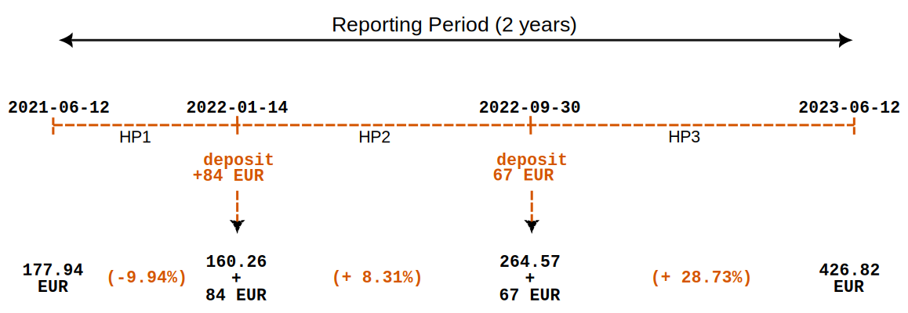

# Time-Weighted Rate of Return

The Time-Weighted Rate of Return (TWROR) treats each time period equally when calculating the return rate, regardless of the amount invested during those periods. In contrast, the Money-Weighted Rate of Return (MWROR) gives more weight to periods with larger investments, factoring in both the size and timing of cash flows.

The purpose of the Time-Weighted Rate of Return (TWROR) is to reflect the true market rate of return, excluding external factors such as deposits and withdrawals. For example, suppose the Market Value at the End (MVE) of yesterday was 100 EUR. Today, the MVE increases to 110 EUR, but this change consists of: a 1% market return (1 EUR), and a 9 EUR deposit. 

In this case, the TWROR should be **1%** (101/100 - 1), and not 10% (110/100 - 1).

Now, suppose that a few days later, the MVE rises from 110 EUR to 120 EUR, but this includes again a 1% market return over the period (1.1 EUR), and a 8.9 EUR deposit on the last day.  

Again, the TWROR for this period should be **1%** (111.1/110 - 1), and not 9.09% (120/110 - 1).

Finally, the cumulative market rate of return (TWROR) for the total period should be (1+1%) x (1+1%) - 1 = **2.01%**, and not 120/100 - 1 = 20%.

The formula for the *Simple Rate of Return* r = (MVE/MVB) - 1 (see [Eq 1 of Performance Measurement](index.md#performance-measurement)) should be adjusted to neutralize or compensate the cash flows.

## General Method

In most financial management handbooks, calculating the time-weighted rate of return for a reporting period is described as a three-step process:

1. Divide the reporting period into **subperiods**, such as weeks, months, or quarters. However, it is preferable to base these subperiods on cash flow dates. In this approach, a subperiod starts either at the beginning of the reporting period or just before a cash flow and ends just before the next cash flow or at the end of the reporting period. As a result, the subperiods will likely have unequal durations.

2. Calculate the sub-period **growth rates** using Equation 1:
    
    $$\mathrm{1 + r = \frac{MVE}{MVB + CF} \qquad \text{(Eq 1)}}$$

    where MVE = the market value of the asset at the end of the holding period, MVB is the market value at the beginning of the holding period (which is the same value as the MVE of the previous holding period). CF is the incoming cash flow (positive number), or the outgoing cash flow (negative number) in that period. Eq 1 assumes that cash flows occur at the start of the period. As you will see later, Portfolio Performance treats incoming cash flows (*CFin*) as occurring at the start of the day, while outgoing cash flows (*CFout*) are considered to occur at the end of the trading day.

3. **Compound** the sub-period returns into the overall performance for the reporting period using Equation 2:

    $$\mathrm{r = [(1 + r_1)  \cdots  \times (1 + r_n)] - 1 \qquad \text{(Eq  2)}}$$

    where *n* is the number of holding periods and rt is the return rate for holding period *t*.

## Implementation in PP

For optimal accuracy, the method described above requires an asset valuation just before each cash flow. However, in some cases, this isn’t feasible, and valuations are only available monthly or quarterly. These valuations may or may not coincide with the cash flows. In such cases, the result is only an approximation of the *true* performance. However, when a valuation is available just before each cash flow, a **True** Time-Weighted Rate Of Return (TTWROR) could be calculated. The term is coined to differentiate this method from the approximations mentioned above.

In the past, when computing power was expensive, it made sense to create longer holding periods to ease the computational burden, particularly for the required valuations at each cash flow. Today, this is no longer the case, and software like Portfolio Performance can calculate the market value of investments practically in real time. As such Portfolio Performance calculates the market value of the different components on a *daily* basis, regardless of whether there is a cash flow. Therefore, the holding periods all have equal durations of one day.

With daily valuations, it makes sense to assume that cash *inflows* occur at the very start of the day. The money is immediately available to invest during the day. Portfolio Performance also assumes that cash *outflows* occur at the very end of the day, just before the daily valuation. Thus, it makes sense to reflect this in Equation 1: inflows are added to the MVB as in Eq 1, and outflows are added to the MVE. A cash outflow such as a sell transaction will result in a smaller MVE (money has left the portfolio); so, adding it to MVE will neutralize the effect of this cash flow on the daily performance.

 $$\mathrm{1 + r = \frac{MVE + CFout}{MVB + CFin} \qquad \text{(Eq 3)}}$$

where MVE = the market value of the asset at the end of the holding period, MVB is the market value at the beginning of the holding period (which is the same value as the MVE of the previous holding period). CFin is the incoming cash flow, and CFout is the outgoing cash flow in that period.

## TTWROR at portfolio level

The relevant cash flows for the performance calculation at portfolio level are: `Deposit`, `Withdrawal (removal)`, `Delivery In`, and `Delivery Out`. Refer to the [Defining Cash flows section](money-weighted.md#defining-the-cashflows), and in particular [Figure 3](./images/transaction-cashflows.svg) from the chapter about Money-Weighted Rate of Return for detailed information. Please note that the dividend or sale of `share-1` does not affect *portfolio* performance, as the proceeds remain within the portfolio in a deposit account. Figure 1 displays the necessary info for calculating the TTWROR of `demo-portfolio-03`.

Figure: Overview of transactions - Deposit (3x), Buy (3x), Dividend, and partial Sell and charts of share-1 and share-2.{class=pp-figure}

We will use a **2-year reporting period** starting from June 12, 2021 in the following examples. Since the initial purchase of `share-1` for 155 EUR occurred outside of this reporting period, there are only two cash inflows that impact the performance: a deposit of 84 EUR and a deposit of 67 EUR. By June 12, 2021 the market value of the portfolio (MVB) was 177.94 EUR; see Figure 2. 

Figure: Portfolio from demo-portfolio-3.xml (2 years reporting period).{class=pp-figure}

If there aren't any cash flows in a holding period such as in HP1, one can use the [simple rate of return](index.md) formula. This is, of course, the same as Eq 1 with no cash flows: `r = MVE/MVB - 1 = 160.26/177.94 - 1 = - 0.0994` or - 9.94% for HP1. 

The second holding period starts just before the first cash inflow (+ 84 EUR) and ends just before the next one. The MVE is 264.57 EUR. According to Equation 1 the rate of return `1 + r = 264.57 / (160.26 + 84)` or r = 8.31%. By adding the cash inflow to the denominator, the influence of this cash flow on performance is neutralized.

The MVB of the HP3 is the same as the MVE of HP2 or 264.57 EUR. There is a cash inflow of 67 EUR and the MVE = 426.82 EUR. The performance `1 + r = 426.82 / (264.57 + 67)` or r = 28.73%.

It's important to emphasize that the timing of the cash flows is not considered in this calculation. It doesn't matter whether HP1 is short or long. Additionally, the performance is calculated independently of the size of the cash flow, with the cash inflow being added to the beginning Market Value of the Portfolio (MVB). This approach contrasts with the money-weighted rate of return calculation, where both timing and size of cash flows are taken into account.

For each period, you need MVBt (or MVEt-1) and the MVEt period. Because the market value is determined at the end of the trading day (closing price), MVEt-1 is also the value immediately before the cashflow at the beginning of the next day.

!!! Note
    One could argue that, as we are required to add the cash flow CFin to MVEt-1 (as per Equation 1), an alternative approach is to consider the market value of MVEt, which already includes this cash flow CFint. However, it's important to note that throughout the day, market forces may cause fluctuations in the original MVEt-1, and these variations should be excluded when determining the market value at the beginning of the day, just before the cash flow.

The TTWROR of the whole period is: `[(1 - 0.0994) * (1 + 0.0831) * (1 + 0.2873)] - 1 = (0,9006 * 1,0831 * 1,2873) - 1  = 25,58%`, which can be verified with the menu `View > Reports > Performance` 

### Exporting data from PP

You can easily export a CSV-file with the daily portfolio values. Select the menu `View > Reports > Performance > Chart` and click the icon (top right) `Export Data as CSV`. Choose `Export Entire Portfolio` (see Figure 3 for an abbreviated example). The column `Delta in %` corresponds with the computed rate of return *r*. The `Cumulative Performance in %` is the cumulative or total TTWROR, compounding all returns from the previous days.

Figure: Extract of CSV-file from Export Data as CSV (2 years period - portfolio level).{class=pp-figure}

The calculation in Figure 3 is analogous to the explanation of the manual calculation; except for a holding period of one day. Note that the majority of rows from the Excel sheet are hidden. The market value of the portfolio on `2021-06-12`was 177.94 EUR. At the end of HP1 on `2022-01-13` it has dropped to 160.26 EUR. On June 14, a deposit (and buy of share-2) was made. The MVB of HP2 however is not 160.26 EUR + 84 EUR = 244.26 EUR; due to the fact that fees and taxes are paid on the transaction and that the portfolio has slightly evolved during the trading day of 2022-01-14. The market value of the portfolio increases in HP2 to 264.57 EUR. And again, due to fees and taxes (see Figure 2), the daily performance on 2022-09-30 is negative. The cumulative performance is calculated according to Equation 2, but now on a *daily* basis, leading to the same total performance of 25.58% for the entire reporting period.

## TTWROR at security level

The previous section describes the performance of the whole portfolio, including deposit accounts. Understanding the performance calculation for a single security should not pose any problems by now. The same principles apply. However, there are quite a few differences qua approach. 

1. Focusing on a single security ensures that other assets, such as deposit accounts, are not included in the calculation.
2. Conversely, transactions such as dividends and sales influence the performance calculation. Since the proceeds from a sale or dividend are deposited into a cash account, money exits the system from the perspective of the security and is thus factored into the calculation.
3. Special provisions are made for taxes. These are *not* included in the calculation; see [IRR for an explanation](./money-weighted.md#irr-at-security-level).

In Portfolio Performance you can retrieve the IRR and TTWROR of a security through the menu `View > Reports > Performance > Securities` (see Figure 4). However, these values are not displayed by default and should be made available with the :gear: `Show or Hide columns` icon (top right).

Figure: Periodic and annual TTWROR for securities (2 years period). {class=pp-figure}

The chart from the menu `View > Reports > Performance > Chart` can exhibit multiple time series (click the Gear icon). In Figure 5, the cumulative TTWROR for the entire portfolio is depicted, along with individual performance graphs for `share-1` and `share-2` over a 2-year reporting period, starting from June 12, 2021. As `share-2` was acquired on September 30, 2022, its performance until that date registers as zero (indicated by the horizontal orange line). From that point onward, the performance of the total portfolio diverges from that of `share-1` due to the notably successful yet relatively minor contribution of `share-2` within the overall portfolio. As can be seen, the TTWROR of the entire portfolio (black line) ends at 25.58%, as calculated in Figure 3.

Figure: Graph of the cumulative performance of portfolio, share-1, and share-2 (2 years period).{class=pp-figure}

For the *manual* calculation, you need to define the holding periods. This is fairly easy for `share-2`. One holding period should suffice: from just before the buying date until the end of the reporting period. The MVB of `share-2` at the beginning of the holding period (just before the buy) is 0 EUR. The MVE equals 111.76. The buy-transaction cost is 66 EUR (fees included; taxes excluded). The TTWROR is thus equal to `111.76/(0 + 66) = 69.33%`. You can see this in Figure 5, where the orange line ends just below 70%.

The manual calculation for `share-1` is more complex. The table below (Figure 6) summarizes all the relevant info and is based on the CSV export of the *daily* data from the graph in Figure 6 (click the :material-upload: up-pointing arrow at the top-right). 

Figure: Manual calculation of (cumulative) performance of share-1.{class=pp-figure}

The return rate of HP1 is straight-forward. `r = [(160.26)/(177.94 + 0)] - 1 = -9.94%`. HP2 contains a cash inflow (buy): `r = [(287.49)/(160.26 + 83)] - 1 = 6.43%`.

HP3 and HP4 are special cases as they contain cash outflows. The return rate for HP3 is `r = [(339)/(287.49 - 30)] - 1 = 31.66%` and for HP4 `r = [(190.06)/(339 - 107)] - 1 = -18.08%`. The total TTWROR for the entire reporting period is 14,80%; which is slightly less than the reported TTWROR from Portfolio Performance in Figure 4 (14,98%). This small difference is caused by the fact that in Eq 1assumes that all transactions are carried out at the beginning of the trading date, while Eq 3 assumes that cash outflows occur at the end of the trading day. Because the market value of a share can fluctuate during the day, these fluctuations can cause small differences between eq 1 and 3. 

## TTWROR p.a.

Figure 4 displays both the (periodic) `TTWROR` and the `TTWROR p.a.` (per annum or Latin for per year). The periodic TTWROR represents the performance for the entire reporting period. You can add the `TTWROR p.a.` indicator in every table or widget with the :gear: icon.

The `TTWROR p.a.` indicator is calculated by assuming that a year has 365 days.

For example, if the periodic TTWROR is 30% over two years or 730 days, the annualized value would be 14.02% or (1.3 ^ (365/730))-1. This is equivalent to taking the square root of 1.3.

If the TTWROR for the month of January is 2%, the TTWROR p.a. would be calculated as (1.02 ^ (365/31))-1, resulting in 26.26%.

The assumption of 365 days per year may cause a slight discrepancy between the `periodic TTWROR` and `TTWROR p.a.` when the reporting period includes February 29th in a leap year. However, for non-leap years like 2023, both values will be identical.

 
 

