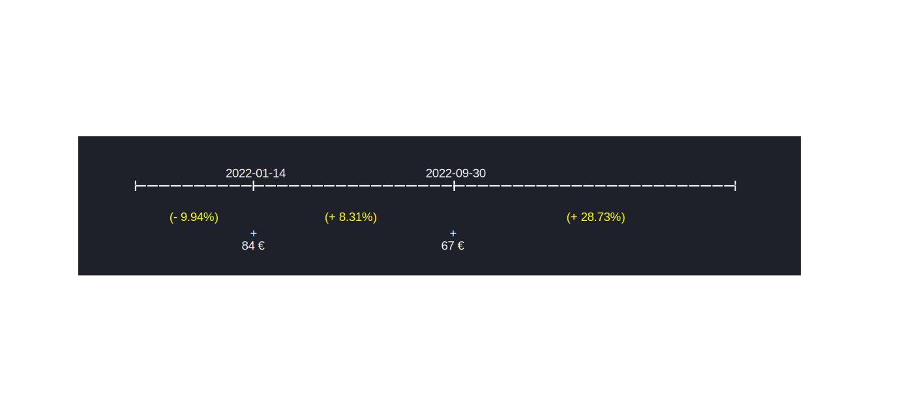
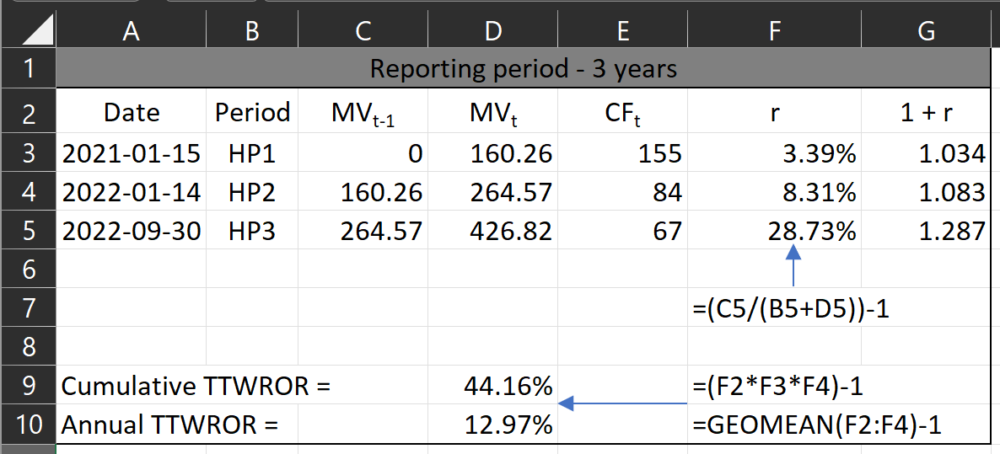
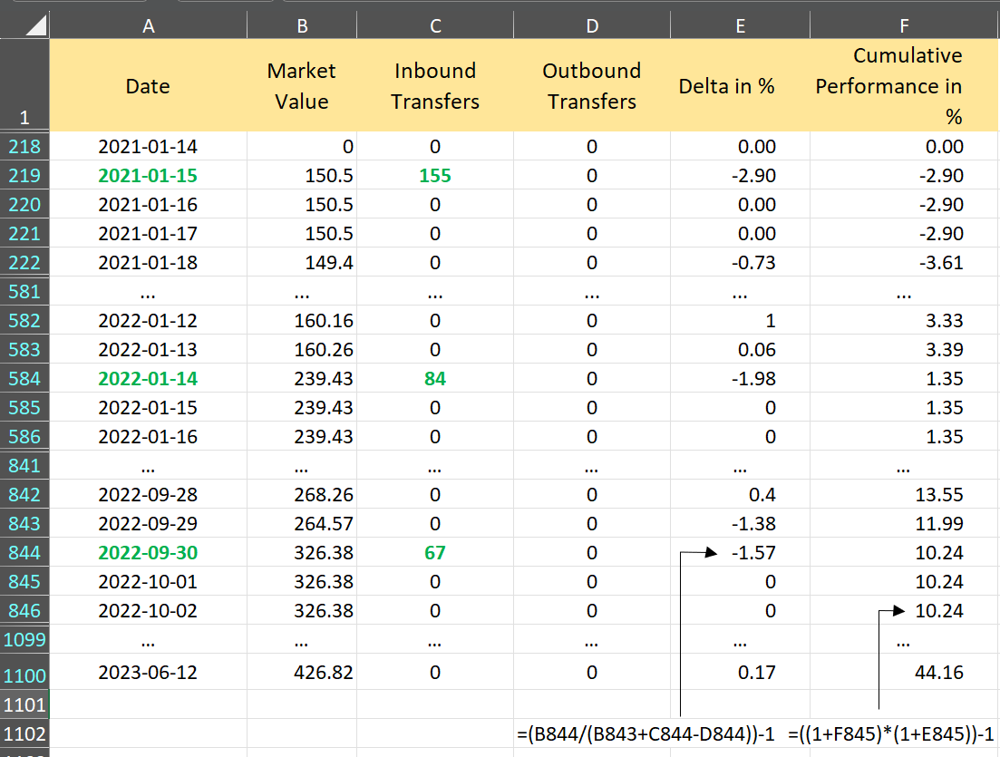
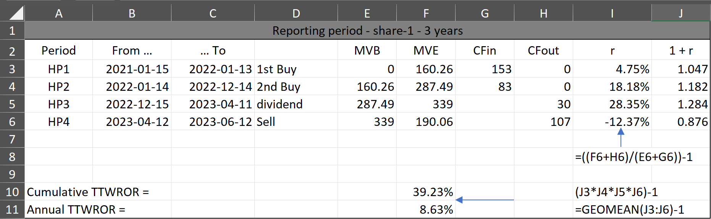
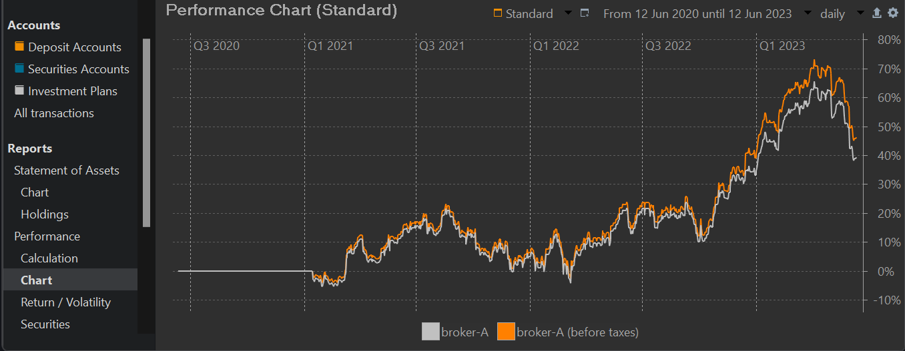

# Time-Weighted Rate of Return
The calculation of the time-weighted rate of return starts with dividing the reporting period into distinct holding periods. For each holding period (HP), a return value is calculated (Eq 1) and then compounded into an overall return (Eq 2).

$$\mathrm{r = \frac{MVE}{MVB + CFin - CFout} - 1 \qquad \text{(Eq 1)}}$$

where MVE = the market value of the portfolio at the end of the holding period, MVB is the market value at the beginning of the holding period. This is the same value as the MVE of the previous holding period. CFin is the incoming (positive) cash flow, and CFout is the outgoing (negative) cashflow in that period.

$$\mathrm{r = [(1 + r_1) \times (1 + r_2) \times (1 + r_3) \cdots (1 + r_{n-1}) \times (1 + r_n)] - 1 \qquad \text{Eq  (2)}}$$

where $r_t$ is the return rate from holding period *t*.

To minimize the computational effort, **older methods** utilized larger holding periods (PP uses days). A natural marker could be the dates of each cash flow. A holding period starts at period start or immediately before a cash flow and ends just before the following cash flow or the period end (see Figure 1). Note that for a 3 years reporting period, HP1 starts just before CFin1 with market value = 0 EUR. For a 2 years period, HP1 start at the period start with a market value of 177.94 EUR. Also notice that market value at the end of period 1 (MVE1) is the same as the market value at the beginning of period 2 (MVB2).

Figure: Holding periods in demo-portfolio.{class=pp-figure}

The return rate is thus corrected for the cashflow, occurring in that period. If there is a difference between the nominator and denominator in Equation 1, it should be caused solely by the gain or loss of the portfolio, independent of the cash flows. Without the correction, the return of HP2 should be: 264.57/160.26 or 65% while in reality the absolute gain of 104 EUR is mostly the result of the incoming cashflow of 84 EUR. The same reasoning holds for an outgoing cash flow. The uncorrected return underestimates the real return because money has left the portfolio. 

Please note that for each holding period, you require the market value of the portfolio *twice*: once at the end of the previous holding period and once at the end of the current one. A cashflow can be positive (inbound transfer) or negative (outbound transfer); assuming that fresh money is added at the beginning of the day (and hence is available to generate return) and removed at the end of the day.

## TTWROR at portfolio level

Our [demo-portfolio-03.xml](../../assets/demo-portfolio-03.xml) portfolio contains one deposit account and two securities accounts with two shares. Only three transactions, e.g. deposits (CFin) are important to calculate the performance of the whole portfolio (see Figure 1). The dividend payment and the sale are deposited into a cash account and don't represent a CFin or CFout of the portfolio. They are evaluated in the market value at the period's end. 

For each period, you need MVB or $\mathrm{MVE_{t-1}}$ and the current $\mathrm{MVE_{t}}$ period. Because the market value is determined at the end of the trading day (closing price), $\mathrm{MVE_{t-1}}$ is also the value immediately before the cashflow at the beginning of the day.

!!! Note
    One could argue that, as we are required to add the cash flow $CFin_t$ to $MVE_{t-1}$ (as per Equation 1), an alternative approach is to consider the market value of $MVE_{t}$, which already includes this cash flow $CFin_t$. However, it's important to note that throughout the day, market forces may cause fluctuations in the original $MVE_{t-1}$, and these variations should be excluded when determining the market value at the beginning of the day, just before the cash flow.

### Manual calculation

Figure: Manual calculation of cumulative and annual TTWROR (3 years period).{class=pp-figure}

As can be seen in Figure 1 and 2 [[download workbook](../../assets/demo-portfolio-03-calculation.xlsx)], the market value at the beginning of the HP1 is zero EUR (immediately before CF1) and 160.26 at the end (immediately before the next cash flow). There was one inbound positive cashflow of 155 EUR, necessary for buying 10 shares of `share-1`. The return of this period = 160.26/(0 +155) = 3.39%. Thus, eliminating the effect of the incoming cash flow, your portfolio has grown with 3.39% during this holding period of 364 days.

Compounding these individual periodical returns into one portfolio return for the whole portfolio with Equation 2 results in a cumulative performance of 44.16%.

### Exporting data from PP
Since computer time is inexpensive nowadays, there's no need to define long holding periods to minimize manual computation. Therefore, PP employs a single day as the holding period. You can easily export a CSV-file with the daily portfolio values. Select the menu `View > Reports > Performance > Chart` and click the icon (top right) `Export Data as CSV`. Choose `Export Entire Portfolio` (see Figure 3 for an abbreviated example). `Delta in %` corresponds with the computed return *r* in figure 2. The `Cumulative Performance in %` is the cumulative TTWROR in Figure 2, but as you can see it is calculated daily.

Figure: CSV-file from Export Data as CSV (3 years period).{class=pp-figure}

The calculation is analogous to the explanation for manual calculation using longer holding periods. Before `2021-01-15`, all values are zero, as the first transaction occurred on that day. Note however that the performance for `2021-01-15`is negative in Figure 3 and positive in Figure 2. This is the result of the daily calculation approach. The performance is indeed negative for that single day; due to fees and taxes. The market value of `share-1` is 150 EUR, but you have paid 155 EUR: 150/(0+155) = -2.90%. The performance in Figure 3 is the performance for the entire HP1. Compounding the daily returns will lead by 2023-01-13 (the day before the following cash flow) to the calculated 3.39% in Figure 2.

The TTWOR for the whole portfolio over all holding periods is 44.16% in both calculations.

## TTWROR at security level

Understanding the calculation for a single security should not pose any problems by now. In PP you can retrieve these values through the menu `View > Reports > Performance > Securities`. However, these values are not displayed by default and should be made available with the `Show or Hide columns` icon (top right).

Figure: Cumulative and annual TTWROR for securities - share-2.{class=pp-figure}

For the manual calculation, you need to define the holding periods. For `share-2` one HP suffices: from just before the buying date until the end of the reporting period. The market value of `share-2` at the beginning of the holding period is 0 EUR and at the end 111.76 (8 shares at 13.97 EUR/share). You purchased these 8 shares at 8 EUR/share with 2 EUR fees. Taxes, however are **NOT** included in the performance calculation (see [IRR for an explanation](./money-weighted.md#irr-at-security-level)). So, the total value of CFin = 66 EUR. The TTWROR is thus equal to 111.76/(0 + 66)= 69.33%.

The manual calculation for `share-1` is more complex (2 buy, 1 sale, 1 dividend transaction). Figure 5 lists all the data.

Figure: Cumulative and annual TTWROR for securities - share-1 (3 years period).{class=pp-figure}

## TTWOR at securities account level

A portfolio can consist of various securities and deposit accounts. To compute and exhibit the performance of each account separately, navigate to `View > Reports > Performance > Chart` in the menu. In Figure 8, the graphs depict the performance of the securities account labeled as `broker-A`, both pre and post-tax. Hovering the mouse over the graph reveals the corresponding values; for instance, on April 9, 2023, the performance of broker-A was 64.24% after taxes and 71.76% before taxes.

Figure: Performance of security account with and without taxes. {class=pp-figure}

