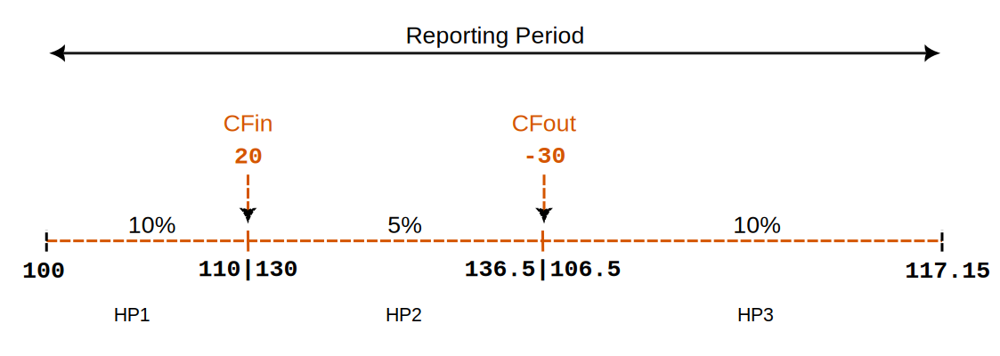
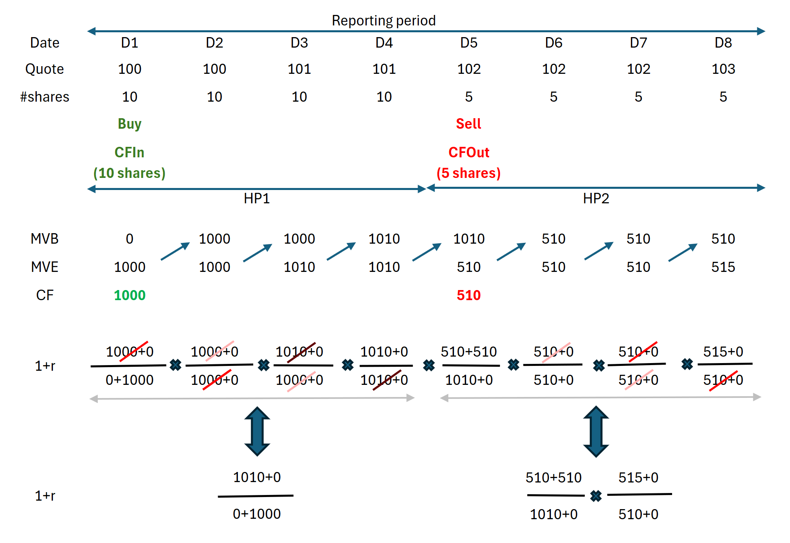

# Time-Weighted Rate of Return

The Time-Weighted Rate of Return (TWR) treats each time period equally when calculating the return rate, regardless of the amount invested during those periods. In contrast, the Money-Weighted Rate of Return (MWROR) gives more weight to periods with larger investments, factoring in both the size and timing of cash flows.

## General Method

In most financial management handbooks, calculating the time-weighted rate of return for a reporting period is described as a three-step process:

1. Divide the reporting period into **subperiods** based on cash flow dates: A subperiod runs from the start of the reporting period or from just before a cash flow until just before the next cash flow or the end of the reporting period. As such, the sub-periods are likely to have unequal durations.

2. Calculate the sub-period **growth rates** using Equation 1:
    
    $$\mathrm{1 + r = \frac{MVE + CFout}{MVB + CFin} \qquad \text{(Eq 1)}}$$

    where MVE = the market value of the asset at the end of the holding period, MVB is the market value at the beginning of the holding period (which is the same value as the MVE of the previous holding period). CFin is the incoming cash flow, and CFout is the outgoing cash flow in that period.

3. **Compound** the sub-period returns into the overall performance for the reporting period using Equation 2:

    $$\mathrm{r = [(1 + r_1)  \cdots  \times (1 + r_n)] - 1 \qquad \text{(Eq  2)}}$$

    where *n* is the number of holding periods and rt is the return rate for holding period *t*.

    !!! Note
        Figure 1 depicts a simplified example with three holding periods and *known* performances (10%, 5%, and 10%), along with one incoming cashflow (20) and one outgoing cashflow (-30). In reality, however, actual returns are unknown; only the intermediate valuations of the portfolio are available.

        Figure: Portfolio with 1 Deposit and 1 Withdrawal (Removal) transaction and thus 3 holding periods.{class=pp-figure}

        

        What is the TWR of this portfolio? According to Equation 2, this should be: `[(1+0.1)*(1+0.05)*(1+0.1)]-1 = 27.05%`. Please note, that this is *not* an annualized return but a return for the entire period. The durations of the holding periods could differ but no information about durations is provided. Secondly, the sequence of the returns does not matter; (5%, 10%,10%) gives the same result. Lastly, the size and timing of the cash flows do not impact the result. If there were no cash flows for example, the intermediate values would be: `100*1.1= 110; 110*1.05= 115.5`, and `115.5*1.1= 127.5`. This is excatly the same result as starting with a MVB = 100 and a performance of 27,50% or the starting value `100*1.275`.

        However, since there are cash flows, Equation 1 could be used to calculate the holding period returns (instead of assuming they were given):
        
        - HP1: no cash flow: `(110/100)-1 = 10%`.
        - HP2: cash inflow of 20: `[136.5/(110+20)]-1 = 5%`.
        - HP3: cash outflow of -30: `[117.15/(136.5-30)]-1 = 10.33%` .
        
        Please note that the formula for the cash outflow is slightly different than the one given in Equation 2 (see [TTWROR at security level](./time-weighted.md#ttwror-at-security-level) for an explanation). 
        
        
## Implementation in PP

In the classical method described above, an asset valuation is required at each cash flow. You need to know the value of the portfolio or asset just before each cash flow. However, there are instances when this isn't feasible, and only monthly or quarterly valuations are available. These valuations may or may not coincide with the cash flows. In such cases, an approximation can be used. However, when a valuation is available just before each cash flow, a *True* Time-Weighted Rate Of Return (TTWROR) could be calculated. The term is coined to differentiate this method from the approximations mentioned above.

In the past, when computing power was expensive, it made sense to create longer holding periods to ease the computational burden, particularly for the required valuations at each cash flow. Today, this is no longer the case, and software like PP can calculate the market value of investments practically in real time. As an in-between solution, PP creates valuations of the different components on a daily basis, regardless of whether there is a cash flow. Therefore, the holding periods all have equal durations of one day.
In the past, when computing power was expensive, it made sense to create longer holding periods to ease the computational burden, particularly for the required valuations at each cash flow. Today, this is no longer the case, and software like PP can calculate the market value of investments practically in real time. As an in-between solution, PP creates valuations of the different components on a daily basis, regardless of whether there is a cash flow. Therefore, the holding periods all have equal durations of one day.

With daily valuations, it makes sense to assume that cash inflows occur at the very start of the day. The money is immediately available to invest during the day. Consequently, there will never be a portfolio with an MVB of 0, because cash inflows are added immediately to the portfolio. PP also assumes that cash outflows occur at the very end of the day, just before valuation. Thus, it makes sense to reflect this in Equation 1: inflows are added to the MVB, and outflows are added to the MVE.

## TTWROR at portfolio level

The relevant cash flows for the performance calculation at portfolio level are: `Deposit`, `Withdrawal (removal)`, `Delivery In`, and `Delivery Out`. Refer to the [Defining Cashflows section](money-weighted.md#defining-the-cashflows), and in particular [Figure 3](./images/transaction-cashflows.svg) from the chapter about Money-Weighted Rate of Return for detailed information.

!!! Note
    Figure 2 displays the necessary info for calculating the TTWROR of demo-portfolio-03.

    Figure: Overview of transactions - Deposit (3x), Buy (3x), Dividend, and partial Sell and charts of share-1 and share-2.{class=pp-figure}

    

We will use a **2-year reporting period** starting from June 12, 2021 in the following examples. Since the initial purchase of `share-1` for 155 EUR occurred outside of this reporting period, there are only two cash flows that impact the performance. By June 12, 2021 the market value of `share-1` (MVB) was increased to 177.94 EUR; see the first chart in Figure 2. 

Figure: Portfolio from demo-portfolio-3.xml (2 years reporting period).{class=pp-figure}

If there aren't any cashflows in a holding period such as in HP1, one can use the [simple rate of return](index.md) formula: `r = MVE/MVB - 1 = 160.26/177.94 - 1 = - 0.0994` or - 9.94% for HP1.

The second holding period however starts just before a cash inflow (+ 84 EUR). The MVE is 264.57 EUR. According to Equation 1 the rate of return `r = 264.57 + 0 / (160.26 + 84)` or 8.31%. By adding the cash inflow to the denominator, the influence of this cash flow on performance is neutralized.

The MVB of the HP3 is the same as the MVE of HP2 or 264.57 EUR. There is a cash inflow of 67 EUR and the MVE = 426.82 EUR. The performance `r = 426.82 / (264.57 + 67)` or 28.73%.

It's important to emphasize that the timing of the cash flows is not considered in this calculation. It doesn't matter whether HP1 is short or long. Additionally, the performance is calculated independently of the size of the cash flow, with the cash inflow being added to the beginning Market Value of the Portfolio (MVB). This approach contrasts with the money-weighted rate of return calculation, where both timing and size of cash flows are taken into account.

For each period, you need MVBt (or MVEt-1) and the MVEt period. Because the market value is determined at the end of the trading day (closing price), MVEt-1 is also the value immediately before the cashflow at the beginning of the day.

!!! Note
    One could argue that, as we are required to add the cash flow CFin to MVEt-1 (as per Equation 1), an alternative approach is to consider the market value of MVEt, which already includes this cash flow CFint. However, it's important to note that throughout the day, market forces may cause fluctuations in the original MVEt-1, and these variations should be excluded when determining the market value at the beginning of the day, just before the cash flow.

### Exporting data from PP

Since computer time is inexpensive nowadays, there's no need to define long holding periods to minimize manual computation. Therefore, PP employs a single day as the holding period. You can easily export a CSV-file with the daily portfolio values. Select the menu `View > Reports > Performance > Chart` and click the icon (top right) `Export Data as CSV`. Choose `Export Entire Portfolio` (see Figure 4 for an abbreviated example). `Delta in %` corresponds with the computed rate of return *r*. The `Cumulative Performance in %` is the cumulative or total TTWROR, compounding all returns from the previous days.

Figure: Extract of CSV-file from Export Data as CSV (2 years period - portfolio level).{class=pp-figure}

The calculation is analogous to the explanation of the manual calculation. Note that the majority of rows from the Excel sheet are hidden. The market value of the portfolio on `2021-06-12`was 177.94 EUR. At the end of HP1 on `2022-01-13` it has dropped to 160.26 EUR. On June 14, a deposit (and buy of share-2) was made. The market value of the portfolio increases as a result to 264.57 EUR. Due to fees and taxes (see Figure 2), the daily performance is negative. The cumulative performance is calculated according to Equation 2, leading to a total performance of the portfolio of 25.58% for the entire reporting period.

## TTWROR at security level

The previous section describes the performance of the whole portfolio, including deposit accounts. Understanding the performance calculation for a single security should not pose any problems by now. The same principles are applied. However, there are quite a few differences qua approach. 

1. Focusing on a single security ensures that other assets, such as deposit accounts, are not included in the calculation.
2. Conversely, transactions such as dividends and sales are now incorporated into the performance calculation. Since the proceeds from a sale or dividend are deposited into a cash account, money exits the system from the perspective of the security and is thus factored into the calculation.
3. Special provisions are made for taxes. These are not included in the calculation; see [IRR for an explanation](./money-weighted.md#irr-at-security-level).

In PP you can retrieve the IRR and TTWROR of a security through the menu `View > Reports > Performance > Securities`. However, these values are not displayed by default and should be made available with the :gear: `Show or Hide columns` icon (top right).

Figure: Periodic and annual TTWROR for securities (2 years period). {class=pp-figure}

The chart from the menu `View > Reports > Performance > Chart` can exhibit multiple time series (click the Gear icon). In Figure 6, the cumulative TTWROR for the entire portfolio is depicted, along with individual graphs for `share-1` and `share-2` over a 2-year reporting period, starting from June 12, 2021. As `share-2` was acquired on September 30, 2022, its performance until that date registers as zero (indicated by the horizontal orange line). From that point onward, the performance of the portfolio diverges from that of `share-1` due to the notably successful yet relatively minor contribution of `share-2` within the overall portfolio. As can be seen, the periodic TTWROR of the entire portfolio or the last cumulative performance of the portfolio is 25.58%, as calculated in Figure 4.

Figure: Graph of the cumulative performance of portfolio, share-1, and share-2 (2 years period).{class=pp-figure}

For the manual calculation, you need to define the holding periods. This is fairly easy for `share-2`. One holding period should suffice: from just before the buying date until the end of the reporting period. The MVB of `share-2` at the beginning of the holding period (just before the buy) is 0 EUR. The MVE equals 111.76. The buy-transaction cost (taxes excluded) is 66 EUR. The TTWROR is thus equal to `111.76/(0 + 66) = 69.33%`. You can see this in Figure 6, where the orange line ends just below 70%.

The manual calculation for `share-1` is more complex due to the involvement of multiple transactions, especially outflow transactions such as dividends and sales. The best approach to understanding the problem is to draw a timeline, as depicted in Figure 3 or Figure 8. The table below summarises all the relevant info and is based on the CSV export of the *daily* data (market value, daily rate of return, and cumulative rate of return) from the graph in Figure 6 (click the :material-upload: up-pointing arrow at the top-right). 

Figure: Manual calculation of (cumulative) performance of share-1.{class=pp-figure}

Note that Figure 7 illustrates two distinct methods for defining holding periods. The first method, previously discussed, defines a holding period from immediately before a cash flow (or the start of the reporting period) until just before the next cash flow (or the end of the reporting period). In this case, the calculated TTWROR is 19.71%, which is higher than the PP indicator of 14.98% (see Figure 5). However, this method is inappropriate for this particular scenario due to the presence of cash outflows.

The reason is that, as shown in Equation 1, outflows are added to the Market Value End (MVE), while inflows are added to the Market Value Begin (MVB). Figure 8 presents a simplified example for clarification.

The reporting period spans 8 days, with a cash inflow (buy) on D1 and a cash outflow (sell) on D5, resulting in two holding periods. The MVB and MVE are displayed below. Note that MVBt = MVEt-1 and that MVEt = quote x #shares for that day.

Figure: Simplified example.{class=pp-figure}

According to Equation 1, `1 + r = (MVE + CFout)/(MVB + CFin)` or for day 1: `(1000+0)/(0+1000)`; which results in a performance of zero. Note that, since MVBt = MVEt-1, the terms in the numerator and denominator cancel out, leaving the simplified formula for the return of the first holding period (HP1) as: `1 + r = (1010 / 1000), or r = 1%`.

However, this method cannot be applied to HP2, because the cash outflow (510 EUR) is added to the MVE of the selling date. The numerator of day 55 isn't equal to the denominator of day 6. The correct simplified formula for HP2 is thus separating the performance calculation for the transaction date from the following days, as is done in Figure 7 (lower part). If the first method was used, then the cash outflow would be added to the MVE of day 8; which is of course not the selling date.

Transferring this method to Figure 7, the return rate of HP1 is straight-forward. `r = [(160.26 + 0)/(177.94 + 0)] - 1 = -9.94%`. HP2 contains a cash inflow (buy), which causes no problems: `r = [(287.49 + 0)/(160.26 + 83)] - 1 = 6.43%`.

HP3 and HP4 are special cases as they contain cash outflows. They are split into the day of the transaction itself and the remaining period. The MVE is increased with the cash outflow to neutralize the effect of this outflow. The MVE date of the third holding period is April 11, 2023, while the dividend is disbursed on December 12, 2022. Although an imperfect solution, one approach could involve modifying the formula to subtract the dividend from the MVB, which is at the correct date. However, remember that PP records inflows at the beginning of the trading day and outflows at the end of the day. While the difference for the dividend payment is relatively minor (e.g., 287.49 versus 283.47), it is more significant for the selling transaction (e.g., 339 versus 224). By splitting the holding period into two sub-periods, this issue is resolved, enabling the retention of the original formula in Equation 1.

## TTWROR p.a.

Figure 5 displays both the (periodic) `TTWROR` and the `TTWROR p.a.` (per annum or Latin for per year). The periodic TTWROR represents the performance for the entire reporting period. You can add the `TTWROR p.a.` indicator in every table or widget with the :gear: icon.

The `TTWROR p.a.` indicator is calculated by assuming that a year has 365 days.

For example, if the periodic TTWROR is 30% over two years or 730 days, the annualized value would be 14.02% or (1.3 ^ (365/730))-1. This is equivalent to taking the square root of 1.3.

If the TTWOR for the month of January is 2%, the TTWROR p.a. would be calculated as (1.02 ^ (365/31))-1, resulting in 26.26%.

The assumption of 365 days per year may cause a slight discrepancy between the `periodic TTWROR` and `TTWROR p.a.` when the reporting period includes February 29th in a leap year. However, for non-leap years like 2023, both values will be identical.

 
 

