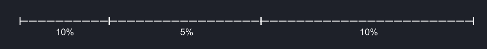
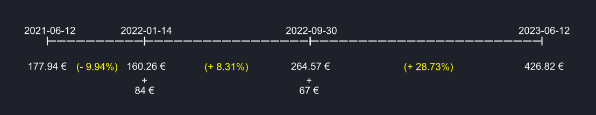
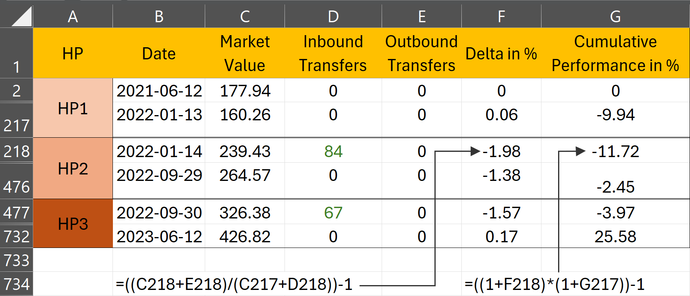
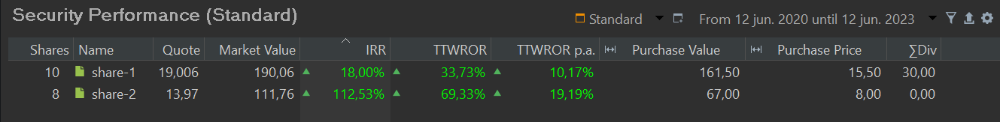
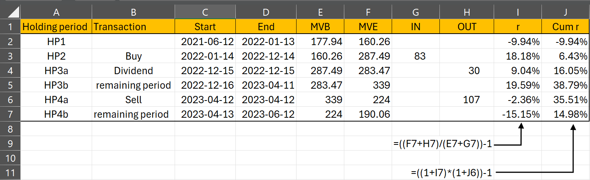

# Time-Weighted Rate of Return
The calculation of the time-weighted rate of return starts with dividing the reporting period into distinct but continuous holding periods. PP always employs a daily holding period. For each holding period (HP), a growth rate is calculated (Eq 1) and then compounded into an overall return (Eq 2).

$$\mathrm{1 + r = \frac{MVE + CFout}{MVB + CFin} \qquad \text{(Eq 1)}}$$

where MVE = the market value of the asset at the end of the holding period, MVB is the market value at the beginning of the holding period. Because the HP are continuous, this is the same value as the MVE of the previous holding period. CFin is the incoming cash flow, and CFout is the outgoing cashflow in that period.

$$\mathrm{r = [(1 + r_1) \times (1 + r_2) \times (1 + r_3) \cdots (1 + r_{n-1}) \times (1 + r_n)] - 1 \qquad \text{Eq  (2)}}$$

where $r_t$ is the return rate from holding period *t*.

To gain a clearer understanding of Eq 2, let's consider a simplified example with three holding periods and known performances: 10%, 5%, and again 10%, as illustrated in Figure 1.

Figure: Portfolio with 2 BUY-transactions and 3 holding periods.{class=pp-figure}

Imagine you start with a capital of 1 EUR. What amount will you have at the conclusion of the first holding period? Following the [simple rate of return](./index.md), this should be: `1 x (1 + 0.10) = 1.1 EUR`. During the second holding period, this value will further increase by 5%: `1.1 x (1 + 0.05) = 1.155 EUR`. To determine the final value at the end of HP2 in one step, you must compound both rates: `1 x (1 + 0.1) x (1 + 0.05)`. For the third holding period, the calculation expands to:` 1 x (1 + 0.1) x (1 + 0.05) x (1 + 0.10) = 1.2705`. Subtract the initial value and divide by 100 to obtain the rate of return as a percentage: 27.05%. The total performance of this portfolio exceeds the sum of the individual rates because subsequent holding periods benefit from the outcomes of previous ones. It's important to note that the holding periods differ in duration, and the formula provided doesn't incorporate this time information.

## TTWROR at portfolio level

Of course, the return rates of our portfolio are not readily available and must be calculated. For this purpose, Eq 1 is necessary. Let's examine the project depicted in Figure 2. You can download the project file named [demo-portfolio-03.xml](../../assets/demo-portfolio-03.xml) for further analysis.

!!! Note
    Our [demo-portfolio-03.xml](../../assets/demo-portfolio-03.xml) portfolio contains one deposit account and two securities accounts with two shares. All transactions are displayed in Figure 2. Only three transactions, e.g. deposits (CFin) are important to calculate the performance of the whole portfolio. The dividend payment and the sale are deposited into a cash account and don't represent a CFin or CFout of the portfolio.  Also, the buy transactions are irrelevant on portfolio level: the cash outflow from the deposit account counterbalances the cash inflow in the securities account. No money is leaving or entering the portfolio.

    Figure: All transactions in demo-portfolio-03.xml.{class=pp-figure}

    

Figure 3 depicts a 2-year reporting period starting from June 12, 2021. The initial purchase of share-1 for 155 EUR occurred outside of this reporting period. However, by June 12, the market value of share-1 had increased to 177.94 EUR, which represents the MVB of the portfolio for the first holding period.

Figure: Portfolio from demo-portfolio-3.xml (2 years reporting period).{class=pp-figure}

PP calculates the performance on a day per day basis. However, to minimize the computational effort, *older methods* utilized larger holding periods. A clean delineation of the holding periods can be achieved by using the dates corresponding to each cash flow. A holding period starts at the reporting period start (HP1) or immediately before a cash flow and ends just before the following cash flow (HP2) or the period end (HP3); see Figure 2. Please note that for the mentioned two-year reporting period, HP1 commences at the outset and concludes just before the 84 EUR cash inflow. The market value of the portfolio at that time was 160.26 EUR. Please note that the cash inflow is *immediately after* the holding period start. Subsequently, the second holding period immediately follows and extends until just before the second cash flow.

A cashflow can be positive (inbound transfer) or negative (outbound transfer); assuming that fresh money is added at the beginning of the day (and hence is available to generate return) and removed at the end of the day.

If there aren't any cashflows in a holding period such as in HP1, one can use the [simple rate of return](index.md) formula: `r = MVE/MVB - 1 = 160.26/177.94 - 1 = - 0.0994` or - 9.94%.

The second holding period however starts just before a cash inflow (+ 84 EUR). The MVE is 264.57 EUR. According to Eq 1 the rate of return `r = 264.57 / (160.26 + 84)` or 8.31%. By adding the cash inflow to the denominator, the influence of this cash flow on performance is neutralized.

The MVB of the HP3 is the same as the MVE of HP2 or 264.57 EUR. There is a cash inflow of 67 EUR and the MVE = 426.82 EUR. The performance `r = 426.82 / (264.57 + 67)` or 28.73%.

It's important to emphasize that the timing of the cash flows is not considered in this calculation. It doesn't matter whether HP1 is short or long. Additionally, the performance is calculated independently of the size of the cash flow, with the cash inflow being added to the beginning Market Value of the Portfolio (MVB). This approach contrasts with the money-weighted rate of return calculation, where both timing and size of cash flows are taken into account.

For each period, you need MVB or $\mathrm{MVE_{t-1}}$ and the current $\mathrm{MVE_{t}}$ period. Because the market value is determined at the end of the trading day (closing price), $\mathrm{MVE_{t-1}}$ is also the value immediately before the cashflow at the beginning of the day.

!!! Note
    One could argue that, as we are required to add the cash flow $CFin_t$ to $MVE_{t-1}$ (as per Equation 1), an alternative approach is to consider the market value of $MVE_{t}$, which already includes this cash flow $CFin_t$. However, it's important to note that throughout the day, market forces may cause fluctuations in the original $MVE_{t-1}$, and these variations should be excluded when determining the market value at the beginning of the day, just before the cash flow.

### Exporting data from PP

Since computer time is inexpensive nowadays, there's no need to define long holding periods to minimize manual computation. Therefore, PP employs a single day as the holding period. You can easily export a CSV-file with the daily portfolio values. Select the menu `View > Reports > Performance > Chart` and click the icon (top right) `Export Data as CSV`. Choose `Export Entire Portfolio` (see Figure 5 for an abbreviated example). `Delta in %` corresponds with the computed rate of return *r*. The `Cumulative Performance in %` is the cumulative or total TTWROR, compounding all returns from the previous days.

Figure: CSV-file from Export Data as CSV (2 years period - portfolio level).{class=pp-figure}

The calculation is analogous to the explanation of the manual calculation. Note that the majority of rows from the Excel sheet are hidden. The market value of the portfolio on `2021-06-12`was 177.94 EUR. At the end of HP1 on `2022-01-13` it has dropped to 160.26 EUR. On June 14, a deposit (and buy of share-2) was made. The market value of the portfolio increases as a result to 264.57 EUR. Due to fees and taxes (see Figure 2), the daily performance is negative. The cumulative performance is calculated according to Eq 2, leading to a total performance of the portfolio of 25.58% for the entire reporting period.

## TTWROR at security level

The previous section describes the performance of the whole portfolio, including deposit accounts. Understanding the performance calculation for a single security should not pose any problems by now. The same principles are applied. However, there are quite a few differences qua approach. 

1. Focusing on a single security ensures that other assets, such as deposit accounts, are not included in the calculation.
2. Conversely, transactions such as dividends and sales are now incorporated into the performance calculation. Since the proceeds from a sale or dividend are deposited into a cash account, money exits the system and is thus factored into the calculation.
3. Special provisions are made for taxes. These are not included in the calculation; see [IRR for an explanation](./money-weighted.md#irr-at-security-level).

In PP you can retrieve the total IRR and TTWROR through the menu `View > Reports > Performance > Securities`. However, these values are not displayed by default and should be made available with the `Show or Hide columns` icon (top right).

Figure: Total and annual TTWROR for securities.{class=pp-figure}

The chart from the menu `View > Reports > Performance > Chart` can exhibit multiple time series (click the Gear icon). In Figure 6, the cumulative TTWROR for the entire portfolio is depicted, along with individual graphs for `share-1` and `share-2` over a 2-year reporting period, starting from June 12, 2021. As share-2 was acquired on September 30, 2022, its performance until that date registers as zero (indicated by the horizontal yellow line). From that point onward, the performance of the portfolio diverges from that of share-1 due to the notably successful yet relatively minor contribution of share-2 within the overall portfolio. As can be seen, the total TTWROR or the last cumulative performance of the portfolio is 25.58%, as calculated in figure 4.

Figure: Graph of the cumulative performance of portfolio, share-1, and share-2 (2 years period).{class=pp-figure}

For the manual calculation, you need to define the holding periods. This is fairly easy for `share-2`. One holding period should suffice: from just before the buying date until the end of the reporting period. The MVB of `share-2` at the beginning of the holding period (just before the buy) is 0 EUR. The MVE equals 111.76. The buy-transaction cost (taxes excluded) is 66 EUR. The TTWROR is thus equal to 111.76/(0 + 66)= 69.33%.

The manual calculation for `share-1` is more complex due to the involvement of multiple transactions (2 purchases, 1 sale, and 1 dividend transaction). The best approach to understand the problem is to draw a timeline, as depicted in Figure 3. The table below summarizes all the relevant info and is based on the CSV-export of the *daily* data (market value, daily rate of return, and cumulative rate of return) from the graph in figure 6 (click the up-pointing arrow at the top-right). 

Figure: Manual calculation of (cumulative) performance of share-1.{class=pp-figure}

The first holding period starts at the period start (2021-06-12) and ends just before the buy-transaction (of share-1). HP2 starts just before the purchase with the result that MVE of HP1 is equal to MVB of HP2.

HP3 & HP4 are special cases and split into the day of the transaction itself and the remaining period; see below for an explanation.

The return rate of HP1 is straight-forward. `r = [(160.26 + 0)/(177.94 + 0)] - 1 = -9.94%`. HP2 contains a cash inflow (buy). `r = [(287.49 + 0)/(160.26 + 83)] - 1 = 6.43%`. Comparing with the data from Figure 2, you will notice that taxes are not included in the cash inflow.

HP3 and HP4 are divided into two sub-periods, one consisting of the transaction day and the other containing the remaining days until the subsequent transaction. Why? Take a close look at Equation 2. The MVE is increased with the cash outflow, thereby allowing for a more accurate performance calculation. The MVE date of the third holding period is however April 11, 2023, while the dividend is disbursed on December 12, 2022. Although an imperfect solution, one approach could involve modifying the formula and add the dividend to the MVB (which is at the correct date). But, remember that PP records inflows at the beginning of the trading day and outflows at the end of the day. While the difference for the dividend payment is relatively minor (e.g., 287.49 versus 283.47), it is more significant for the selling transaction (e.g., 339 versus 224). By splitting the holding period into two sub-periods, this issue is resolved, enabling the retention of the original formula in Equation 1.