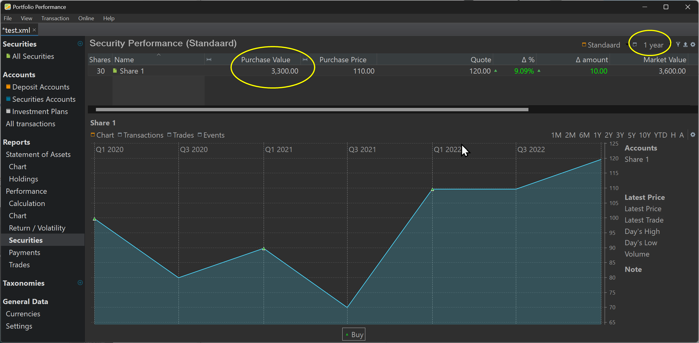
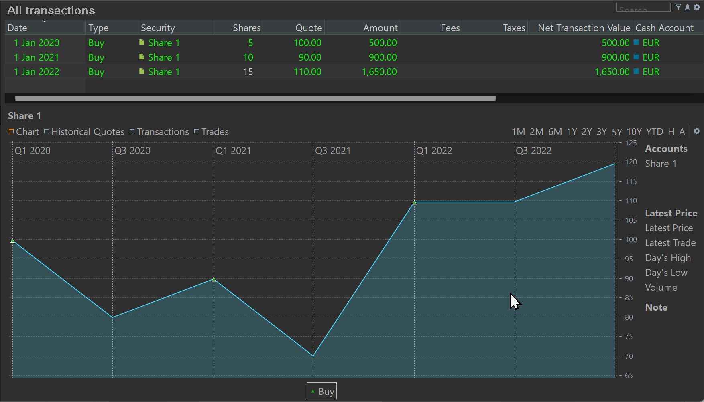
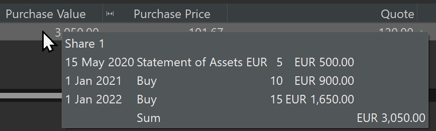
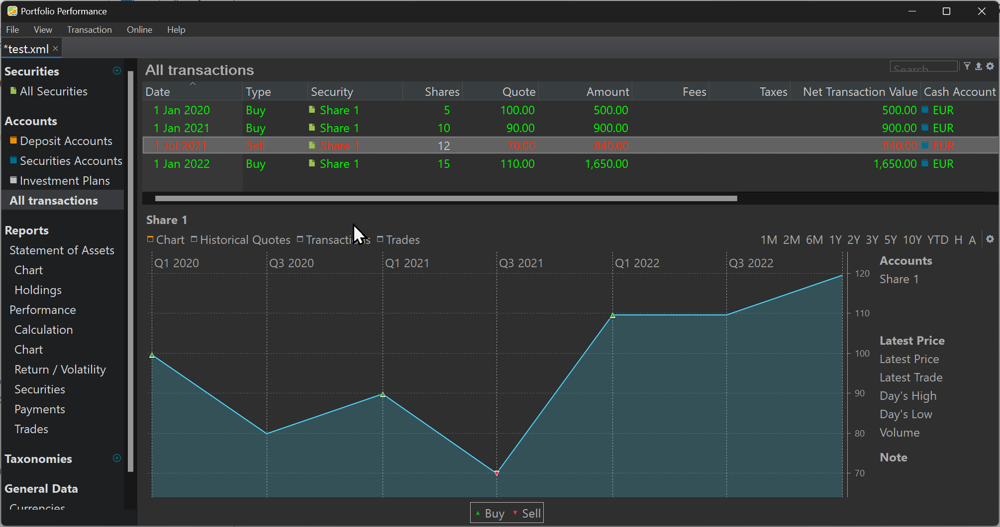

The Purchase Value of a security is the summed value of each buy (+) and sell (-) transaction of that security, taken into account the [reporting period](reporting-period.md). The value of a transaction includes the taxes and fees; sometimes also called “Net Transaction Value”.

If the purchase date lies before the beginning of the reporting period, then the value at the beginning of the period is taken. If the purchase date lies within the period, then the value at the purchase date is used. However, if the purchase data is later than the end of the reporting period, then the purchase is not taken into account for the calculation of the purchase value. Purchase Value and Purchase Price are used in Reports > Performance > Securities (see figure 1)

{.pp-figure}

Assume the following scenario. We are now 2023, May, 15th and you have bought 30 shares at different times and quotes (see figure 2). An overview of all buys and their respective quotes is shown in figure.

{.pp-figure}

The reported purchase value of a particular security is dependent upon the selected reporting period. In the Table 1, you can see that the purchase value of this simple transaction, can vary between 3300 EUR and 500 EUR, depending on the selected period.

Table: Three reporting periods based on the current day (2023-05-15)

| Period | From … to … | Purchase Value |
| --- | --- | --- |
| 1 year | 2022, May 15 - 2023, May 15 | 3300 EUR |
| 2 years | 2021, May 15 - 2023, May 15 | 3000 EUR |
| 3 years | 2020, May 15 - 2023, May 15 | 2050 EUR |
| Custom | 2000, Jan 1 - 2020, Jan 01 | 500 EUR |

The 1 year period starts at 2022, May 15 and ends today (2023,May 15); sometimes also called YTD (Year To Date). Because all purchases fall before the reporting period, the value for each of them is taken from the beginning of the period. At that time (2022, May 15), the share was valued at a quote of 110 EUR (see graph). So, the total purchase value is 30 shares * 110 = 3300 EUR. This is the beginning situation of the period (also called Statement of Assets). Since, there are no purchases afterwards, this amount is also the purchase value of the 1 year period.

The 2 years period starts at 2021, May 15. Only the third buy falls within the period. So, buy 1 and buy 2 are evaluated at the price from the beginning of the period (= 90 EUR). So, the Statement of Assets equals 1350 EUR. There is one buy afterwards (valued at the buying quote). The total Purchase Value of this 2 year period is therefore (5 + 10) shares at 90 EUR + 15 shares at 110 EUR or 1350 +1650 = 3000 EUR.

The 3 years period start at 2020, May 15. The second and third buy lie within the reporting period and are evaluated at their respective quotes: 10 shares at 90 EUR (= 900 EUR) and 15 shares at 110 EUR (= 1650 EUR). The beginning of the period or Statement of Assets is the result of the first buy (2020, Jan 1) takes the quote from the beginning of the period (2020, May 15) which is the same as the purchase quote (e.g. 100 EUR); resulting in a purchase of 5 * 100 EUR = 500 EUR.

The previous explanation can be seen in the pop-over, when hovering the mouse over the Purchase Value (see Figure 3).

{.pp-figure}

The custom period (from 2000, Jan 1 (not included) until 2020, Jan 1 (included) has a Purchase Value of 500 EUR because it contains only the first buy (= 5 * 100 EUR). The second and third buy or not taken into account because they occur later than the period end.
Things become more complicated -but with the same logic- when there are also sell transactions. Important to remember is that PP use a FIFO (First In, First OUT) method to calculate the result of a sell transaction. Suppose that you did a (rather bad timed) sell at 2021, Jul 1 2020 of 12 shares (see Figure 4).

At that moment there were 15 shares available (5 at 100 EUR and 10 at 90 EUR). Selling 12 of them will first sell the 5 shares of 100 EUR and then another 2 of 90 EUR, leaving 3 shares of 90 EUR available.

Now, let's calculate the Purchase Value for the different periods.

  + 1 year period: The period runs from 2022, May 15 until 2023, May 15. All purchases are done before the beginning of the period; so each of them is valued at the price of 2022, May 15, which is 110 EUR. How many shares are available? 5 + 10 - 12 + 15 = 18 at 110 EUR or 1980 EUR.

  + 2 years period running from 2021, May 15 until 2023, May 15. Only the last buy transaction falls within the period and is evaluated at its current quote (110 EUR). The Statement of Assets consists of 3 shares (15 buy - 12 sell). They are evaluated at the price from the beginning of the period (90 EUR). The Purchase Value for the 2 years period is: 3 * 90 EUR + 15 * 110 EUR = 1920 EUR.

  + 3 years period running from 2020, May 15 until 2023, May 15. The Statement of Assets is 0 EUR because all 5 shares from buy 1 are sold (FIFO) on 2021, Jul 15. From the second buy, only 3 shares are remaining, evaluated at 90 EUR. The third buy is evaluated at 110 EUR. The Purchase Value of the 3 years period is 3 shares * 90 EUR + 15 shares * 110 EUR = 1920 EUR. Longer periods have the same Purchase Value.
