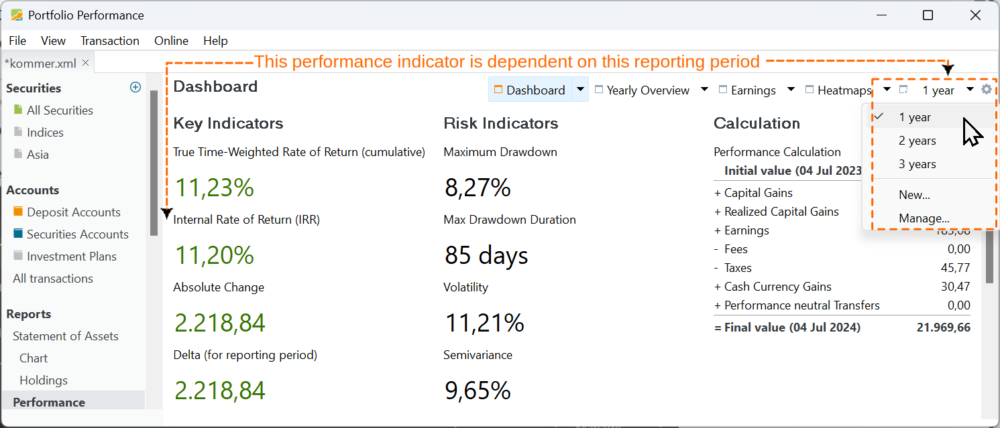
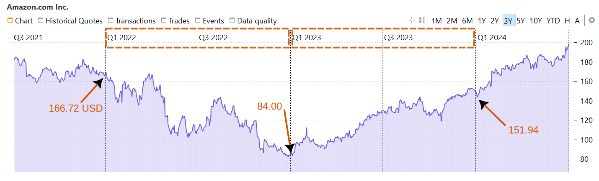

The reporting period refers to the specific timeframe used when reporting on the performance of your portfolio. For instance, the performance indicators depicted in Figure 1 are computed over a one-year period, starting from the current date. Other reports and charts, such as those concerning return/volatility and securities performance, also consider this reporting period. It's essential to understand that *every* performance calculation is based on a reporting period, even if one hasn't been explicitly defined. By default, it is set in PP to one year from the current date.

Figure: Drop-down list for selecting the reporting period. {class= pp-figure}

The reporting period can significantly influence performance and can be easily manipulated to support a particular viewpoint. Consider, for instance, the price trend of the Amazon share depicted in Figure 2. Depending on the reporting period, you have a massive loss, a massive gain, or a moderate loss.

!!! Note
    Use the equations in [Basic Concepts > Performance](./performance/index.md) to calculate the performance indices. If you want to check the numbers in PP, use the kommer portfolio. Add Amazon as a [benchmark](../reference/view/reports/performance/performance-chart.md#new-features) to the performance chart and set the appropriate reporting period e.g. 2022. Don't forget to switch the portfolio currency to USD to have the performance calculations in USD.

- 2022: `TTWROR = IRR = (84/166.72)-1 = -49.62%`
- 2023: `TTWROR = IRR = (151.94/84)-1 = +80.88%`
- 2022-2023: `TTWROR = IRR = (151.94/166.72)-1 = -8.87% or -4.53% p.a.`

Figure: Historical prices in USD for Amazon (period 2022 - 2023). {class= pp-figure}

You can set the reporting period with the drop-down period:material-triangle-small-down: in the top-right corner of the window (see Figure 1). The available options are: `1 year`, `2 years`, `3 years`, `New ...`, and `Manage ...`.  With this last option you can delete or reorder the available time periods.

The 1, 2, or 3-year period is always calculated from the current day and extends from the end of the current day to the end of the day one, two, or three years earlier. For instance, if today is July 4, 2024 then a reporting period of 1 year will extend from closing time of July 4, 2023 to closing time of July 4, 2024.  The market value at the beginning (MVB) of this period reflects the portfolio's status at the end of July 4, 2023, while MVE represents the portfolio's status at the end of July 4, 2024 (see for example Figure 3). Concerning the [IRR calculation equation](./performance/money-weighted.md), transactions made on the first date, e.g. July 4, 2023 should not be included in the equation, as they are already accounted for in the MVB of the period. Conversely, transactions on the last day of the period should be included in the equation, as they influence the MVE, even if for a very brief period. In the example mentioned above however, as the `year 2022` period extends from December 31, 2021, to December 31, 2022, a purchase made on January 1, 2022 should be regarded as a cash inflow.

With the `New` submenu, you can create custom time periods. The choice options in the Figure 3 are rather self-explanatory. You cannot give a custom name to this period as they are predefined and named by PP: for example `Last 10 trading days` or `2023` for the year 2023.

Figure: Possible custom time periods for reporting (current day is July 4, 2024). {class=pp-figure}

- `Last xxx years yyyy months`: From the current day minus the number of years and months. The standard periods `1 year`, `2 years`, `3 years` could be recreated with this option. With this syntax, however, you could create a custom period, such as a `1.5 years` period.
- `Last xxx days`:  A day refers to a calendar day. Note that in Figure 3, the last xxx days are already pre-populated. PP recognizes that the current year 2024 is a leap year with February 29 and therefore automatically sets the number of days to 366.
- `Last xxx trading days`: A trading day refers to a regular business day on which financial markets are open for trading. Weekends and days from the [selected calendar](../reference/help/preferences.md#calendar) are excluded. The calendar to be utilized can be specified in the `Help > Preferences > Calendar` menu. Are there 256 trading days in 2024? In Figure 3, the `Default` calendar was selected, which includes seven holidays: New Year, Easter Monday, Christmas Eve, and four others. In the selected period, there are 262 non-weekend days. Out of the seven holidays, six (excluding Christmas Eve 2023) fall on a weekday. Therefore, there are a total of 256 trading days in the year.
- `From xxx (excl.) until yyy`: A period between two dates, whereby the first day is not included (starts at the end of that day).
- `Since xxx (excl)`: from the given date (excluded) until today (included).
- `Year xxxx`: The year always runs from December 31, xxxx until December 31, xxxx+1.
- `Current`: `Week`, `Month`, `Quarter`, or `Year`.  A week runs from Sunday or Monday (evening) to the following Sunday or Monday (evening), depending on the country specified in the [settings](../reference/help/preferences.md#language). A quarter comprises three months, e.g. January to March, April to June, and so on. The abbreviation `YTD` stands for *Year-to-date* and refers to the period from the beginning of the current year up to the present day.
- `Previous`: `Day`, `Trading day`, `Week`, `Month`, `Quarter`, and `Year`. The `Previous Day` is not the same as `Last 1 days`. As of today, July 4, the Previous Day would be July 3 running from the evening of July 2 to the evening of July 3, whereas the Last 1 Day period would be July 4 (the current day). The Previous Trading Day is similar to the Previous Day but excludes weekends and holidays. The Previous Month runs from the first day of the previous month until the last day of the current month. The First Quarter runs from January 1 until March 31. The Previous Year starts on January 1 of the previous year and ends on December 31 of the previous year.