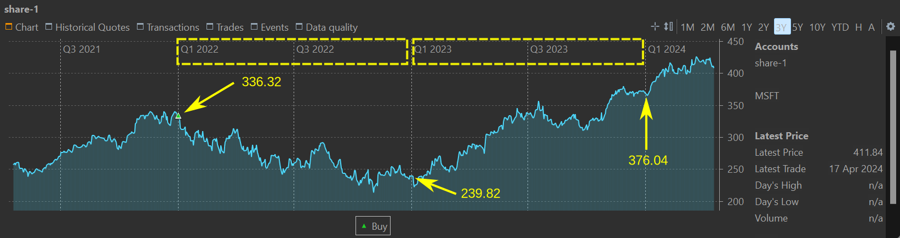

The reporting period refers to the timeframe used when reporting on the performance of your portfolio. For instance, the performance indicators depicted in Figure 1 are computed over a one-year period, starting from the present moment. Other reports and charts, such as those concerning return/volatility and securities performance, also consider this reporting period. It's essential to understand that every performance calculation is based on a reporting period, even if one hasn't been explicitly defined. By default, it is set in PP to one year from the current date.

Figure: Drop-down list for selecting the reporting period. {class= pp-figure}

The reporting period can significantly influence performance and can be easily manipulated to support a particular viewpoint. Consider, for instance, the price trend of share-1 depicted in Figure 2. Suppose you purchased 10 shares at $336 per share on January 1, 2022. Now, adjust the reporting period to cover the years 2022 and 2023, and attempt to forecast the Internal Rate of Return (IRR). You can use the equations in [Basic Concepts > Performance > Money-weighted return](./performance/money-weighted.md).

- 2022: `10 x 239.82 = 0 + 10 x 336.32 x (1 + IRR)^1` or IRR = - 28.76% 
- 2023: `10 x 376.04 = 10 x 239.82 x (1 + IRR)^1 + 10 x 239.82 x (1 + IRR)^1` or IRR IRR = +  56.80% 

Figure: Historical prices for share-1 (period 2022 - 2023). {class= pp-figure}

You can set the reporting period with the drop-down icon in the top-right corner of the window (see Figure 1). The available options are: `1 year`, `2 years`, `3 years`, `New ...`, and `Manage ...`.  With this last option you can delete or reorder the available time periods.

The 1, 2, or 3-year period is always calculated from the current day and extends from the end of the current day to the end of the day 1, 2, or 3 years earlier. For instance, for the reporting period from May 30, 2023, to May 30, 2024, the market value at the beginning (MVB) reflects the portfolio's status at the end of May 30, 2023, while MVE represents the portfolio's status at the end of May 30, 2024. Concerning the [IRR calculation equation](./performance/money-weighted.md), transactions made on the first date should not be included, as they do not affect MVE except through their inclusion in MVB. Conversely, transactions on the last day of the period should be included, as they influence MVE, even if for a brief period.

In the example mentioned above, as the 2022 period extends from December 31, 2021, to December 31, 2022, the purchase made on January 1 should indeed be regarded as a cash inflow.

With the `New` submenu, you can create custom time periods. The choice options in the Figure 3 are rather self-explanatory. You cannot give a self-chosen name to this period as they are named by PP: for example `Last 10 trading days`or `2023` for the year 2023.

Figure: Possible custom time periods for reporting. {class=pp-figure}

- `Last xxx years yyyy months`: from the current day minus the number of years and months. The pre-existing `1 year`, `2 years`, `3 years` periods could be recreated with this option. In this case however, you could create a `1.5 years` period.
- `Last xxx days` versus `Last xxx trading days`. A trading day refers to a regular business day on which financial markets are open for trading. Weekends and days from the default calendar are excluded. The default calendar is defined in the `Help > Preferences > Calendar` menu. For example, April 1, 2024 is a non-trading day because it's set in the default calendar as Easter Monday.
- `From xxx (excl.) until yyy`: the first day is not included (see above).
- `Since xxx (excl)`: from the given date (excluded) until today (included).
- `Year xxxx`: The year always runs from December 31, xxxx until December 31, xxxx+1.
- `Current`: `Week`, `Month`, `Quarter`, or `Year`. The abbreviation `YTD` stands for *Year-to-date* or from the beginning of the current year up to the present day.
- `Previous`: `Day`, `Trading day`, `Week`, `Month`, `Quarter`, and `Year`. A week runs from Sunday (evening) + 7 days. The previous month runs from the last day of the previous month until the last day of the current month. The first quarter runs from December 31 until March 31. The previous year starts on December 31 of the previous year.