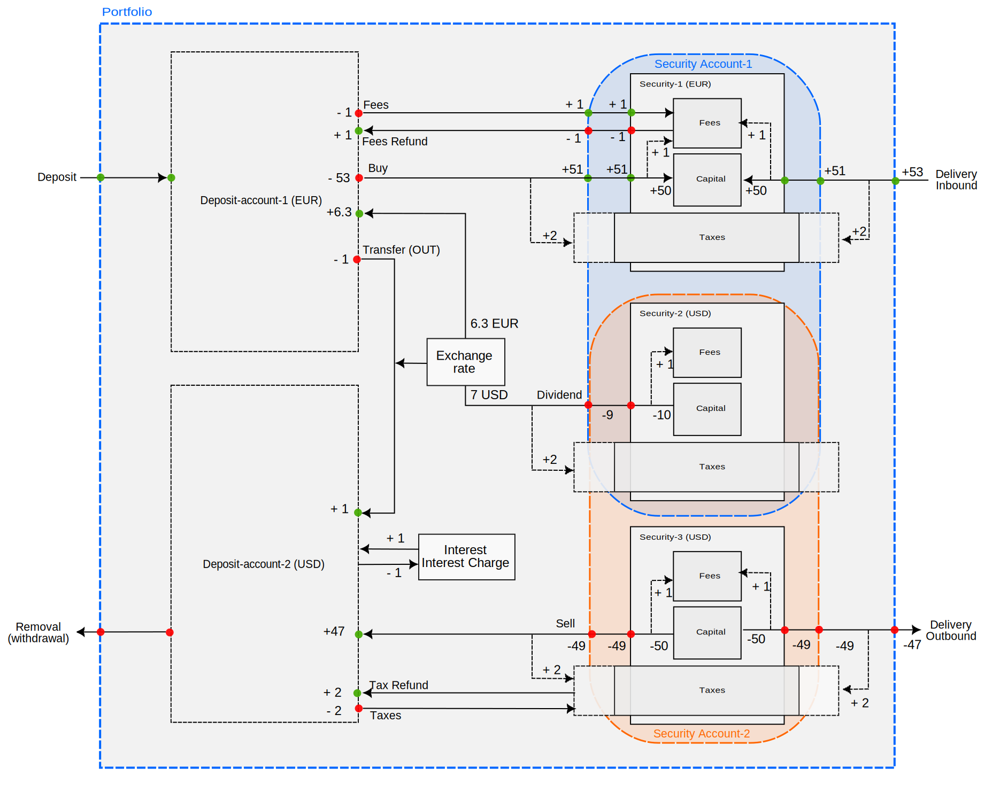

The name PortfolioPerformance (PP) captures its purpose very well: managing an investment portfolio from a performance perspective. This focus contrasts with many proprietary broker apps, which primarily facilitate the technical execution of orders. The following text outlines the principal components (see figure 1). Follow the links to obtain more information about each component. An [example](system-overview-example.md) with a simple portfolio can be found in a separate text.

## Components

Figure: System overview with components and relations.{class=pp-figure}

Performance is a multi-layered concept. Not only are there several different methods to calculate it, such as [money-weighted (IRR)](./performance/money-weighted.md) and [time-weighted (TTWROR)](./performance/time-weighted.md) rates of return, but you can also calculate performance at various levels: the [portfolio as a whole](../reference/view/reports/performance/index.md), a security or deposit account, an [individual security](../reference/view/reports/performance/securities.md), or a single [trade](../reference/view/reports/performance/trades.md). In its simplest form, without any transactions, the performance of a portfolio can be represented by the following equation (please refer to the links provided earlier for more detailed information):

$$\mathrm{r = \frac{(MVE - MVB)}{MVB} \quad (Eq  1)}$$

where MVE = the market value of the portfolio at the end of the reporting period, and MVB = the market value of the portfolio at the beginning of the period.

Performance is directly influenced by the [reporting period](./reporting-period.md), which is set by default to one year from today. The reporting period determines the value of the portfolio, account, or security at the beginning and end of the period (e.g. MVB and MVE in the performance equations). In the case of the money-weighted rate of return (IRR), it also determines the remaining duration that a cash flow has available to generate a profit or a loss at the end of the reporting period. 

[Currency exchange rates](../reference/view/general-data/currencies.md) have a more indirect influence and come into play whenever a transaction involves currency conversion. This includes transfers between different currency cash accounts and transactions such as buys, sells, and dividends in multiple currencies. For example, buying securities that are quoted in USD may require you to convert Euros to USD at a certain exchange rate. Upon selling these securities, you may need to convert the USD back to Euros. Fluctuations in the exchange rate between the time of purchase and the time of sale can result in a profit or a loss, as the value of the USD in terms of Euros may have changed.

[Historical prices](../how-to/downloading-historical-price/index.md) of securities significantly impact the market value and, consequently, the performance of the portfolio, security accounts, individual securities, and trades. It is clear that when a security's price is higher at the end of a trade compared to its price at the beginning, a profitable trade has been made. This price increase results in a capital gain, which directly contributes to the overall performance and value of the portfolio.

Last but not least, performance is directly dependent on the portfolio and transactions. *Without* any transactions within the reporting period, the basic performance equation simplifies to IRR = TTWROR = (MVE/MVB) - 1. If the MVE is greater than MVB, a profit has been made, resulting in a positive performance. Conversely, if MVE is less than MVB, the portfolio is worth less at the end of the reporting period than at the beginning, leading to a negative performance.

## Transactions

Things become more complicated when [transactions](../reference/transaction/index.md) occur during the reporting period. There are 13 types of transactions, each generating cash flows into and out of the portfolio, account, or security. Figure 2 illustrates all transaction types between the four major components: the portfolio (represented by a dashed blue line), deposit (cash) accounts in both EUR and USD, three securities (two of which are quoted in USD), and collected into two security accounts (orange and blue dashed lines). Security-2 (USD) is present in both accounts.

Transactions are represented by arrows. They generate cash outflows (red circle) or cash inflows (green circle). The numbers next to the circles represent the magnitude of the cash flow, based on a hypothetical example of a buy or sell of 5 shares at 10 EUR/USD per share, resulting in a capital inflow of 50 EUR/USD. Fees and taxes are always set at 1 and 2 EUR respectively. A dividend of 2 USD is paid per share; an exchange rate of 0.9 EUR/USD is used.

Figure: Overview of all transaction types with associated cash flows at portfolio, account and security level. {class=pp-figure}

As can be seen, **only four types of transactions** generate a cash flow at the portfolio level: deposit, removal (withdrawal), inbound delivery, and outbound delivery. These transactions will thus influence the performance indicator on the dashboard (View > Reports > Performance); which is a portfolio performance indicator. 

A [*deposit*](../reference/transaction/deposit-removal.md) transaction generates two cash inflows: one at the portfolio level and one at the deposit account level. This transaction results in an inflow because money is brought into the deposit account, and as such also into the portfolio. On the other hand, a [*withdrawal*](../reference/transaction/deposit-removal.md) creates two cash outflows and removes money from a cash account and the portfolio.

An [*inbound delivery*](../reference/transaction/delivery.md) adds shares to a security; thus increasing the capital of the security (shares x historical price) **and** the security account. Conversely, an [*outbound delivery*](../reference/transaction/delivery.md) decreases the capital by removing shares from the security, resulting in a cash outflow.

Special attention should be given to [*fees* and *taxes*](../reference/transaction/fees-taxes.md). The inbound delivery of 5 shares at 10 EUR per share will increase the capital by 50 EUR, but requires a 53 EUR inflow into the portfolio. However, the cash inflow into the security is 51 EUR, because the 1 EUR fee is only split off after the cashflow at the security boundary. To determine the cash inflow or outflow of a security, one should always incorporate the fees. Fees are considered intrinsic to the transaction, whereas taxes are not considered intrinsic to a security. Collecting taxes varies greatly per country, and the performance of a security should not depend on it. Taxes are by default excluded from the performance calculation at security level. Concerning the security account level, PP offers two possibilities: account performance **before** or **after** taxes (default calculation); see menu View > Reports > Chart > configure chart > Add data series ... The default **After taxes** calculation is shown in Figure 2. Upon crossing the security account border (second green circle), the taxes are already accounted for in the taxes component of the security. The cash inflow of the security account is thus 51 EUR. With the **Before taxes** calculation, the security account cash inflow is 53 EUR, because 2 EUR taxes are deposited into the taxes entity only after crossing the security account border.

All other transactions are internal to the portfolio; they do not influence the portfolio's performance. For example, the *transfer-out transaction* is a flow between two deposit accounts and, as such, has no impact on the performance of the portfolio, except when there is a currency conversion as in the example of Figure 2. 

Suppose that you transfer 100 EUR at the very beginning of the reporting period at a conversion rate of 1.1 EUR/USD, giving you a deposit of 90.91 USD. The exchange rate changed to 0.9 EUR/USD at the end of the reporting period. Because the performance calculation is done in the currency of the portfolio, e.g., EUR, that 90.91 USD is valued at 81.82 EUR at the period end, resulting in a loss of about 18 EUR due to currency loss.

A [*buy* transaction](../reference/transaction/buy-sell.md) closely mirrors a delivery inbound, except that the cash flow originates from inside the portfolio rather than from outside. From the perspective of the cash account, this resembles a cash outflow. The security and security account receive a cash inflow. For a discussion about fees and taxes, please refer to the earlier text.

A *sell* transaction will result in a cash inflow into a deposit account (47 USD) because the 50 USD capital sell is reduced by taxes and fees.

!!! Note
    In terms of performance, a Buy/Sell versus Delivery Inbound/Outbound transaction can produce significantly different results. Only when a buy transaction is accompanied by a deposit transaction on the same day and for the same amount, there is no difference in performance between buy versus delivery. However, when a buy transaction is not accompanied by a corresponding deposit transaction, the cash balance in the relevant account will be reduced (and potentially become negative), which can have a negative impact on the market value at the end (MVE) of the account. 

A [*dividend*](../reference/transaction/dividend.md) can be viewed as a type of sell transaction. In Figure 2, the capital (5 shares) of security-2 (USD) will provide you with a dividend (gross amount) of 10 USD (5 shares x 2 USD/share). The fees are deducted, resulting in a security and security account outflow of 9 USD. After deducting the taxes and converting the remaining 7 USD to EUR, a +6.3 EUR cash inflow is received by deposit-account-1 (EUR).

The separate *fees*, *fees refund*, *taxes*, and *taxes refund* transactions follow the same rules as outlined above. Therefore, it makes no difference whether you record taxes and fees as part of one buy, sell, or delivery transaction, or whether you split them off into a separate transaction.

A special case is made by the *interest* and *interest charge* transactions. Although they do increase or decrease the cash balance of the deposit account, they do **not** generate any cash inflow or outflow. Just as the capital of a security can increase or decrease as a result of changing quotes (capital gain or loss), the balance of a deposit account can change due to interest.