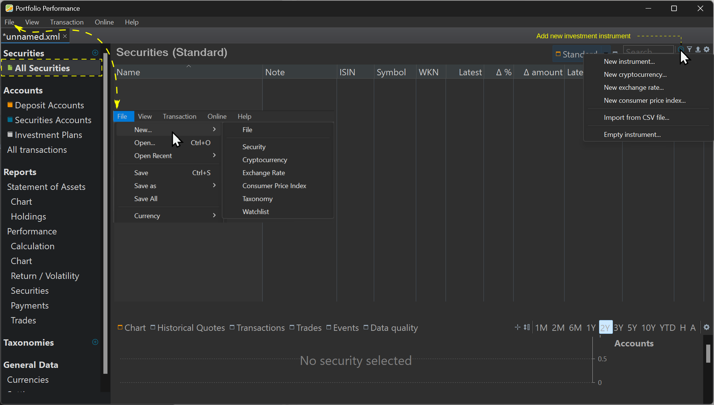
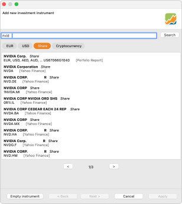

Right after the preceding *Create portfolio* step, your portfolio is still empty. You can check with the left sidebar option `Securities > All Securities`. This list should encompasses all the securities you are monitoring, not necessarily the ones you have purchased. Currently, the list is empty (see Figure 1).

!!! note
    A security is a financial instrument that holds value and can be traded between parties. Securities can be broadly categorized into: debt securities (e.g., banknotes, bonds, and debentures), equity securities (e.g., common stocks) derivatives (e.g., forwards, futures, options, and swaps) [\[Source Wikipedia\]](<https://en.wikipedia.org/wiki/Security_ (finance)>).

Figure: Main screen after creating a new portfolio.{class=pp-figure}

The `Add new investment instrument` button allows you to start adding securities to your portfolio. As you can see in Figure 1, you can add new instruments (stocks, bonds, ...), cryptocurrencies, exchange rates. You can also import securities from a CSV-file or to create a new empty security. You could also use the menu `File > New` menu (see Figure 1).

**Adding new instruments**

Suppose you intend to acquire NVIDIA shares. Before proceeding with the purchase, you must first add the specific share to the list of Securities. To achieve this, choose either `New > Security` from the menu or click on `New Instrument...` (button). This action will open the following window (refer to Figure 2).

{.pp-figure}

You can type (part of) the security name in the search box, e.g. *NVID*. After clicking the Search button, the list below will be populated with possible target instruments (see Figure 2).

After selecting the appropriate security, click on the Apply button to move on to the next step. Certain information, such as name, symbol, and historical quotes, will be pre-filled based on the selected data source. You have the flexibility to modify all this information, including the name. In Figure 3, it is evident that the currency for the NVIDIA share is incorrectly set to EUR.

 Figure: Panel for entering info about the selected security.{class=pp-figure}
 
 

In some cases, starting with an empty instrument and manually inputting the information might be more straightforward. While only the name is mandatory, it is advisable to set additional details such as `Currency`, `Symbol`, and `Historical Quotes Feed`.

More information about all these attributes can be found in the [Reference Manual > File > New](../reference/file/new.md). Finding the correct settings to import the Historical Prices of your security is described in the [How-to section](../how-to/download-historical-prices.md).