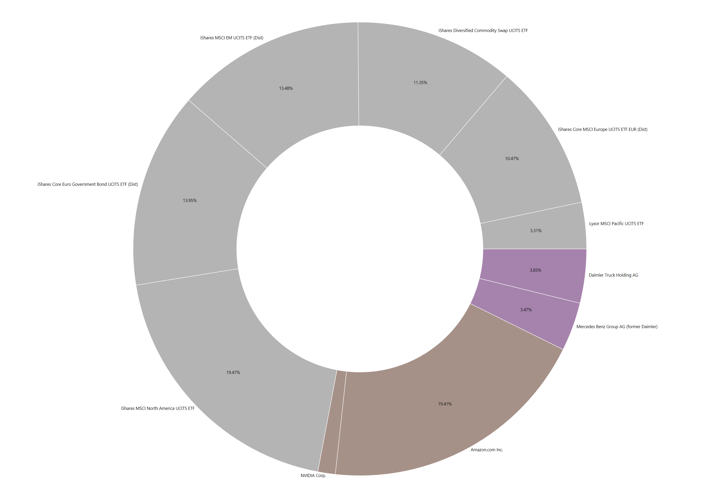
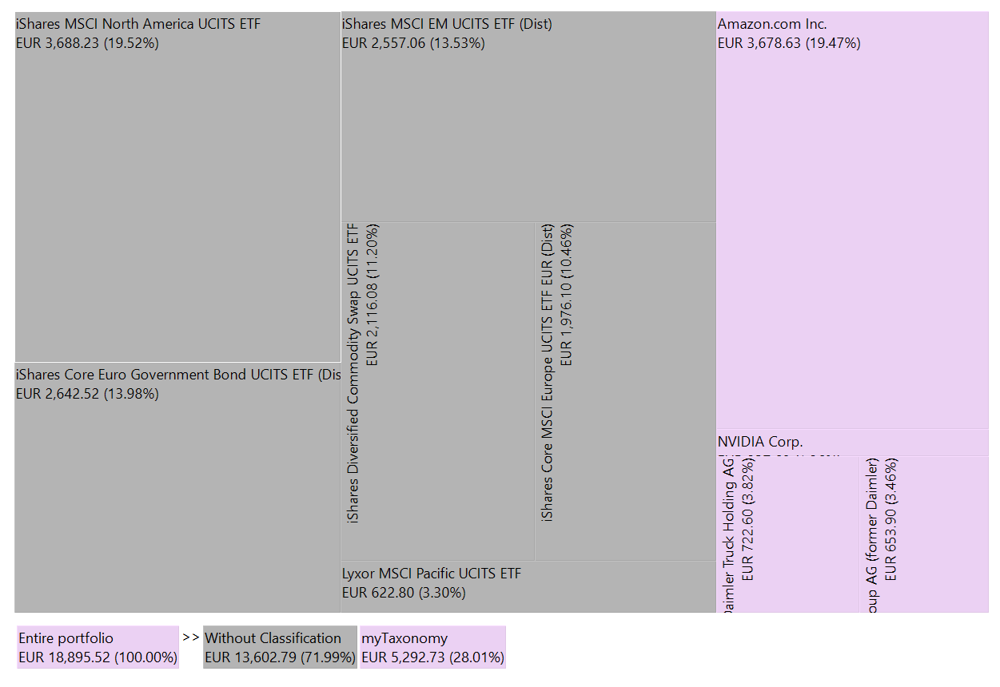
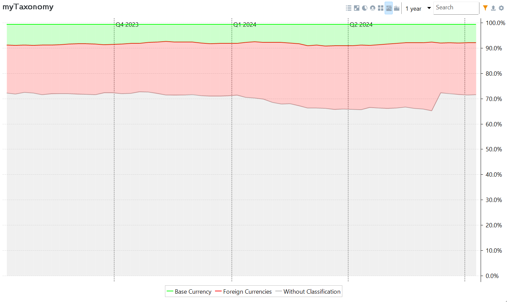

A golden rule of investment is to diversify your portfolio across different sectors, types, regions, ... This strategy helps to mitigate risk by spreading investments across various areas.

With taxonomies, you can visualise and measure diversification. A taxonomy is a tool for categorising the investments within your portfolio. There are several predefined and well-known existing taxonomies, such as the Global Industry Classification Standard (GICS), developed by MSCI. Alternatively, you can create your own custom taxonomy; see [Reference > View > Taxonomies](../reference/view/taxonomies/index.md) for further information.

Figure: Taxonomies view with several predefined and one custom taxonomy. {class=pp-figure}

In Figure 1, several predefined taxonomies (Asset Classes, Asset Allocation, etc.) and one custom taxonomy are added to the Taxonomies view. The main pane displays the definition of the custom taxonomy `myTaxonomy`. It categorises the securities into a Base Currency (EUR) or Foreign Currency group. Daimler and Mercedes are quoted in EUR, while Amazon and Nvidia are quoted in USD. Please note that most securities (72.02%) are not categorised yet and reside in a group labelled `Without Classification`.

To add a taxonomy to the Taxonomies view, select the `File` menu and choose `New > Taxonomy`, or use the sidebar. Select one of the existing taxonomies or create a new one. Use the context menu to add a new classification (category); see [Reference > View > Taxonomies > Managing taxonomies](../reference/view/taxonomies/managing-taxonomies.md) for further information.

There are several ways to add a security to a taxonomy category, the simplest being dragging it from the `Without Classification` list to the desired category, such as `Base currency` or `Foreign currencies`.

Select one of the chart icons on top to visualise the taxonomy and gain a sense of proportion between categories. Click on the tabs below to see an example of each available chart type.

=== "Donut chart"

    

=== "Pie chart"

    

=== "Tree map"

    

=== "Stacked chart"

    

=== "Stacked area chart"

    

=== "Donut chart"

    