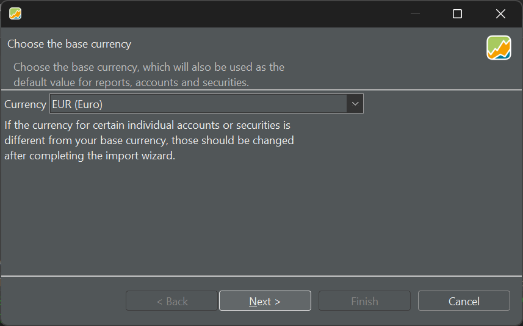

# Creating your portfolio

You can quickly create a PP file using a wizard to guide you through the setup process. There are five steps, but only the first two are mandatory. Start with the menu `File > New > File` to create a new portfolio file.

- **Step 1**
    
    First, you need to select the default currency for the portfolio (see figure 1). You can always change the currency for individual securities. PP supports almost every possible currency: from AED (United Arab Emirates Dirham) to ZWL (Zimbabwean dollar).

    Figure: Selecting the default currency for the portfolio.{class=pp-figure}

    

- **Step 2**

    Your portfolio must contain at least one security [account](../reference/view/accounts/index.md) and one associated reference (deposit) account.

    Figure: Adding security and reference accounts to the portfolio.{class=pp-figure}

    

    When at least one security account with a reference account has been created, the `Finish` button becomes available. Don't worry about the next steps if you don't understand what they are about.

    !!! note
        If you have an existing portfolio, PP supports importing CSV files to quickly add securities, buy and sell transactions, and payments. See [this tutorial](https://forum.portfolio-performance.info/t/import-csv-file/17123) for importing a portfolio and dividends.

- **Step 3**

    Sometimes, you need more than one deposit account. You can add these extra cash accounts (e.g., in different currencies) to your portfolio.

    Figure: Adding additional cash accounts to the portfolio.{class=pp-figure}

    

- **Step 4**

    As part of the creation wizard, you can also add the securities that you want to track in this portfolio. These securities are retrieved from German index trackers such as DAX (Deutscher Aktienindex), tecDax, SDAX, and MDAX. You can also add the index itself or others (e.g., NASDAQ) with `Indizes`. Of course, you can add securities later on. Your choice is then much larger.

    Figure: Adding instruments to the portfolio.{class=pp-figure}

    

- **Step 5**

    Taxonomies, such as Asset classes and Regions, are used to classify your securities. This classification can then later on be used in performance analysis (e.g., show me the performance of all securities from region xxx).

    Figure: Adding taxonomies to the portfolio.{class=pp-figure}

    

- **Finish**

    When the wizard is finished, an `unnamed.xml` file is created. All data of your portfolio is stored in this XML-file (eXtensible Markup Language). More info on the [available file-formats](../reference/file/save.md) here. Of course, you should save it with a different name and location.

