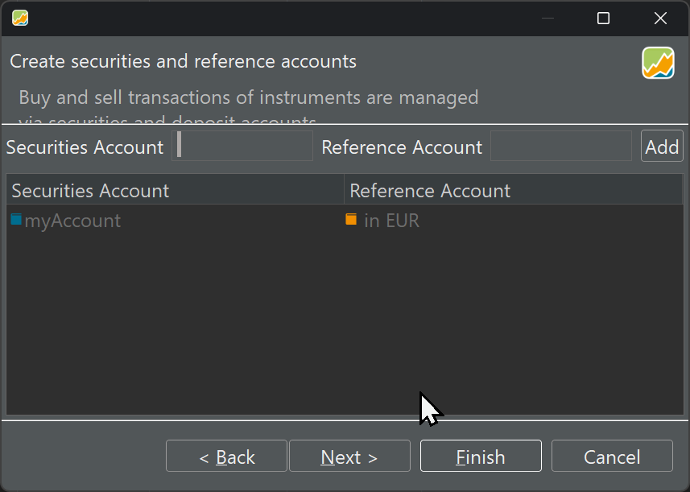
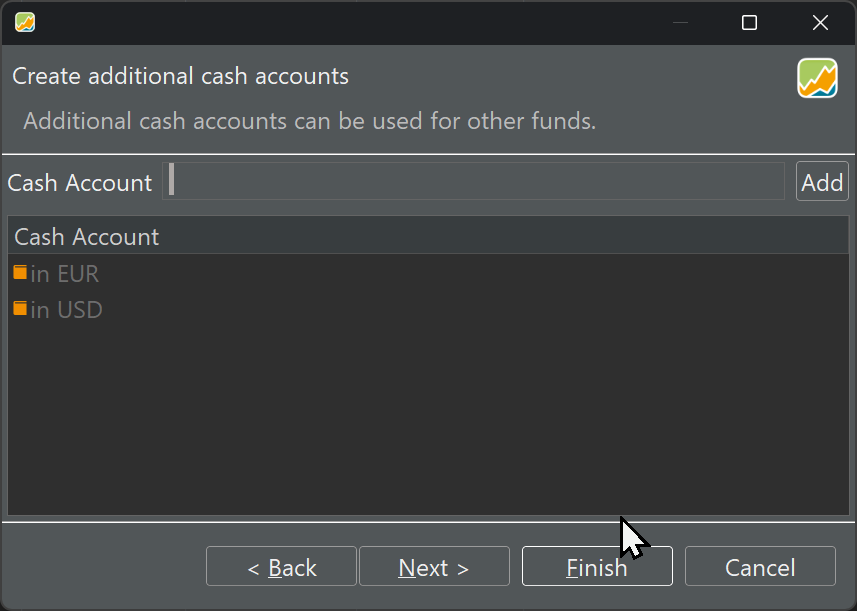
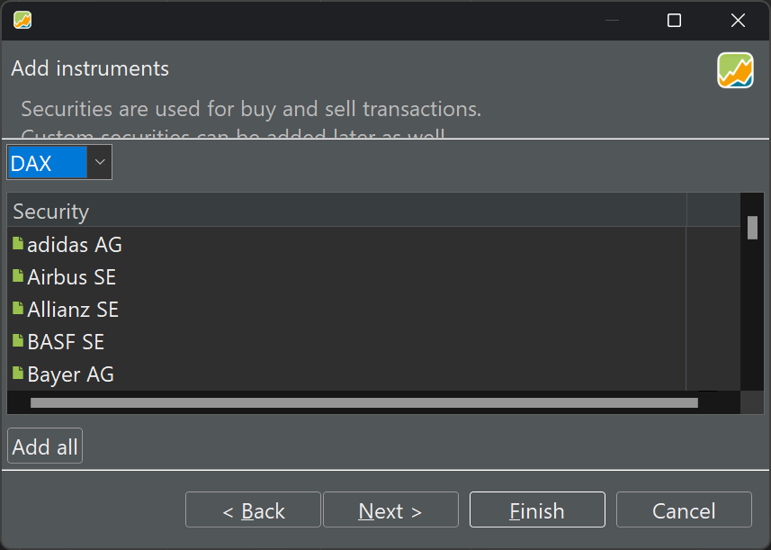

With the menu `File > New > File` you can create a new portfolio file. You can have as many portfolios on your system. A wizard will guide you through the setup process.

First you need to select the default currency for the portfolio (see figure 1). You can always change the currency for individual securities. PP supports almost every possible currency: from AED (United Arab Emirates Dirham) to ZWL (Zimbabwean dollar).
{.pp-figure}

Your portfolio must contain at least one security [account](../concepts/account.md) and one associated deposit account (reference).

{.pp-figure}

Sometimes, you need more than one deposit account. In step 3, you can add these extra cash accounts (e.g. in different currencies) to your portfolio.
{.pp-figure}

As part of the creation wizard, you can also add the securities that you want to track in this portfolio. These securities are retrieved from German index trackers such a DAX (Deutscher Aktienindex) , tecDax, SDAX, and MDAX. You can also add the index itself or others (e.g. NASDAQ) with Indizes. Of course, you can add securities later on. Your choice is then much larger. 

{.pp-figure}


Taxonomies such as Asset classes and Regions are used to classify your securities. This classification can then later on be used in performance analysis e.g. show me the performance of all securities from region xxx.

{.pp-figure}

Only steps 1 and 2 are mandatory: setting the default currency and base portfolio with associated cash account. You can tell this from figure 2 because the `Finish` button becomes available. After that a file `unamed.xml` is created. Of course, you should save it under a different name and location.

# XML
All data of your portfolio is stored in one XML-file (eXtensible Markup Language). This is a human-readable file format. For example, take the following buying transaction  of 5 shares of Microsoft at a purchase price of 334.27 USD with 30  USD fees and 45 USD taxes (see figure 6.).

{.pp-figure}

This single buying transaction is represented with the following XML code.

``` xml
<transactions>
   <portfolio-transaction>
      <uuid>72bf2b32-60a5-4c99-ba6d-d3ab695624e5</uuid>
      <date>2023-09-10T00:00</date>
      <currencyCode>USD</currencyCode>
      <amount>174635</amount>
      <security reference="../../../../../../../../../securities/security"/>
      <crossEntry class="buysell" reference="../../../.."/>
      <shares>500000000</shares>
      <note>First buy on advice of ...</note>
      <units>
         <unit type="FEE">
            <amount currency="USD" amount="3000"/>
          </unit>
         <unit type="TAX">
            <amount currency="USD" amount="4500"/>
         </unit>
      </units>
      <updatedAt>2023-09-10T18:43:28.135529700Z</updatedAt>
         <type>BUY</type>
   </portfolio-transaction>
</transactions>

```
