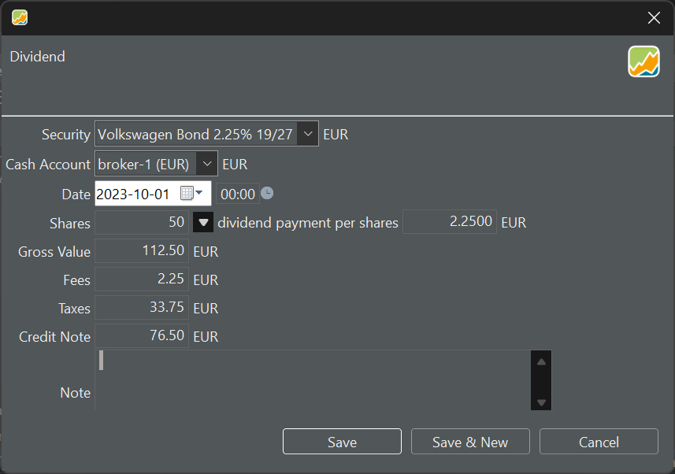

A bond is a financial instrument that represents a debt obligation. When an entity, such as a government or corporation, issues a bond, they are borrowing money from investors. In return, they promise to pay back the principal amount along with periodic interest payments over a specified period [[1](https://www.investopedia.com/articles/bonds/08/bond-market-basics.asp)]. Bonds are not well-supported in Portfolio Performance but with a few simple workarounds mentioned in the [German forum](https://forum.portfolio-performance.info/t/verbuchung-von-anleihen/1537/43), you could manage them effectively. 

# Adding the bond as a security.

Let's assume you've purchased a Volkswagen bond. You received the following banknote as shown in Figure 1.

Figure: Banknote of buying a bond.{pp-figure}

Before you can add the buying transaction, you must [create the security](../adding-securities.md) in the Securities account. Searching for the ISIN in Portfolio Performance does not yield any results, and searching by name returns the tradable Volkswagen shares. Therefore, you'll need to create an empty instrument and manually input the information for the bond. Historical bond prices aren't particularly crucial since the bond will ultimately be redeemed at 100% upon maturity.  However, -if necessary- they can be [downloaded in table format](../../how-to/downloading-historical-prices/table-website.md) from for example the [ariva.de website ](https://www.ariva.de/XS1972547696/kurse/historische-kurse?go=1&boerse_id=1&month=&clean_bezug=1). It's important to note that bond prices in historical records are typically expressed as percentages, ranging from 0 to 100%, rather than in a specific currency like EUR, as is common for shares.

# Recording the buy transaction

Since historical prices are represented as numbers from 0 to 100, you can use this format also for the buying price. At maturity date, the bond will value 5000 EUR with a price of 100%. In terms of `shares` and `quotes`, this means that you will receive the value of 50 shares x 100 EUR. However, you buy the security at 91.76% (see banknote in Figure 1). The Gross Value becomes 50 x 91.76 EUR = 4588 EUR. Fees and taxes can be registered as usual.

The bond depicted in Figure 1 matures on October 1, 2027, with an annual interest rate of 2.25%, payable each year on October 1. Since you acquired the bond on October 27 (value day), there have already been 26 days of accrued interest. At a rate of 2.25%, this amounts to 5000 EUR * 2.25% * 26/365, or 8.01 EUR. You have to pay this accrued interest at the purchase date to the seller, but you will get it back on the first interest payment on October 1, 2023.

To process the accrued interest correctly, there are a few options; (see [discussion](https://forum.portfolio-performance.info/t/verbuchung-von-anleihen/1537/43) on forum for a few variants).

1. Adapt the buying price. In case of the example in Figure 1, the buying price becomes 4596  EUR (=4588 + 8.01). The quote price becomes 91.92 EUR of 91.92% (=4596/50). The disadvantage of this method is that the price evolution and the performance calculation is not correct.

    Figure: Workaround with adaptation of quote price to incorporate accrued interest.

    {pp-figure}

2. To maintain a precise record of the purchase price, you could record the accrued interest as an additional `tax` (see Figure 3). The quote price is correct and the correct amount will be withdrawn from the deposit account.  The 'false' taxes could be corrected at the first interest payment with a `Tax refund` transaction.

    Figure: Workaround with adding accrued interest to taxes.{pp-figure}

    

3. The buy transaction of the bond security is recorded without the accrued interest. To handle the accrued interest, you transfer the correct amount (8.01 EUR), from the deposit account associated with the security to a separate deposit account. During the first interest payment, the accrued interest amount then is transferred back to the original deposit account associated with the security. 

# Recording the interest payment

The `Transaction > Interest` option is designed for recording interest payments on deposit accounts. While it could be utilized for recording bond interest payments, it lacks the ability to specify the security from which the interest originated. Consequently, the deposit account would aggregate all interest payments, without the ability to attribute a particular interest payment to the performance of a specific security.

A better, albeit somewhat unintuitive, approach is to record the transaction as a `Transaction > Dividend`. Dividends are tied to a specific security, in this case a bond, ensuring that the performance calculation of the bond remains accurate. Depending on the chosen recording option for the purchase (as discussed earlier), the following three transactions could be made. 

1. The accrued interest is fully booked as a dividend (see Figure 4). The accrued interest (for the seller) on the purchase date (8.01 EUR) has already been accounted for in the recorded purchase price.

    Figure: Interest payment 2.25% of 5000 EUR.

    

2. The interest payment (112.50 EUR) is reduced by the amount that was already recorded as tax on the purchase date (8.01 EUR). With a `Transaction > Tax refund` that amount is refunded.
3. The interest payment is reduced by the amount that was transferred to a separate account. The accrued interest amount then is transferred back to the original deposit account associated with the security.

