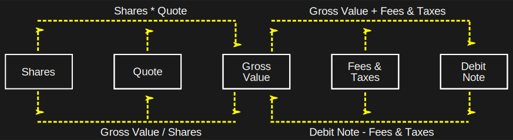
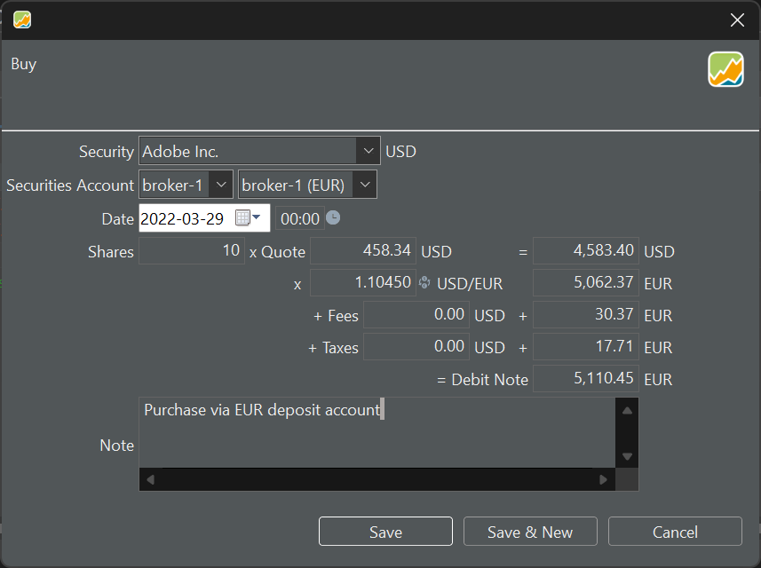

When you receive a notification from your bank or broker detailing a transaction, as shown in Figure 1, you need to record this transaction in PP. If it's on paper, you must do this manually. Otherwise, you can attempt to [import](../../reference/file/import.md) the transaction.

# Transaction with one currency

The transaction in Figure 1 involves only one currency. Both the Security and the Deposit Account use the same currency (EUR). There is no need for currency conversion.

Figure: Paper note from your bank regarding your buy transaction.

{.pp-figure}

With this note, you can enter the transaction details into PP. Figure 2 displays the input panel for entering the information. The security (Heidelberg Materials) is quoted in EUR and the transaction is handled with the `broker-1` security account and the `broker-1 (EUR)` deposit account. The example of the [sell transaction](sell.md) involves a more complex setup with a security quoted in USD, but the transaction handled through a deposit account in EUR.

Figure: Buying a security (EUR) through a deposit account (EUR).

{.pp-figure}

- **Security** : You can select the security from a drop-down. If a particular security was already chosen before initiating the transaction, this info will be pre-filled. Please note that the currency is automatically filled in because each security has a reference currency, which is set during [creating the security](../../getting-started/adding-securities.md). The list of all available securities can be found in the sidebar under `Securities > All Securities`
- **Securities Account** : choose from the drop-down menu or leave it pre-filled if you started from a securities account.
- **Deposit Account**: Select from the drop-down menu or leave it pre-filled with the [account](../../reference/view/accounts/index.md) related to the security. If the currency of the chosen deposit account differs from the security currency, you'll need to convert the Gross Amount and Fees and Taxes, requiring an Exchange Rate. See the example with the [sell transaction](sell.md).
- **Date of transaction**: You can pick this date from a calendar or enter it manually (format = YYYY-MM-DD). On the right (00:00), you can input the transaction time. The choice between a 12-hour or 24-hour clock is determined by the menu setting `Help > Preferences > Language > Country`. For instance, the UK uses a 12-hour clock (with AM and PM), while Belgium uses a 24-hour clock.
- **Shares**: the number of securities that you buy or sell. This can be a decimal number.
- **Quote** : This is the price you paid for one share. If the security includes historical prices (see [adding securities](../../getting-started/adding-securities.md)), the correct price for the given date will already be filled in. However, this historical price may not match what your bank provides, as it is based on end-of-day prices, whereas the bank uses real-time information.

The above six fields are *mandatory* for completing the transaction. Most of these fields are pre-filled based on the selected security. The following fields are either calculated or optional.

- **Gross Value** : This is the result of multiplying Shares by Quote. If you later change the Gross Value, the Quote Price will be adjusted accordingly to maintain the equation Shares * Quote.

- **Fees** and **Taxes** : A purchase transaction typically incurs fees and taxes. These may be in the currency of the security and/or deposit account (see [selling](sell.md) for an example).

- **Debit Note** : This is the amount you need to pay as a result of this buying transaction. It is calculated as Shares * Quote + Fees + Taxes. Other terms for this are Value or Net Value.

- **Note** : You can add a textual note to each transaction.

The typical flow for entering this information is likely to be `Shares * Quote (price) >> Gross Value + Fees + Taxes >> Debit Note`. There are a few nuances if you make changes afterward (see Figure 3).

Figure: Calculation flow between Shares and Debit Note.

{.pp-figure}

- Changing the *Debit note* (afterward) will modify the Gross Value, and consequently, the Quote Price will be adjusted. The number of shares remains unchanged.
- Changing the *Gross Value* afterward will alter the Debit Note and the Quote Price. Fees, taxes, and the number of shares are unaffected.

# Transaction with two currencies

If you want to purchase shares in a foreign currency, there are two options. Either you have the required amount in the foreign currency in a deposit account. Or, you'll need to [make a deposit](deposit.md#MakingaDeposit) or [convert](deposit.md#transferbetweentwocurrencies) another currency into the foreign currency first.

Figure 4 displays the bank's paper note regarding the purchase of USD shares. Since taxes and fees need to be settled in EUR (due to it being a European bank), and the portfolio's base currency for reporting is also EUR, the total amount in USD is also converted to EUR.

Figure: Paper note of a Buy transaction of a share in a foreign currency.{class="pp-figure"}

From the note, it isn't quite clear which deposit account (EUR or USD) is used. Recording this transaction in PP however is quite straightforward. Figure 5 shows the transaction done with a USD deposit account. Figure 6 is a little more complex because a EUR deposit account is used; so a conversion should be made (EUR --> USD).

Figure: Buy transaction of a USD security with a USD deposit account.{class="pp-figure"}

Figure: Buy transaction of a USD security with a EUR deposit account.{class="pp-figure"}

The quote price and the USD/EUR exchange rate are automatically filled in based on the entered date. However, please note that real-time prices are not available. The entry form in PP also provides the additional option to record fees and taxes in the foreign currency. 

Remember: good practice requires making a deposit beforehand, either in USD (for the transaction in Figure 5) or in EUR (Figure 6). Failing to do so will result in a negative balance.

