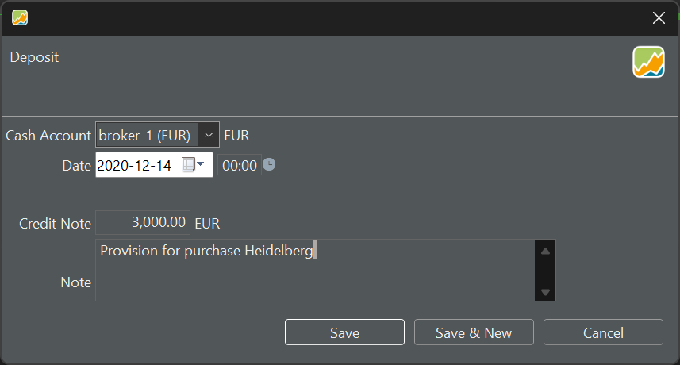
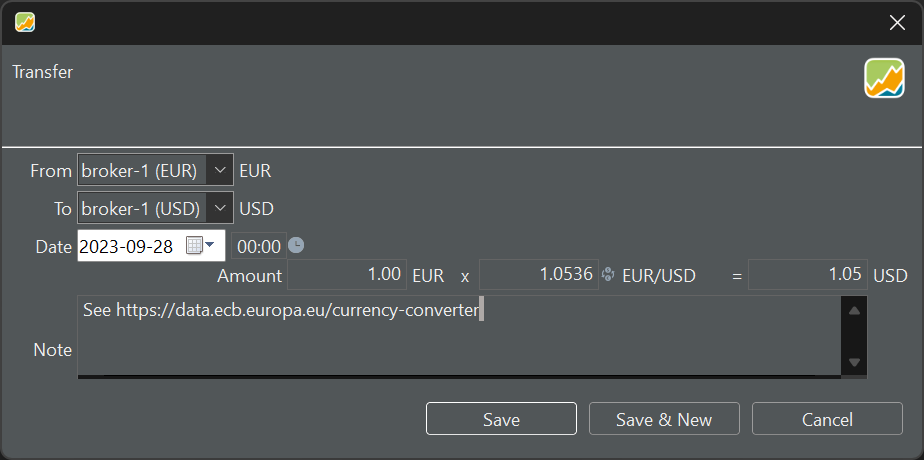

To initiate a deposit in a specific currency, navigate to the `Transaction > Deposit` menu. Ensure that the chosen account shares the same currency as the deposit. For transferring funds between accounts, whether in the same currency or different currencies (utilizing exchange rates provided by the [ECB](https://data.ecb.europa.eu/currency-converter)), employ the `Transaction > Transfer between Accounts` command.

# Making a Deposit

Recording a deposit is a straightforward process (see Figure 1). Input the deposit account, transaction date, amount, and optionally, an accompanying note.

Figure: Making a provision for the Heidelberg buy transaction.{class="pp-figure"}

Please be aware that a deposit contributes to certain performance metrics. Additionally, note that each security purchase corresponds to a reduction in a deposit account. If the account balance is insufficient, the deposit account's balance may become negative.

# Transfer between two currencies

You can transfer funds between two accounts, whether they share the same currency or not. In cases where the accounts have different currencies (see Figure 2), PP will automatically suggest an exchange rate based on the [ECB website](https://data.ecb.europa.eu/currency-converter).

Figure: Converting from EUR to USD.{class="pp-figure"}

