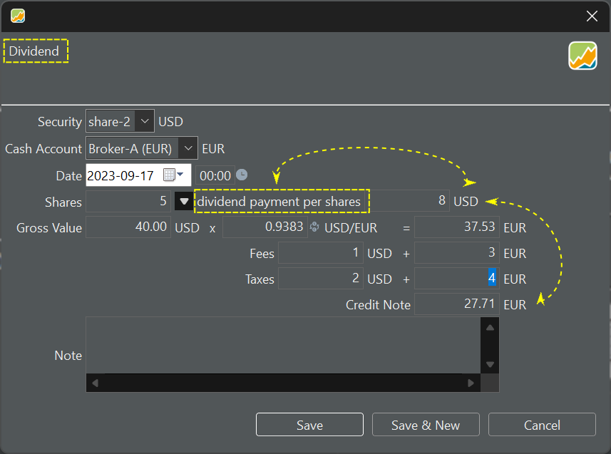

## Dividend transaction
Booking a dividend is almost like a buy or sale; except that the quote price is replaced with a field Dividend payment per shares (see figure 5)

{.pp-figure}

There is no separate function to book a "Dividend Investment Plan" (DRIP). One solution is to fully book all dividends with a buy transaction of the agreed-upon number of shares. More information at [Reinvesting dividends](../../procedures/reinvesting-dividends.md).
