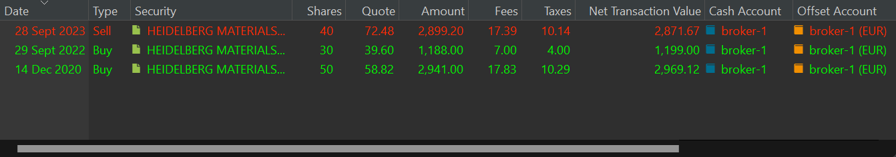

The selling transaction is very similar to the buying transaction. Here as well, you can record the transaction's outcomes in an account with the same currency or a different currency. In the latter scenario (see Figure 1), upon selecting the foreign account (e.g. USD), three new fields become available: exchange rate (XR), USD fees, and USD taxes.

# Selling a single buy security

In the demo portfolio, we've purchased the Adobe stock only once (10 shares). All those shares have of course the same price, so it doesn't matter which specific ones are sold in the case of a partial sale.

Figure: Selling a USD security through an EUR deposit account.{class=pp-figure}

In Figure 1, the share is quoted in USD, and consequently, the Gross Value is also calculated in USD. However, since you intend to record this transaction in a EUR account, this USD value needs to be converted. As soon as you choose a deposit account with a different currency, the exchange rate field (e.g., 0.9491) is automatically filled with the correct exchange rate for that specific date and currency. This information is obtained from the European Central Bank (ECB) website. You can also consult it through the menu `View > Currencies > Currency Converter`.

Changing the date afterward will adjust the exchange rate (XR) appropriately, even if you've manually entered an XR. Therefore, it's considered good practice to set the transaction date first.

You have the flexibility to input fees and taxes in both currencies. The foreign fees and taxes are automatically converted using the same exchange rate as above. There isn't a subtotal in the local currency, so the Credit Note amount isn't a simple sum of the numbers above.

The calculation flow remains consistent with [Figure 3](buy.md) in the buying page. For instance, modifying the Credit Note will subsequently adjust the Gross Value in EUR, which, in turn, impacts the Gross Value in USD (XR remains unchanged), and finally, the Quote price.

# Selling a multiple buy security

In your portfolio, some effects may have been purchased multiple times at different prices (see Figure 2 for an example). What happens when you partially sell that share?

Figure: Multiple transaction on the same security.{class=pp-figure}

Do those shares come from the first or second series that you purchased, or from a combination of both? For the actual sale, it doesn't matter. In the example from Figure 2, 40 shares were sold at a price of 72.48 EUR. But how are the remaining shares valued? Portfolio Performance follows the **FIFO principle** (First In, First Out). So, the 40 shares that are sold come entirely from the first purchase. What remains are 10 shares from the first batch and 30 shares from the second batch. Another possibility would be LIFO (Last In, First Out). In that case, 10 shares from the first batch would remain, and none from the second batch. Does this make a difference? In this particular case, the stock is valued lower in the FIFO approach.

`FIFO`: average price of the remaining 40 shares = ((10 * 58.82) + (30 * 39.60)) / 40 = 44.05 EUR

`LIFO`: average price of the remaining 40 shares = ((40 * 58.82) + (00 * 39.60)) / 40 = 58.82 EUR

