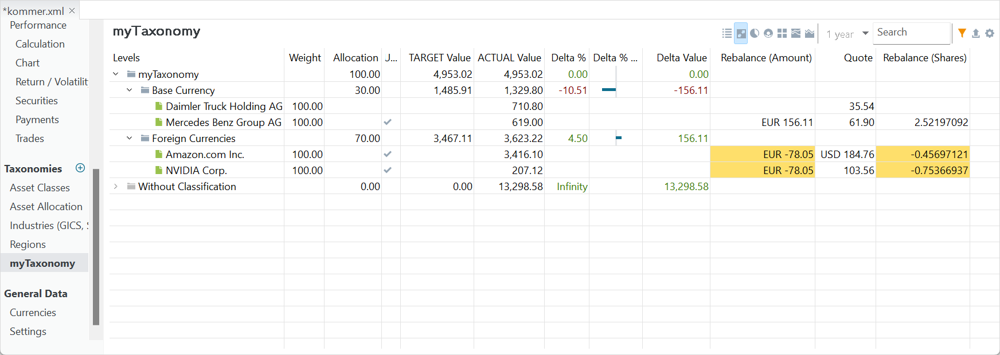

By defining a strategy and goal, investors can avoid emotional reactions to market fluctuations and stay focused on their long-term plans. You can use [taxonomies](../reference/view/taxonomies/index.md) (see also the previous section in this Getting Started chapter) and [rebalancing](../reference/view/taxonomies/using-taxonomies.md#rebalancing-view) to achieve this.

Rebalancing is a strategy of bringing a portfolio that has deviated away from one's target asset allocation back into line [Wikipedia](https://en.wikipedia.org/wiki/Rebalancing_investments). This target can be set in the rebalancing view of a taxonomy (see Figure 1).

Figure: Rebalancing view. {class=pp-figure}

The first step is to set the allocation goal for each category. For example, in Figure 1, the (rather counterintuitive) target allocation for the Foreign Currencies category is set to 70%, leaving 30% for the Base Currency category. You can enter or change the allocation percentage by double-clicking the cell, and the target value will be immediately adjusted.

The Rebalance (Amount) and Rebalance (Shares) columns show the amount and number of shares you need to sell (negative number) or buy (positive number) to reach the target value. Naturally, it isn't always possible to buy or sell a fractional number of shares.

Please note that the sum of the allocation percentages across categories does not need to be 100%, although it is advisable. Color coding will draw your attention to any discrepancies if the sum isn't 100%.