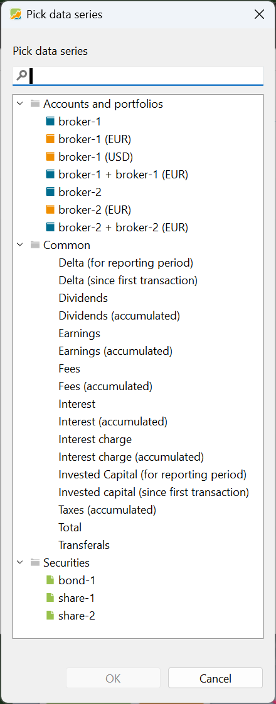

Using the menu `View > Reports > Statement of Assets > Chart` or the sidebar, you can generate a graphical representation of your assets performance over time. The y-axis displays the total value of your assets, denominated in the portfolio's default currency (1k = 1000 units of the portfolio currency). You can change the scale of this axis by scrolling with the middle mouse button. Hold the mouse position at the value (e.g. 4k) where you want to increase or decrease the scale around.  The x-axis represents time, and you can select the desired time period using the dropdown menu in the top-right corner. By default, the periods of 1 year, 2 years, 3 years, 4 years, 6 years, and the previous day are available. Additionally, you have the option to create a custom time period using the 'New' feature; see [Reporting Period](../../concepts/reporting-period.md) for a description.

Figure: Chart of the Total value of the demo portfolio.{class=pp-figure}

By default, two data series are displayed: 'Transferals' (primarily deposits) and 'Total' (which includes transferals). When you left-click the canvas and hold the mouse down on a specific day, for example, March 28, 2022, a dialog box will appear, displaying detailed values for all data series on that day. Right-clicking on the chart canvas provides additional options (see Figure 1).

- Crosshair: A large crosshair appears above the chart when you left-click the canvas. The origin is at the mouse position of the click. The exact value of a certain point of the data series is then easier to read.
- Measure distance: Select this option if you want to determine the exact number of days between two points on the chart. It also displays the difference in value and the corresponding percentage between the two points.
- Adjust range: 0.
- Various navigation options with their respective shortcut keys, such as Zoom In (Ctrl+Arrow Up), Scroll Up (Arrow Up), and more.
- Save diagram: This feature allows you to save the visible chart as a PNG or JPG image on your computer.

Right-clicking on the legend icons (for example, the blue and red squares from Figure 1) will give you access to additional formatting options. For all types of data series and their legend entries, you can modify the `Color`, `Position` (Send backwards, Send to back or Bring forward, and Bring to Front)), and `Sort` (A-Z or Z-A). The latter two options will reorganize the legend entries accordingly. In the case of a line-type data series like the Total value, you can also adjust the `Line Style` (solid, dash, dot, ...), and the `Show Area` option (which fills the area below the data series). Additionally, you have the choice to either hide (the legend entry is visible but the data series is not displayed in the chart) or remove the series (both the legend and data series are removed from the chart).

Figure: Dataseries for chart.{class=align-right}

With the gear icon (top right) you can display additional data series to the chart. Remember that in the demo-portfolio, we have two brokers; where broker-1 has two deposit accounts (EUR and USD). Broker-2 has only one EUR-deposit account.

With the `Accounts and Portfolios` option, you can choose to display specific combinations of accounts, such as broker-1 along with its USD deposit account. Select the appropriate option and hold Ctrl to add more selections. Once you've added a data series, it will no longer appear in the list of available data series in Figure 2, but you'll find it checked in the gear menu. You can remove a data series from the chart by unchecking it in the gear menu or by deleting it from the legend (as explained above). If you remove all data series, the chart will revert to its default view with Total and Transferals as the data series.

The Common option in Figure 2 will display some additional info.

- Delta (for reporting period or since first transaction): represents how much the portfolio's value has increased or decreased for the reporting period or since first transaction until today. This Delta will fluctuate around zero, for example for the first transaction day the delta will be zero. The chapter on [Reporting Period](../../concepts/reporting-period.md) explains that the valuation of a portfolio can differ according to the selected `Reporting Period`.
- Dividends, Fees, Interest, Interest Charge, and Taxes are available with an accumulated and 'instance' version. These fields are described in [Transactions](../../concepts/transaction.md) and are recorded as part of each transaction.
- Earnings: the sum of dividends and interests.
- Invested Capital (for reporting period or since first transaction): the term "invested capital" refers to the total amount of money that an investor has used to purchase various securities, such as stocks, bonds, or other financial instruments. It includes the initial purchase price of the securities, additional investments made over time, and other factors such as fees, taxes, ....
- Total: the total value of the portfolio valuated over time.
- Transferals: each Deposit or Removal is represented by a very small spike (positive or negative) on the day that the transferal was made.

With securities, you can make a graph of each separate or combination of securities in your portfolio, for example share-1 or share-1 + bond-1.

In the default configuration, the `Standard` view only includes two data series: Total and Transferals. However, you have extensive customization options, as mentioned earlier. Using the dropdown menu, you can `Duplicate`, `Rename`, or `Delete` this view. You can also create a new view by clicking on the New icon, located in the top right corner between the Standard and Period options. Similar to the existing one, you can duplicate, rename, or delete your newly created view. If you wish to have this view as the leftmost view, select the `Bring to front` option from the dropdown menu.

