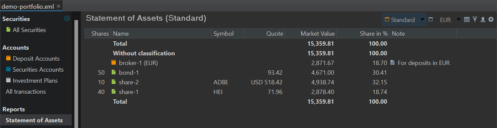

The `Statement of Assets` report provides a snapshot of your portfolio's assets (securities, accounts) at a specific point in time. The default date is the current day. You can choose a different date with the "Time machine"; the calendar icon at the top right. Figure 1 lists all transactions of the demo-portfolio up to October 5, 2023. Figure 2 displays the Statement of Assets report as of this date.

Figure: List of All transactions of demo portfolio (2023-10-05){class=pp-figure}

In addition to the purchase of `share-1`, `share-2`, and `bond-1`, there is also a sale of a portion of `share-1`. In this latter transaction, no deposit is made, and the proceeds from the sale remain in the deposit account.

Figure: Statement of Assets report of demo portfolio (2023-10-05){class=pp-figure}

The report in Figure 2 displays all the available assets on October 5, 2023, including the deposit account with the result of the sale of `share-1`. The securities are valued at their market prices based on the closing quotes from the previous day, which is -in this case- October 4, 2023. `Share-2` is handled in USD. The conversion to EUR is based on the exchange rate provided by the ECB on October 4, 2023 (closing previous day).

The report displays a total line above and below the assets. With the Presentation option (see Figure 3 bottom), you could add or remove the Total lines. The default setting is above *and* below. Since no taxonomy has been added to the demo portfolio, all assets are listed as `Without classification`.

# Available columns

Figure: Available columns. {class=align-right}

The default columns that are displayed are `Shares`, `Name`, `Symbol`, `Quote`, `Market Value`, `Share in %`, and `Note`. Many more columns/fields are available (see Figure 3). While the column headings are mostly self-explanatory, a few of them may require further clarification. You can customize the default columns using the gear icon located in the top-right corner (see Figure 2).

The abbreviation "MA" that follows Purchase Price/Value stands for "Moving Average" but in fact it should be better called WA or "Weighted Average". As mentioned in the discussion about [Purchase Value](../../concepts/purchase-value.md), PP uses the FIFO (First-in, First-out) method to calculate prices and values. "Moving/weighted average", however, is another commonly used method.

The Purchase Price and the Purchase Price (MA) of `share-1` are respectively 44.41 EUR and 51.61 EUR; a rather big difference. Why? From Figure 2:

- Purchase of 50 shares at 58.82 EUR on December 14, 2020.
- Purchase of 30 shares at 39.60 EUR on September 29, 2022.
- Sale of 40 shares at 72.48 EUR on September 28, 2023.

What is the Purchase Price of the remaining 40 shares in the portfolio?

- The moving/weighted average method states that the average price of the original 80 shares was ((50 x 58.82) + (30 x 39.60))/80 = 51.6125 EUR. The remaining 40 shares are valuated at this price.
- The FIFO method asserts that the remaining 40 shares are composed of 10 shares of the first purchase and 30 shares of the second purchase. The average price is thus ((10 x 58.82) + (30 x 39.60))/40 = 44.405 EUR.

The available fields under `Performance` and `Dividends` are discussed in a separate chapter.

With the `Attributes` option, you can add custom fields to the table. These fields are defined in `left sidebar > settings > Attributes: Securities` and following panels. You can enter a specific attribute value for a security in the `Additional attributes` panel of the security (see for example, Figure 3 in [Getting started > Adding securities](../adding-securities.md))

The `Forex` (Foreign Exchange) option allows you to view the currency of the quote for each asset and its exchange rate relative to the base currency of the portfolio. The fields labeled as `Market value**`, `Purchase Price**`, and `Profit/Loss**` retain the same meaning as their counterparts in the base currency, but they are presented in the foreign currency.

For instance, let's consider `share-2`, which is traded in USD. In the default view, the Market Value is expressed in EUR. If you wish to view that value in USD instead, you can achieve this by adding the `Market Value**` field.

The `Distance to SMA` is a metric that measures the difference between the current price of a share and the average price of that share over a specified number of past days. The acronym "SMA" presumably represents "Simple Moving Average."

When you choose to include this column, you'll also need to specify a period, such as 5 days, 20 days, 50 days, or 200 days. Suppose that you want to know the &Delta; to SMA5 (Distance to SMA for a 5 days period) of `share-1`. The last 5 available prices are: 71.96, 72.00, 72.42, 73.52, and 74.50 EUR; including the latest available on October, 5 (= 71.96 EUR). The calculation is carried out as follows:

1. Calculate the average price of the last 5 days, including today = (71.96 + ... + 74.50)/5 = 72.88 EUR.
2. Calculate the difference of today's price with the average price = 71.96 - 72.88 = -0.92 EUR.
3. Divide this difference by the average price and convert to a percentage = -0.92/72.88 = -1.26%. The current price (October 5) is 1.26% lower than the average price of the last 5 days.

`Distance to ATH` (All Time High) is a likewise metric that shows how far the current price is from the highest price in the specified period. For example, the highest price of share-1 in the last year was 77.4 EUR. The current price is 71.96 EUR. So the &Delta; ATH 1 year (Distance to ATH for a 1 year period) is equal to (71.96 - 77.4)/77.4 or -7.03%. 

 # Available views

Using the `Reset Columns` option in Figure 3, you can revert to the default arrangement of columns. It's advisable to keep this layout as the `Standard` view, which is represented by the first button at the top (see Figure 1). By clicking the triangle icon next to the button, you can access options to rename, duplicate, or delete the current view.

If you find yourself needing a custom layout regularly, you can duplicate the standard view, give it a new name, and customize it to your preferences. Additionally, there is a `New View` button available to create a new view based on the default setup.

To the right of the `New` button, there is a currency selection button. It should be labeled with the base currency of the portfolio, but you have the option to choose other currencies. All calculated fields such as `Market Value` are then converted to the selected currency.

The `Filter` icon located in the top right corner allows you to filter the assets that will be used in the calculations. You have several options:

1. You can select the entire portfolio.
2. You can choose only one security account.
3. You can select the security account along with the associated deposit account.

Additionally, you have the option to create a custom filter. To do this, you will need to make a selection from all the available assets within the portfolio.

 