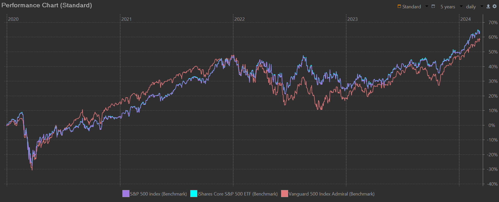
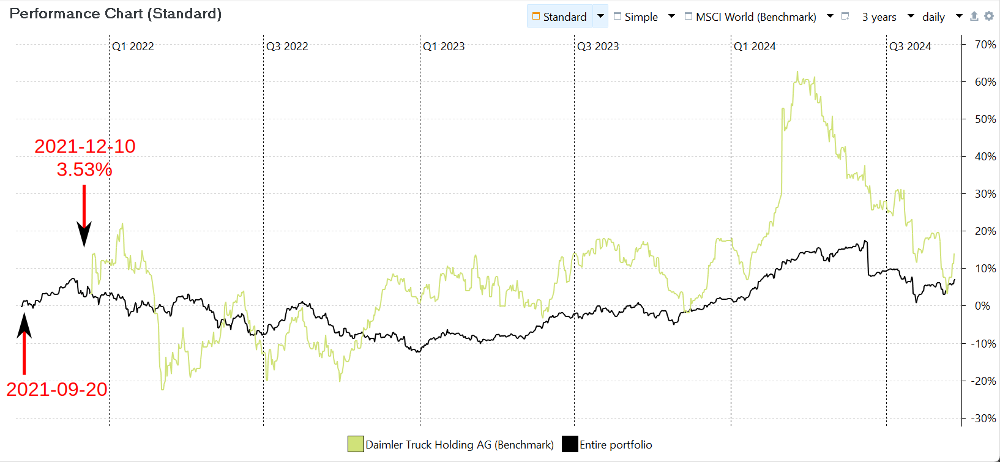
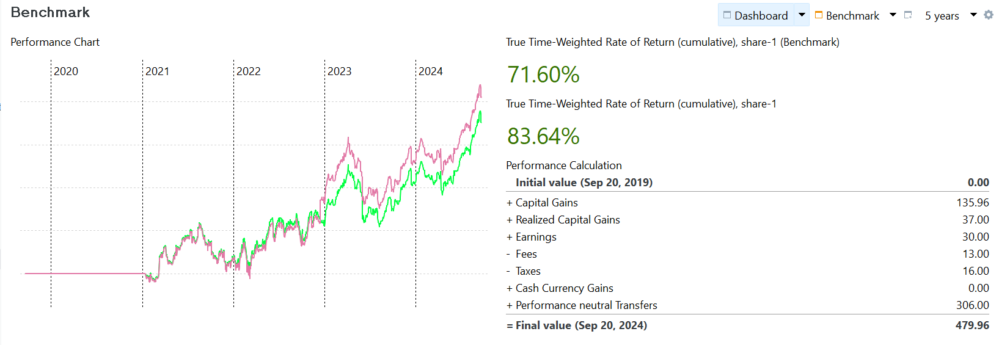

Benchmarking your portfolio performance against financial indexes is a common practice in investment management. This process involves comparing the returns of your portfolio or individual securities to the returns of a selected benchmark index.

A stock index is a measure of a hypothetical portfolio of investment holdings that represents a segment of the financial market. For example, [Standard & Poor’s
500](https://www.spglobal.com/spdji/en/indices/equity/sp-500/#overview) index measures the performance of 500 large companies listed on stock exchanges in the United States. It is a market capitalization-weighted index, which means that the influence of each company in the index is proportional to its market capitalization. On March 8, 2024, the S&P 500 Index stood at 5,123.69 USD.

## Finding an index

A list of major indexes can be found on several financial websites such as [investing.com](https://www.investing.com/indices/major-indices) and [Yahoo Finance](https://finance.yahoo.com/world-indices/). In order to use an index for benchmarking your portfolio, you need to add it as a security.

For the indexes listed on Yahoo Finance, simply [add a new security](../getting-started/adding-securities.md) and search for the ticker symbol; e.g. ^GSPC. If you want to use the data from investing.com, you have to download the historical prices. Select the correct time period and click the download button to receive a CSV-file (you need a free registration for that). Create a new empty instrument. See the section [File > Import](../reference/file/import/csv-import.md#csv-files-comma-separated-values) and [How-to > Downloading Historical Prices](./downloading-historical-prices/csv-file.md#investingcom) for a detailed explanation how to import these historical prices. For appending the future daily prices, you can use the daily updated table from the last month. Set the Quote Feed of the Historical Quotes to `Table on website` and use the following Feed URL: `https://www.investing.com/indices/us-spx-500-historical-data`. This Quote Feed will not overwrite the existing prices but will append new ones.

There are plenty of mutual funds or ETF's that replicate an index. For example, both [Vanguard 500 Index Fund Admiral](https://investor.vanguard.com/investment-products/mutual-funds/profile/vfiax#portfolio-composition) and the [iShares Core S&P 500 ETF](https://www.ishares.com/us/products/239726/ishares-core-sp-500-etf) replicate the S&P 500 quite narrowly. So, you could use also one these funds as benchmark.

Figure: Comparison of SP 500 index with two replicating funds. {class=pp-figure}

As shown in Figure 1, the iShares Core S&P 500 ETF and the Vanguard index closely track the S&P index, to the point where the individual lines overlap and are almost indistinguishable. Despite all three benchmarks having historical prices dating back to 2014, their initial performance is set to zero at the start of the reporting period.

## Displaying the benchmark

To display a graph similar to Figure 1, follow these steps:

1. Navigate to the menu `View > Reports > Performance > Chart`.
2. Utilize the `Configure Chart` icon, represented by a :gear: gear symbol, located in the top right corner of the screen.
3. Within the configuration options, you can add or remove `time series` and `benchmarks`which are sequences of data points recorded at regular time intervals, e.g. market values or historical prices.
4. In order to be used as a time series, a security must have a market value - meaning they have been purchased. Benchmarks only require historical prices. Since we haven't purchased any shares of both iShares or Vanguard, we need to use the benchmark option for it.

Please take note that the historical prices of the securities differ notably: roughly 5000 USD for the S&P index, and approximately 500 USD for both the iShares ETF and Vanguard index fund. Despite this discrepancy, the curves overlap, indicating that the vertical value axis of the graph represents the performance (in %, not USD). The chart is indeed a performance chart.

## Comparing to the benchmark

Naturally, you'd want to compare the performance of your portfolio or that of an individual security against one of the benchmarks. You may also wish to evaluate your track record of buying and selling by comparing it with the unbiased historical prices of a specific security.

### Comparing with the entire portfolio

The `Add data series` option in the `Configure Chart` menu (:gear: gear symbol) will open the `Pick data series ...` window (see Figure 2). From this window, you can add timeseries for accounts, securities, or the entire portfolio (before or after taxes). The `Pick Data Series` window is shown in Figure 2. Please note that the `Entire portfolio` (after taxes) and `S&P 500 (benchmark)` are already included in the chart. Selecting a data series to add will remove it from the list at the bottom, mark it as checked in the top list, and, of course, add it to the chart.

Figure: Comparison of the performance of the portfolio with SP 500 index. {class=pp-figure}

As shown in Figure 2, the performance of both time series starts at 0% at the beginning of the 3-years reporting period. The actual start of both series however was before the beginning of the reporting period.

### Comparing with an individual security

Figure 3 compares the performance of the actual `share-1` position in the portfolio with the `share-1 (Benchmark)` over a 5-year reporting period. See above for adding both indices to the performance chart to the main pane. The information pane at the bottom displays the historical prices chart of the security with the buy, dividend, and sell transactions indicated. The reporting period covers 5 years in both panes, starting well before the portfolio's inception on January 15, 2021. Please note:

- The flat line representing the `share-1` position before 2021, reflecting zero performance as no purchase was made.
- The benchmark starting at zero performance at the beginning of 2021, despite historical prices being available from 2014.

Figure: Benchmark of the performance of share-1 as in the portfolio (actual) with its historical price (benchmark). {class=pp-figure}

The slight differences between the benchmark and the actual position in the beginning is caused by the fees of the purchase and the slightly different buying price regarding the close price of the day. For example, the historical prices of the share were 15.21 and 15.05 on January 14 and 15, 2021. Using [Equation 1 (MVE+out/MVB+in)](../concepts/performance/time-weighted.md) of the section on Time-Weighted Rate of Return, the performance of the benchmark was thus ((15.05+0)/(15.21+0))-1 = -1.05%. The actual purchase of `share-1` was at 15 EUR with 3 EUR fees. The performance on the share on the first day was thus =(150.5+0/(0+153))-1 = -1.63%. The benchmark solely utilizes historical prices, while the performance of the `actual share-1` takes into account both inbound and outbound transfers.

The most significant divergence occurs when a dividend is paid on December 15, 2022. The performance of the actual Share-1 position benefits from this additional outbound transfer, resulting in a significant increase in the daily performance of around 9%.

!!! Note
    In the previous examples, the historical prices extend well before the start of the reporting period. However, there are instances where securities have a limited range of historical prices, such as in the *kommer.xml* sample project, to reduce file size, or in the case of Daimler Truck Holding AG, due to a recent spin-off.
    
    As noted by user [@veterini](https://forum.portfolio-performance.info/t/portfolio-performance-documentation/25480/22), the start of the reporting period is important. For instance, Figures 4 and 5 show the benchmark of the Daimler Truck Holding AG for a reporting periods of 3 and 5 years. The starting performance on December 10, 2021 (the split-off date) is 3.53% or 25.73%, depending on the reporting period.    
    
    Figure: Benchmark of Daimler Truck Holding AG with reporting period of 3 years. {class=pp-figure}

    
    
    The start of the period in both cases is before the first available historical price. Both starting dates are well before the earliest historical price (December 10, 2021: the split-off introduction date). Since it is impossible to calculate the performance of the Daimler share before this date, PP assumes the initial performance to match the portfolio’s performance, making the (later) comparison easy. For the 3-year period, this is 3.53%, and for the 5-year period, it is 25.73%.

    When historical prices *are available* from the start of the reporting period, PP assumes an initial performance of 0% for both the entire portfolio and the security. From that point, performance is calculated using the available historical prices.
   
    Figure: Benchmark of Daimler Truck Holding AG with reporting period of 5 years. {class=pp-figure}

    

The overall performance of the benchmark could be read from the graph. A more precise number of the `actual share-1` could be obtained from the Securities table under [View > Report > Securities](../reference/view/reports/performance/securities.md). Unfortunately, this is not possible for the benhmark (there are no transactions). Nevertheless, it is feasible to present the benchmark's performance graph and the TTWROR values of both indices as a widget. See [Reference > view > reports > performance](../reference/view/reports/performance/index.md#configuring-the-dashboard) for info about configuring the dashboard.

Figure: Dashboard with performance chart and TTWROR widgets. {class=pp-figure}

In Figure 2, the start of the reporting period was *after* the first purchase of `share-1`. What would happen if you took a longer reporting period such as the first purchase of `share-1` falls within the period. What would the initial performance be on the first day of that reporting period? For the benchmark, it should be the historical price of that  

When a data series added as a benchmark starts after the start of the reporting period, its start value is not 0%.